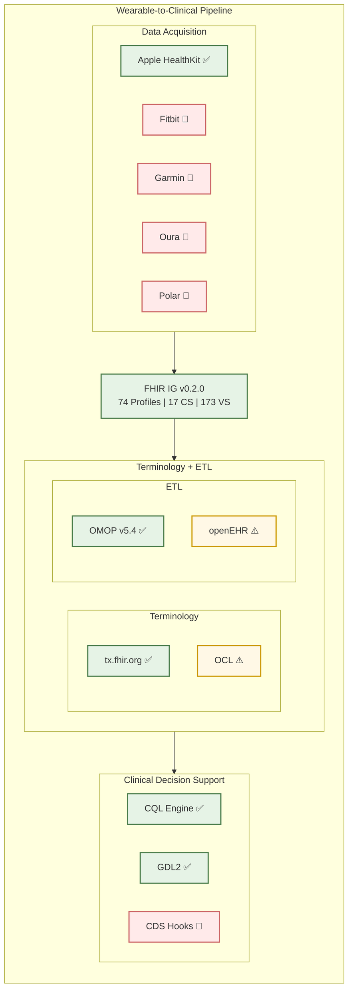
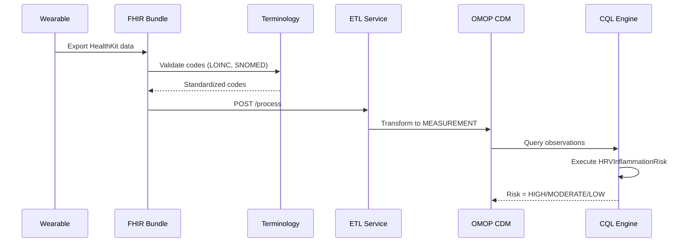
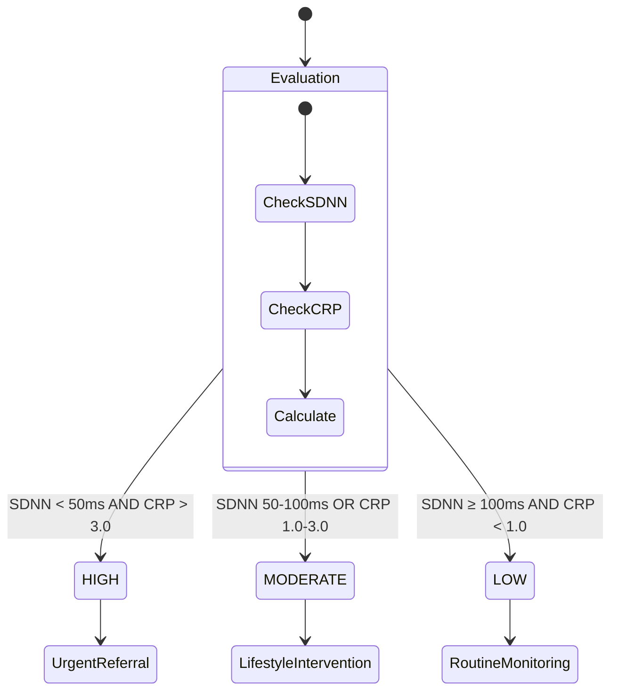
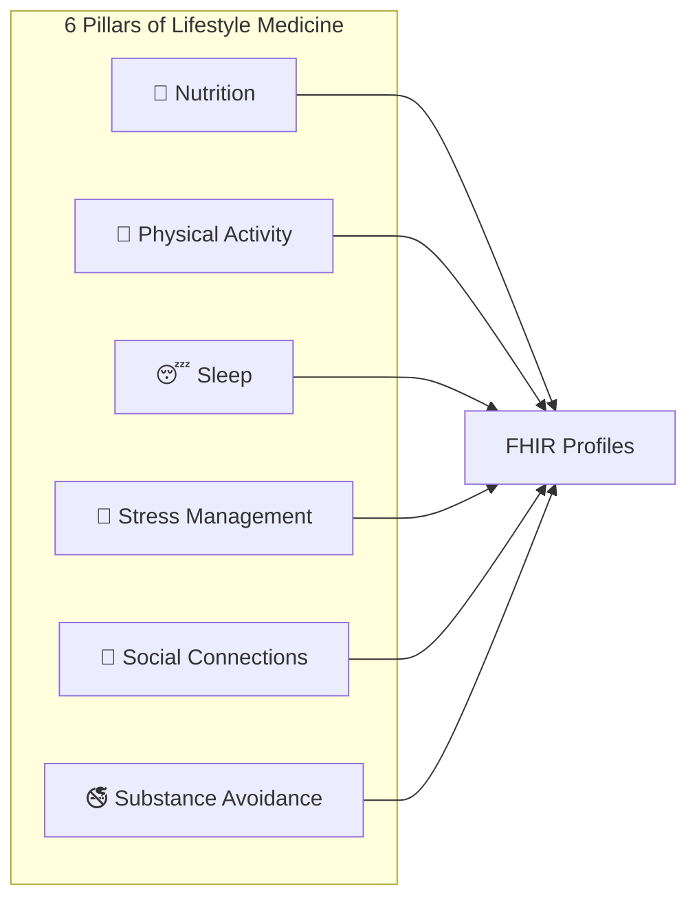
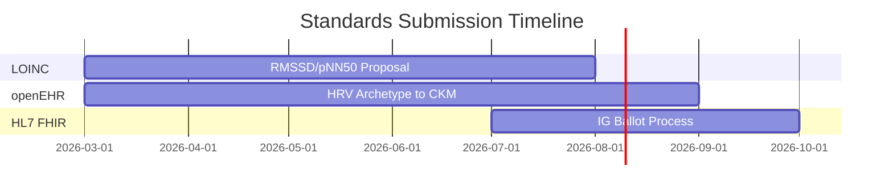

# iOS Lifestyle Medicine FHIR Implementation Guide

[](https://hl7.org/fhir/R4/)
[](https://confluence.hl7.org/display/FHIR/IG+Publisher+Documentation)
[](LICENSE)

**Version**: 0.2.0
**Status**: STU1 Draft
**Publisher**: FMUP (Faculty of Medicine, University of Porto)
**Canonical**: `https://2rdoc.pt/ig/ios-lifestyle-medicine`

---

## Overview

This FHIR Implementation Guide provides a comprehensive framework for integrating wearable device data into clinical workflows, with focus on lifestyle medicine and preventive health. It enables semantic interoperability between consumer health devices (Apple Watch, Fitbit, Garmin, etc.) and clinical systems.

### Key Features

- **85 FHIR Profiles** for wearable observations, lifestyle metrics, AI/CDSS compliance, and regulatory (LGPD/CFM)
- **15 CodeSystems** with 1,115 custom codes (719 TemporaryCS + 277 AppLogicCS + 119 AgentCS)
- **193 ValueSets** with LOINC, SNOMED CT, and vendor-specific bindings
- **29 ConceptMaps** for FHIR ↔ openEHR ↔ OMOP transformations
- **240 Example Instances** including 5 round-trip validation bundles
- **CQL/GDL2** clinical decision support rules

---

## Pipeline Architecture


```mermaid
flowchart TB
    subgraph WP["Wearable-to-Clinical Pipeline"]
        direction TB

        subgraph TG1["Data Acquisition"]
            direction LR
            APPLE["Apple HealthKit ✅"]
            FITBIT["Fitbit 🔴"]
            GARMIN["Garmin 🔴"]
            OURA["Oura 🔴"]
            POLAR["Polar 🔴"]
        end

        FHIRIG["FHIR IG v0.2.0<br/>74 Profiles | 17 CS | 173 VS"]

        subgraph TG2["Terminology + ETL"]
            direction LR
            subgraph TERM["Terminology"]
                TXFHIR["tx.fhir.org ✅"]
                OCL["OCL ⚠️"]
            end
            subgraph ETL["ETL"]
                OMOP["OMOP v5.4 ✅"]
                OPENEHR["openEHR ⚠️"]
            end
        end

        subgraph TG4["Clinical Decision Support"]
            direction LR
            CQL["CQL Engine ✅"]
            GDL2["GDL2 ✅"]
            CDSHOOKS["CDS Hooks 🔴"]
        end
    end

    TG1 --> FHIRIG
    FHIRIG --> TG2
    TG2 --> TG4

    classDef done fill:#e6f3e6,stroke:#4a7c4a,stroke-width:2px,color:#333
    classDef partial fill:#fff8e6,stroke:#cc9900,stroke-width:2px,color:#333
    classDef todo fill:#ffeaea,stroke:#cc6666,stroke-width:2px,color:#333

    class APPLE,FHIRIG,TXFHIR,OMOP,CQL,GDL2 done
    class OCL,OPENEHR partial
    class FITBIT,GARMIN,OURA,POLAR,CDSHOOKS todo
```

---

## Data Flow


```mermaid
sequenceDiagram
    participant W as Wearable
    participant F as FHIR Bundle
    participant T as Terminology
    participant E as ETL Service
    participant O as OMOP CDM
    participant C as CQL Engine

    W->>F: Export HealthKit data
    F->>T: Validate codes (LOINC, SNOMED)
    T-->>F: Standardized codes
    F->>E: POST /process
    E->>O: Transform to MEASUREMENT
    O->>C: Query observations
    C->>C: Execute HRVInflammationRisk
    C-->>O: Risk = HIGH/MODERATE/LOW
```

---

## Artifact Summary

| Category | Count | Description |
|----------|:-----:|-------------|
| **Profiles** | 74 | Observation, Device, Patient profiles |
| **Extensions** | 50 | Custom FHIR extensions |
| **CodeSystems** | 17 | 10 content (1,186 codes) + 7 external stubs |
| **ValueSets** | 173 | LOINC, SNOMED CT, custom bindings |
| **ConceptMaps** | 28 | Cross-terminology mappings |
| **Examples** | 189 | Validation instances |
| **Total** | **525** | All artifacts |
| **FSH Files** | 171 | Total source files |
| **FSH Lines** | 21,491 | Total lines of FSH code |

### Build Validation (2026-02-26)

| Metric | Value | Notes |
|--------|:-----:|-------|
| Errors | 28 | All inherited from IPS upstream |
| Warnings | 75 | 97.3% non-actionable |
| Broken Links | 0 | |
| HTML Pages | 6,663 | |
| Links Checked | 2,646,758 | |

---

## Terminology Coverage

### LOINC Codes (HRV)

| Code | Description | Status |
|------|-------------|:------:|
| 80404-7 | R-R interval standard deviation (SDNN) | ✅ |
| 76643-6 | R-R interval standard deviation by EKG | ✅ |
| 76644-4 | R-R interval coefficient of variation | ✅ |
| — | RMSSD | ❌ Gap |
| — | pNN50 | ❌ Gap |
| — | LF/HF Ratio | ❌ Gap |

### Terminology Gaps

| Standard | Mapped | Gap | Coverage |
|----------|:------:|:---:|:--------:|
| LOINC (HRV) | 3 | 6 | 33% |
| LOINC (Other) | 34 | 4 | 89% |
| SNOMED CT | 45 | 12 | 79% |
| openEHR | 15% | 85% | 15% |

---

## Clinical Decision Support

### Risk Stratification Logic


```mermaid
stateDiagram-v2
    [*] --> Evaluation

    state Evaluation {
        [*] --> CheckSDNN
        CheckSDNN --> CheckCRP
        CheckCRP --> Calculate
    }

    Evaluation --> HIGH: SDNN < 50ms AND CRP > 3.0
    Evaluation --> MODERATE: SDNN 50-100ms OR CRP 1.0-3.0
    Evaluation --> LOW: SDNN ≥ 100ms AND CRP < 1.0

    HIGH --> UrgentReferral
    MODERATE --> LifestyleIntervention
    LOW --> RoutineMonitoring
```

### Thresholds

| Level | SDNN | hs-CRP | Action |
|-------|------|--------|--------|
| **HIGH** | < 50 ms | > 3.0 mg/L | Urgent cardiology referral |
| **MODERATE** | 50-100 ms | 1.0-3.0 mg/L | Lifestyle intervention |
| **LOW** | ≥ 100 ms | < 1.0 mg/L | Routine monitoring |

---

## Lifestyle Medicine: 6 Pillars


```mermaid
flowchart LR
    subgraph ACLM["6 Pillars of Lifestyle Medicine"]
        direction TB
        P1["🥗 Nutrition"]
        P2["🏃 Physical Activity"]
        P3["😴 Sleep"]
        P4["🧘 Stress Management"]
        P5["👥 Social Connections"]
        P6["🚭 Substance Avoidance"]
    end

    P1 --> FHIR["FHIR Profiles"]
    P2 --> FHIR
    P3 --> FHIR
    P4 --> FHIR
    P5 --> FHIR
    P6 --> FHIR
```

---

## Quick Start

### Prerequisites

- [SUSHI](https://fshschool.org/docs/sushi/) v3.x
- [IG Publisher](https://confluence.hl7.org/display/FHIR/IG+Publisher+Documentation) v1.6.x
- Java 17+

### Build

```bash
# Clone repository
git clone https://github.com/RicardoLSantos/shorthand.git
cd iOS_Lifestyle_Medicine_HEADS2_FMUP

# Validate FSH
sushi .

# Full IG build
./_genonce.sh
```

### Output

After build, the IG is available at:
- `output/index.html` - Main IG page
- `output/qa.html` - Quality Assurance report

---

## Documentation

| Resource | Link |
|----------|------|
| **IG Index** | [output/index.html](output/index.html) |
| **QA Report** | [output/qa.html](output/qa.html) |
| **Full Package** | [GitHub Release v0.2.0](https://github.com/RicardoLSantos/shorthand/releases/download/v0.2.0/full-ig.zip) (91 MB) |

---

## Project Structure

```
iOS_Lifestyle_Medicine_HEADS2_FMUP/
├── input/
│   ├── fsh/
│   │   ├── profiles/          # 74 FHIR profiles
│   │   ├── extensions/        # 50 extensions
│   │   ├── terminology/       # CodeSystems, ValueSets, ConceptMaps
│   │   └── aliases.fsh        # Common aliases
│   ├── pagecontent/           # Narrative pages
│   └── images/                # Figures and diagrams
├── output/                    # Generated IG
├── sushi-config.yaml          # SUSHI configuration
└── ig.ini                     # IG Publisher config
```

---

## Related Projects

| Project | Description |
|---------|-------------|
| [HEADS-ETL](../../../Thesis_github/etl/) | FHIR → OMOP transformation (R/Python) |
| [CQL Library](../../../Thesis_github/etl_poc/cql/) | HRVInflammationRisk rules |
| [GDL2 Guidelines](../../../Thesis_github/etl_poc/gdl2/) | openEHR decision support |

---

## Standards Roadmap


```mermaid
gantt
    title Standards Submission Timeline
    dateFormat YYYY-MM
    section LOINC
        RMSSD/pNN50 Proposal    :2026-03, 2026-08
    section openEHR
        HRV Archetype to CKM    :2026-03, 2026-09
    section HL7 FHIR
        IG Ballot Process       :2026-07, 2026-10
```

---

## Contributing

Contributions are welcome. Please:

1. Fork the repository
2. Create a feature branch
3. Run `sushi .` to validate
4. Submit a pull request

---

## License

This work is licensed under [CC-BY-4.0](https://creativecommons.org/licenses/by/4.0/).

---

## Citation

```bibtex
@software{santos2026ios,
  author = {Santos, Ricardo Louren\c{c}o dos and Cruz-Correia, Ricardo Jo\~{a}o},
  title = {An {HL7 FHIR} Implementation Guide for Lifestyle Medicine in Learning Health Systems},
  year = {2026},
  publisher = {FMUP / CINTESIS@RISE},
  url = {https://github.com/RicardoLSantos/shorthand},
  note = {Manuscript under review: IJMEDI-D-26-01289}
}
```

---

## Contact

- **Author**: Ricardo Lourenço dos Santos
- **Institution**: Faculty of Medicine, University of Porto (FMUP)
- **Email**: ricardolourencosantos@gmail.com

---

*Last updated: 2026-02-26*
