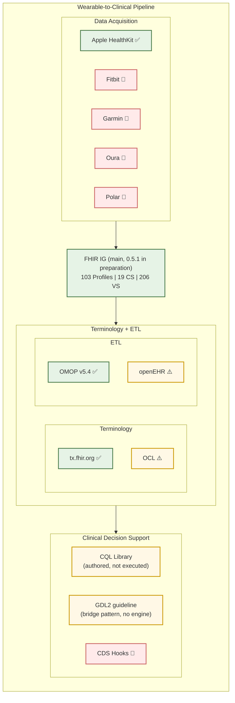
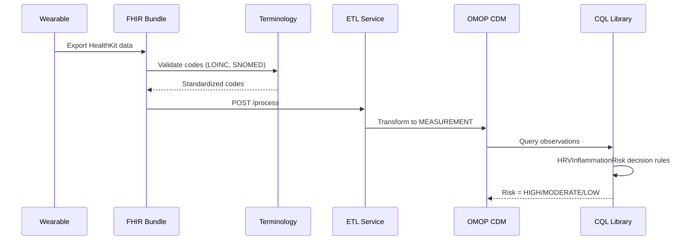
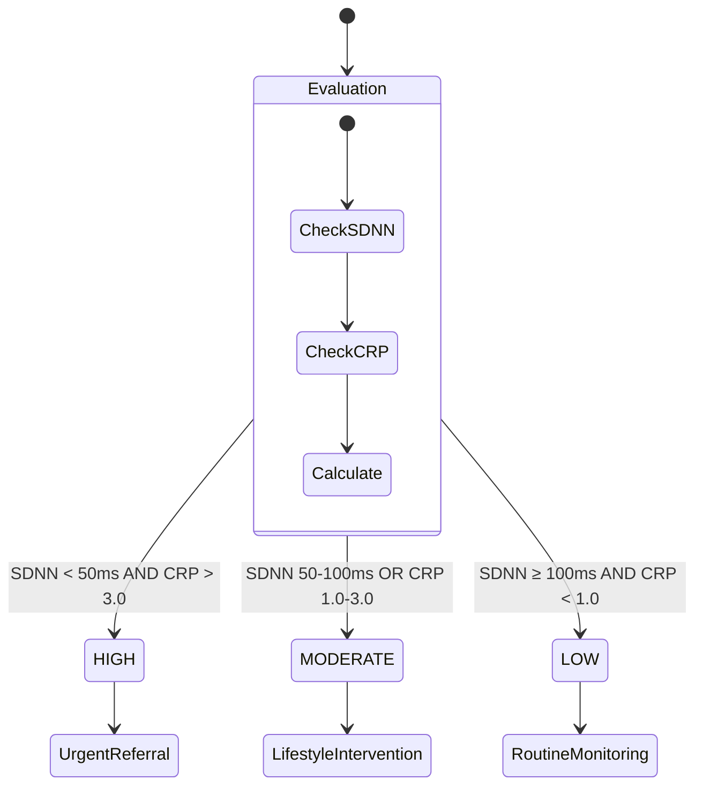
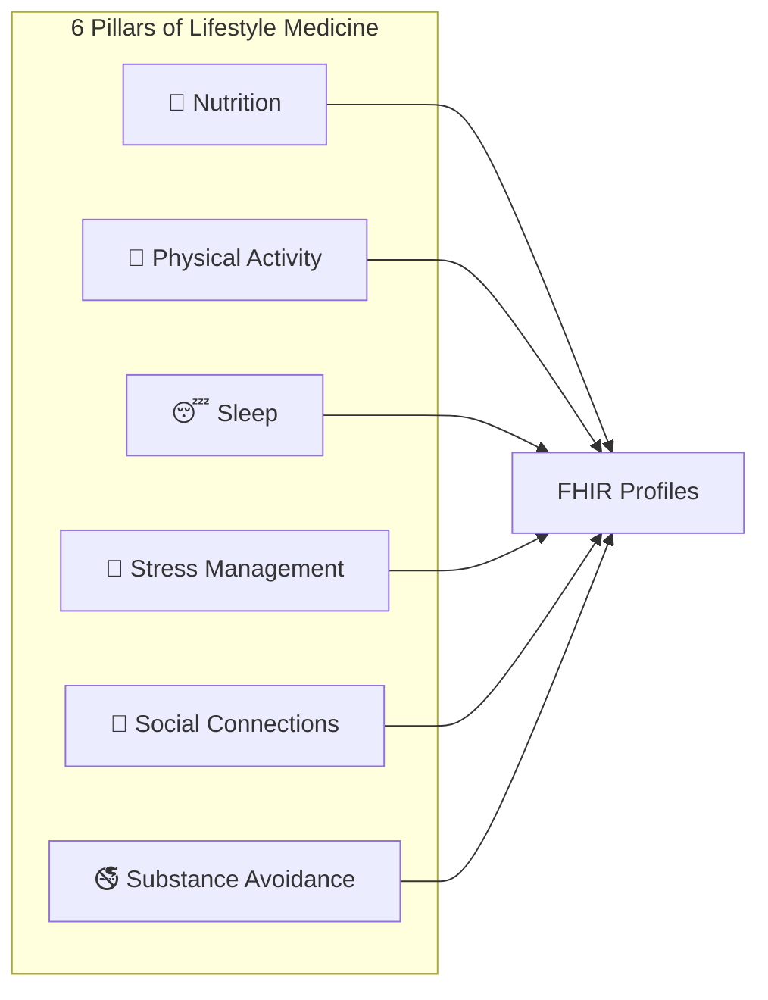

# iOS Lifestyle Medicine FHIR Implementation Guide

[](https://hl7.org/fhir/R4/)
[](https://confluence.hl7.org/display/FHIR/IG+Publisher+Documentation)
[](LICENSE)

**Version**: 0.5.0 (released 2026-09-16)
**Status**: STU1 Draft
**Publisher**: FMUP (Faculty of Medicine, University of Porto)
**Canonical**: `https://2rdoc.pt/ig/ios-lifestyle-medicine`

---

## Overview

This FHIR Implementation Guide provides a comprehensive framework for integrating wearable device data into clinical workflows, with focus on lifestyle medicine and preventive health. It enables semantic interoperability between consumer health devices (Apple Watch, Fitbit, Garmin, etc.) and clinical systems.

### Key Features

- **103 FHIR Profiles** for wearable observations, lifestyle metrics, AI/CDSS compliance, and regulatory (LGPD/CFM)
- **77 Extensions** for measurement context, provenance, and AI/CDSS metadata
- **19 CodeSystems** with custom codes for HRV/lifestyle metrics that lack LOINC/SNOMED (the documented terminology gap)
- **206 ValueSets** with LOINC, SNOMED CT, and vendor-specific bindings
- **29 ConceptMaps** for FHIR ↔ openEHR ↔ OMOP transformations
- **280 Instances** (192 examples, 29 ConceptMaps, round-trip validation bundles)
- **685 total artefacts** on `main` (0.5.1 in preparation; the v0.5.0 release held 682) (FHIR R4 4.0.1; v0.5.0 built with IG Publisher 2.2.10: err=0 / warn=223 — one advisory class, see [Known Issues](input/pagecontent/known-issues.md) / 0 broken links)
- **SMART on FHIR + CDS Hooks 2.0 + Bulk Data** + **CQL/GDL2** clinical decision support
- **openEHR + OMOP** round-trip transformations (ConceptMaps)

---

## Pipeline Architecture


```mermaid
flowchart TB
    subgraph WP["Wearable-to-Clinical Pipeline"]
        direction TB

        subgraph TG1["Data Acquisition"]
            direction LR
            APPLE["Apple HealthKit ✅"]
            FITBIT["Fitbit 🔴"]
            GARMIN["Garmin 🔴"]
            OURA["Oura 🔴"]
            POLAR["Polar 🔴"]
        end

        FHIRIG["FHIR IG (main, 0.5.1 in preparation)<br/>103 Profiles | 19 CS | 206 VS"]

        subgraph TG2["Terminology + ETL"]
            direction LR
            subgraph TERM["Terminology"]
                TXFHIR["tx.fhir.org ✅"]
                OCL["OCL ⚠️"]
            end
            subgraph ETL["ETL"]
                OMOP["OMOP v5.4 ✅"]
                OPENEHR["openEHR ⚠️"]
            end
        end

        subgraph TG4["Clinical Decision Support"]
            direction LR
            CQL["CQL Library<br/>(authored, not executed)"]
            GDL2["GDL2 guideline<br/>(bridge pattern, no engine)"]
            CDSHOOKS["CDS Hooks 🔴"]
        end
    end

    TG1 --> FHIRIG
    FHIRIG --> TG2
    TG2 --> TG4

    classDef done fill:#e6f3e6,stroke:#4a7c4a,stroke-width:2px,color:#333
    classDef partial fill:#fff8e6,stroke:#cc9900,stroke-width:2px,color:#333
    classDef todo fill:#ffeaea,stroke:#cc6666,stroke-width:2px,color:#333

    class APPLE,FHIRIG,TXFHIR,OMOP done
    class OCL,OPENEHR,CQL,GDL2 partial
    class FITBIT,GARMIN,OURA,POLAR,CDSHOOKS todo
```

---

## Data Flow


```mermaid
sequenceDiagram
    participant W as Wearable
    participant F as FHIR Bundle
    participant T as Terminology
    participant E as ETL Service
    participant O as OMOP CDM
    participant C as CQL Library

    W->>F: Export HealthKit data
    F->>T: Validate codes (LOINC, SNOMED)
    T-->>F: Standardized codes
    F->>E: POST /process
    E->>O: Transform to MEASUREMENT
    O->>C: Query observations
    C->>C: HRVInflammationRisk decision rules
    C-->>O: Risk = HIGH/MODERATE/LOW
```

> **Status of the CQL leg.** `HRVInflammationRisk.cql` is **authored and validated,
> but not executed by a CQL engine anywhere in this project.** Its decision logic is
> checked by a JavaScript test harness that re-implements the same rules against FHIR
> R4 test bundles; no CQL execution engine is invoked. The diagram above is the
> intended architecture, not a runtime trace. The CQL source and harness live in the
> companion HEADS-ETL work, not in this repository, which carries only the
> `Library` conformance resources that reference them.

---

## Artifact Summary

| Category | Count | Description |
|----------|:-----:|-------------|
| **Profiles** | 103 | Observation, Device, Patient, vital-signs, AI/CDSS profiles |
| **Extensions** | 77 | Custom FHIR extensions |
| **CodeSystems** | 19 | Content + external-stub CodeSystems |
| **ValueSets** | 206 | LOINC, SNOMED CT, custom bindings |
| **Instances** | 280 | 192 examples, 29 ConceptMaps, round-trip validation bundles |
| **Total** | **685** | All artefacts (main, 0.5.1 in preparation; v0.5.0 held 682; FHIR R4 4.0.1) — counted from the FSH sources by `.github/scripts/ig_counts.sh` |

### Build Validation (2026-09-16, v0.5.0 release)

| Metric | Value | Notes |
|--------|:-----:|-------|
| Errors | 0 | since v0.4.1 |
| Warnings | 223 | a single advisory class — each CodeSystem (19) and ValueSet (204 at v0.5.0; 206 on main) "should have an OID assigned", an optional identifier for OID-based terminology systems; left visible by design. The active suppressions are listed on the [Known Issues](input/pagecontent/known-issues.md) page |
| Information | 13,221 | |
| Broken Links | 0 | |
| Toolchain | IG Publisher 2.2.10 · SUSHI 3.18.1 · FHIR 4.0.1 | the CI builds with the latest publisher |

---

## Terminology Coverage

### LOINC Codes (HRV)

| Code | Description | Status |
|------|-------------|:------:|
| 80404-7 | R-R interval standard deviation (SDNN) | ✅ |
| 76643-6 | R-R interval standard deviation by EKG | ✅ |
| 76644-4 | R-R interval coefficient of variation | ✅ |
| — | RMSSD | ❌ Gap |
| — | pNN50 | ❌ Gap |
| — | LF/HF Ratio | ❌ Gap |

### Terminology Gaps

| Standard | Mapped | Gap | Coverage |
|----------|:------:|:---:|:--------:|
| LOINC (HRV) | 3 | 6 | 33% |
| LOINC (Other) | 34 | 4 | 89% |
| SNOMED CT | 45 | 12 | 79% |
| openEHR | 15% | 85% | 15% |

---

## Clinical Decision Support

### Risk Stratification Logic


```mermaid
stateDiagram-v2
    [*] --> Evaluation

    state Evaluation {
        [*] --> CheckSDNN
        CheckSDNN --> CheckCRP
        CheckCRP --> Calculate
    }

    Evaluation --> HIGH: SDNN < 50ms AND CRP > 3.0
    Evaluation --> MODERATE: SDNN 50-100ms OR CRP 1.0-3.0
    Evaluation --> LOW: SDNN ≥ 100ms AND CRP < 1.0

    HIGH --> UrgentReferral
    MODERATE --> LifestyleIntervention
    LOW --> RoutineMonitoring
```

### Thresholds

| Level | SDNN | hs-CRP | Action |
|-------|------|--------|--------|
| **HIGH** | < 50 ms | > 3.0 mg/L | Urgent cardiology referral |
| **MODERATE** | 50-100 ms | 1.0-3.0 mg/L | Lifestyle intervention |
| **LOW** | ≥ 100 ms | < 1.0 mg/L | Routine monitoring |

---

## Lifestyle Medicine: 6 Pillars


```mermaid
flowchart LR
    subgraph ACLM["6 Pillars of Lifestyle Medicine"]
        direction TB
        P1["🥗 Nutrition"]
        P2["🏃 Physical Activity"]
        P3["😴 Sleep"]
        P4["🧘 Stress Management"]
        P5["👥 Social Connections"]
        P6["🚭 Substance Avoidance"]
    end

    P1 --> FHIR["FHIR Profiles"]
    P2 --> FHIR
    P3 --> FHIR
    P4 --> FHIR
    P5 --> FHIR
    P6 --> FHIR
```

---

## Quick Start

### Prerequisites

- [SUSHI](https://fshschool.org/docs/sushi/) 3.x (v0.5.0 was built with 3.18.1)
- [IG Publisher](https://confluence.hl7.org/display/FHIR/IG+Publisher+Documentation) (v0.5.0 was built with 2.2.10; the CI downloads the latest release)
- Java 17 or later, and Jekyll (`gem install jekyll`) for the HTML rendering

### Build

```bash
# Clone repository
git clone https://github.com/RicardoLSantos/shorthand.git
cd shorthand

# Validate FSH (fast; this is what the CI runs first)
sushi .

# Full IG build — the same two steps the CI runs
mkdir -p input-cache
curl -L https://github.com/HL7/fhir-ig-publisher/releases/latest/download/publisher.jar -o input-cache/publisher.jar
java -Xmx4g -jar input-cache/publisher.jar -ig ig.ini
```

### Output

After build, the IG is available at:
- `output/index.html` - Main IG page
- `output/qa.html` - Quality Assurance report

(The HL7 `_genonce.sh` / `_updatePublisher.sh` wrapper scripts are not tracked in this repository; the two commands above are equivalent.)

---

## Documentation

| Resource | Link |
|----------|------|
| **IG Index** | `output/index.html` after a local build (no hosted site yet — see the [roadmap](input/pagecontent/implementation-scope-and-roadmap.md)) |
| **QA Report** | `output/qa.html` after a local build |
| **Full Package** | [GitHub Release v0.5.0](https://github.com/RicardoLSantos/shorthand/releases/tag/v0.5.0) (`package.tgz`, version 0.5.0) |
| **Change log** | [CHANGELOG.md](CHANGELOG.md) (mirrored on the [Changes](input/pagecontent/changes.md) page) |

---

## Project Structure

```
shorthand/
├── input/
│   ├── fsh/                   # 22 directories; the main ones:
│   │   ├── profiles/          #   103 FHIR profiles
│   │   ├── extensions/        #   77 extensions
│   │   ├── codesystems/, valuesets/, terminology/   # CodeSystems, ValueSets, ConceptMaps and external stubs
│   │   ├── mappings/          #   openEHR `Mapping:` blocks
│   │   ├── examples/          #   example instances
│   │   └── aliases.fsh        #   common aliases
│   ├── pagecontent/           # Narrative pages
│   ├── includes/              # CDS Hooks cards and shared fragments
│   ├── data/                  # terminology-verification-ledger.csv
│   └── images/                # Figures and diagrams
├── .github/workflows/         # CI: sushi-validate, ig-build, security audit
├── RS11_benchmark/            # Reproducible terminology-RAG benchmark toolkit
├── output/                    # Generated IG (local builds only; not tracked)
├── sushi-config.yaml          # SUSHI configuration
└── ig.ini                     # IG Publisher config
```

---

## Related Projects

| Project | Description |
|---------|-------------|
| HEADS-ETL | FHIR → OMOP transformation (R/Python) — companion pipeline |
| CQL Library | HRVInflammationRisk clinical decision rules |
| GDL2 Guidelines | openEHR-based decision support |

---

## Standards Roadmap

Status as of v0.5.0 (2026-09-16) — details on the [Implementation Scope and Roadmap](input/pagecontent/implementation-scope-and-roadmap.md) page:

| Track | Status | Interim mechanism |
|-------|--------|-------------------|
| LOINC submission (RMSSD, pNN50, LF/HF) | **Not submitted** | interim codes in `LifestyleMedicineTemporaryCS`, bridged to LOINC by `ConceptMapHRVToLOINC` (SDNN already has LOINC 80404-7) |
| openEHR CKM | **Not submitted** — the archetypes are catalogued with their status relative to the published CKM (see the [archetype catalog](input/pagecontent/openehr-archetypes-catalog.md)) | five element-level `Mapping:` blocks on the profiles whose archetype was developed for this IG |
| HL7 FHIR ballot | **Not started** | versioned GitHub releases (`package.tgz`) |

---

## Contributing

Contributions are welcome. Please:

1. Fork the repository
2. Create a feature branch
3. Run `sushi .` to validate
4. Submit a pull request

---

## License

This work is licensed under [CC-BY-4.0](https://creativecommons.org/licenses/by/4.0/).

---

## Citation

Please cite the published article (a `CITATION.cff` file is provided for the GitHub "Cite this repository" button):

```bibtex
@article{lourencosantos2026fhirig,
  author  = {Louren\c{c}o Santos, Ricardo and Cruz-Correia, Ricardo Jo\~{a}o},
  title   = {An {HL7 FHIR}{\textregistered} {IG} for lifestyle medicine in learning health systems: Multi-vendor wearable interoperability with documented terminology gaps},
  journal = {International Journal of Medical Informatics},
  year    = {2026},
  volume  = {217},
  pages   = {106465},
  doi     = {10.1016/j.ijmedinf.2026.106465}
}

@software{lourencosantos2026fhirig_repo,
  author  = {Louren\c{c}o Santos, Ricardo and Cruz-Correia, Ricardo Jo\~{a}o},
  title   = {{iOS} Lifestyle Medicine {FHIR} Implementation Guide},
  version = {0.5.0},
  year    = {2026},
  url     = {https://github.com/RicardoLSantos/shorthand}
}
```

---

## Found This Useful?

If this IG helps your work, please consider:

- **Star this repo** to help others discover it
- **Open a Discussion** to share your use case or ask questions
- **Fork** if you're adapting it for your own domain
- **Cite** using the BibTeX entry above

We track anonymous clone statistics via GitHub Insights — if you're using the IG in your work, we'd love to hear about it (open a Discussion).

### Stay Updated

This IG is actively developed as part of a PhD thesis at FMUP. To be notified of releases:

1. Click **Watch** (top right) and select "Releases only"
2. Or check the [terminology-RAG benchmark](RS11_benchmark/) for our reproducible terminology validation toolkit

---

## Contact

- **Author**: Ricardo Lourenço dos Santos
- **Institution**: Faculty of Medicine, University of Porto (FMUP)
- **Research Groups**: RISE-Health, MEDCIDS
- **Email**: ricardolourencosantos@gmail.com
- **ORCID**: [0000-0001-6017-8255](https://orcid.org/0000-0001-6017-8255)

---

*Last updated: 2026-09-16 (v0.5.0)*
