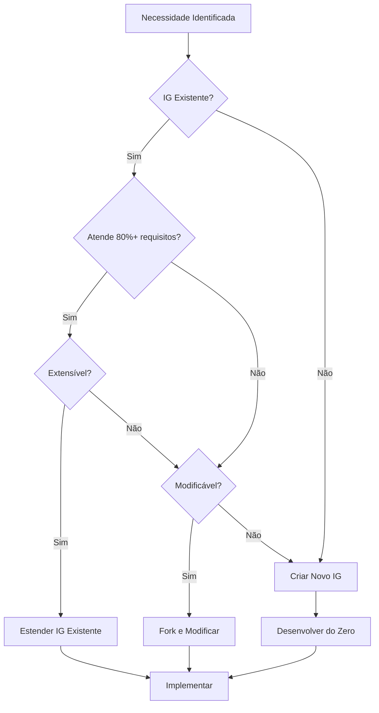

## 13. BUSCA E REUTILIZAÇÃO DE IGs EXISTENTES

### 13.1 Registros de Implementation Guides²⁴

Antes de criar um novo IG, sempre verifique se já existe um que atenda suas necessidades:

#### 13.1.1 FHIR Registry²⁵
```javascript
// Buscar IGs no FHIR Registry
async function searchExistingIGs(criteria) {
    const registryUrl = 'https://registry.fhir.org/api/v1';
    
    // Buscar por país/jurisdição
    const byJurisdiction = await fetch(
        `${registryUrl}/guides?jurisdiction=${criteria.country}`
    );
    
    // Buscar por domínio clínico
    const byDomain = await fetch(
        `${registryUrl}/guides?category=${criteria.domain}`
    );
    
    // Buscar por palavra-chave
    const byKeyword = await fetch(
        `${registryUrl}/search?q=${criteria.keyword}`
    );
    
    return {
        jurisdiction: await byJurisdiction.json(),
        domain: await byDomain.json(),
        keyword: await byKeyword.json()
    };
}
```

#### 13.1.2 Principais Repositórios²⁶
```yaml
ig_repositories:
  international:
    - name: "HL7 International"
      url: "https://hl7.org/fhir/extensions/registry.html"
      description: "IGs oficiais HL7"
      
    - name: "IHE Profiles"
      url: "https://profiles.ihe.net/"
      description: "Perfis IHE em FHIR"
      
    - name: "SMART App Gallery"
      url: "https://apps.smarthealthit.org/"
      description: "Apps e IGs SMART"
      
  national:
    usa:
      - "US Core": "http://hl7.org/fhir/us/core/"
      - "Da Vinci": "http://hl7.org/fhir/us/davinci/"
      - "CARIN": "http://hl7.org/fhir/us/carin/"
      
    brazil:
      - "RNDS": "https://rnds.saude.gov.br/fhir"
      - "BR Core": "http://hl7.org/fhir/br/core/"
      
    europe:
      - "EU Patient Summary": "https://hl7.eu/fhir/"
      
  clinical_domains:
    - "mCODE (Oncology)": "http://hl7.org/fhir/us/mcode/"
    - "Genomics": "http://hl7.org/fhir/uv/genomics-reporting/"
    - "PACIO (Post-Acute Care)": "http://hl7.org/fhir/us/pacio/"
```

### 13.2 Estratégias de Reutilização²⁷

#### 13.2.1 Herança de Perfis
```fsh
// Reutilizar perfil existente como base
Profile: MyOrganizationPatient
Parent: http://hl7.org/fhir/us/core/StructureDefinition/us-core-patient
Id: my-org-patient
Title: "My Organization Patient"
Description: "Extends US Core Patient for our organization"

// Adicionar apenas requisitos específicos
* identifier contains 
    internalMRN 1..1 MS
* identifier[internalMRN].system = "http://myorg.com/mrn"
* identifier[internalMRN].value 1..1

// Reutilizar extensões existentes
* extension contains
    http://hl7.org/fhir/us/core/StructureDefinition/us-core-race named race 0..1 MS and
    http://hl7.org/fhir/us/core/StructureDefinition/us-core-ethnicity named ethnicity 0..1 MS
```

#### 13.2.2 Importação de Terminologias
```fsh
// Importar ValueSets de outros IGs
Alias: $USCoreCondition = http://hl7.org/fhir/us/core/ValueSet/us-core-condition-code

Profile: MyCondition
Parent: Condition
* code from $USCoreCondition (extensible)

// Criar ValueSet que inclui outro
ValueSet: ExtendedConditions
Id: extended-conditions
Title: "Extended Condition Codes"
* include codes from valueset $USCoreCondition
* include codes from system $SCT where concept is-a #404684003 // Clinical finding
```

### 13.3 Avaliação de IGs Existentes²⁸

```javascript
// Framework para avaliar IGs existentes
class IGEvaluator {
    evaluate(ig) {
        const criteria = {
            maturity: this.assessMaturity(ig),
            coverage: this.assessCoverage(ig),
            compatibility: this.assessCompatibility(ig),
            maintenance: this.assessMaintenance(ig),
            adoption: this.assessAdoption(ig)
        };
        
        return {
            score: this.calculateScore(criteria),
            recommendation: this.getRecommendation(criteria),
            gaps: this.identifyGaps(criteria)
        };
    }
    
    assessMaturity(ig) {
        // Verificar status de maturidade
        const maturityLevels = {
            'draft': 1,
            'trial-use': 2,
            'normative': 3,
            'informative': 2
        };
        
        return {
            level: ig.status,
            score: maturityLevels[ig.status] || 0,
            isStable: ig.status === 'normative'
        };
    }
    
    assessCoverage(ig) {
        // Verificar cobertura de requisitos
        const requiredProfiles = ['Patient', 'Practitioner', 'Organization'];
        const coverage = requiredProfiles.filter(p => 
            ig.profiles.some(profile => profile.type === p)
        ).length / requiredProfiles.length;
        
        return {
            percentage: coverage * 100,
            missingProfiles: requiredProfiles.filter(p => 
                !ig.profiles.some(profile => profile.type === p)
            )
        };
    }
}
```

## 14. MIGRAÇÃO ENTRE VERSÕES FHIR

### 14.1 FHIR R4 vs R5²⁹

#### 14.1.1 Principais Diferenças
```yaml
fhir_version_differences:
  r4_to_r5:
    new_resources:
      - SubscriptionTopic
      - InventoryReport
      - Permission
      - Requirements
      
    renamed_resources:
      - MedicinalProduct -> MedicinalProductDefinition
      - DeviceUseStatement -> DeviceUsage
      
    structural_changes:
      Patient:
        - "gender -> sex (com novo elemento gender-identity)"
        - "contact.relationship cardinalidade mudou"
        
      Observation:
        - "hasMember agora pode referenciar outros tipos"
        - "derivedFrom expandido"
        
      Bundle:
        - "timestamp agora é instant (era dateTime)"
        
    new_features:
      - "Subscriptions melhoradas (SubscriptionTopic)"
      - "Permissões granulares (Permission)"
      - "Suporte melhorado para workflows"
```

#### 14.1.2 Conversão R4 para R5³⁰
```javascript
// Conversor R4 para R5
class FHIR_R4_to_R5_Converter {
    convertResource(r4Resource) {
        const r5Resource = { ...r4Resource };
        
        switch(r4Resource.resourceType) {
            case 'Patient':
                return this.convertPatient(r5Resource);
            case 'Observation':
                return this.convertObservation(r5Resource);
            case 'MedicinalProduct':
                r5Resource.resourceType = 'MedicinalProductDefinition';
                return this.convertMedicinalProduct(r5Resource);
            default:
                return r5Resource;
        }
    }
    
    convertPatient(patient) {
        // Converter gender para sex
        if (patient.gender) {
            patient.sex = {
                text: patient.gender
            };
            
            // Preservar gender como extension se necessário
            patient.extension = patient.extension || [];
            patient.extension.push({
                url: 'http://hl7.org/fhir/StructureDefinition/patient-genderIdentity',
                valueCodeableConcept: {
                    coding: [{
                        system: 'http://hl7.org/fhir/gender-identity',
                        code: patient.gender
                    }]
                }
            });
            
            delete patient.gender;
        }
        
        return patient;
    }
    
    convertObservation(observation) {
        // Expandir hasMember se necessário
        if (observation.hasMember) {
            observation.hasMember = observation.hasMember.map(ref => {
                if (typeof ref === 'string') {
                    return { reference: ref };
                }
                return ref;
            });
        }
        
        return observation;
    }
}
```

### 14.2 Desenvolvimento Multi-Versão³¹

#### 14.2.1 IG com Suporte R4 e R5
```yaml
# sushi-config.yaml para multi-versão
fhirVersion: 
  - 4.0.1
  - 5.0.0

# Perfis específicos por versão
groups:
  R4:
    name: "R4 Profiles"
    description: "Profiles for FHIR R4"
    resources:
      - StructureDefinition/patient-r4
      - ValueSet/conditions-r4
      
  R5:
    name: "R5 Profiles"
    description: "Profiles for FHIR R5"
    resources:
      - StructureDefinition/patient-r5
      - ValueSet/conditions-r5
```

#### 14.2.2 FSH com Conditional Features³²
```fsh
// Profile com diferenças entre versões
Profile: MultiVersionPatient
Parent: Patient
Id: multi-version-patient
Title: "Multi-Version Patient"
Description: "Patient profile compatible with R4 and R5"

// Elementos comuns
* identifier 1..* MS
* name 1..* MS
* birthDate 1..1 MS

// Conditional para R4
// #if fhirVersion = 4.0.1
* gender 1..1 MS
* gender from http://hl7.org/fhir/ValueSet/administrative-gender (required)
// #endif

// Conditional para R5
// #if fhirVersion >= 5.0.0
* sex 1..1 MS
* sex from http://hl7.org/fhir/ValueSet/administrative-sex (required)
// #endif
```

### 14.3 Estratégia de Migração³³

#### 14.3.1 Plano de Migração
```javascript
class IGMigrationPlan {
    constructor(currentVersion, targetVersion) {
        this.current = currentVersion;
        this.target = targetVersion;
        this.steps = [];
    }
    
    generatePlan() {
        // 1. Análise de impacto
        this.steps.push({
            phase: 'analysis',
            tasks: [
                'Identificar recursos afetados',
                'Mapear mudanças estruturais',
                'Avaliar breaking changes',
                'Estimar esforço'
            ]
        });
        
        // 2. Preparação
        this.steps.push({
            phase: 'preparation',
            tasks: [
                'Criar branch de migração',
                'Configurar ambiente de teste',
                'Preparar conversores',
                'Documentar mudanças'
            ]
        });
        
        // 3. Migração
        this.steps.push({
            phase: 'migration',
            tasks: [
                'Converter profiles',
                'Atualizar terminologias',
                'Migrar exemplos',
                'Ajustar testes'
            ]
        });
        
        // 4. Validação
        this.steps.push({
            phase: 'validation',
            tasks: [
                'Executar validador FHIR',
                'Rodar testes de regressão',
                'Validar com stakeholders',
                'Corrigir issues'
            ]
        });
        
        // 5. Deployment
        this.steps.push({
            phase: 'deployment',
            tasks: [
                'Publicar versão beta',
                'Period de transição',
                'Deprecar versão antiga',
                'Go-live'
            ]
        });
        
        return this.steps;
    }
    
    estimateEffort() {
        const complexity = {
            'simple': 2,  // semanas
            'medium': 6,  // semanas
            'complex': 12 // semanas
        };
        
        // Calcular complexidade baseado em fatores
        const factors = {
            numberOfProfiles: this.profiles.length,
            customExtensions: this.extensions.length,
            breakingChanges: this.identifyBreakingChanges().length,
            dependencies: this.dependencies.length
        };
        
        let score = 0;
        if (factors.numberOfProfiles > 20) score += 3;
        else if (factors.numberOfProfiles > 10) score += 2;
        else score += 1;
        
        if (factors.customExtensions > 10) score += 3;
        else if (factors.customExtensions > 5) score += 2;
        else score += 1;
        
        if (factors.breakingChanges > 5) score += 3;
        else if (factors.breakingChanges > 2) score += 2;
        else score += 1;
        
        if (score >= 7) return complexity.complex;
        if (score >= 4) return complexity.medium;
        return complexity.simple;
    }
}
```

### 14.4 Testes Cross-Version³⁴

```javascript
// Framework de testes para múltiplas versões
describe('Cross-Version Compatibility', () => {
    const versions = ['4.0.1', '4.3.0', '5.0.0'];
    
    versions.forEach(version => {
        describe(`FHIR ${version}`, () => {
            let validator;
            
            beforeEach(() => {
                validator = new FHIRValidator(version);
            });
            
            it('Should validate patient profile', async () => {
                const patient = loadProfile('Patient', version);
                const result = await validator.validate(patient);
                
                expect(result.valid).toBe(true);
                expect(result.errors).toHaveLength(0);
            });
            
            it('Should convert between versions', async () => {
                if (version !== '5.0.0') {
                    const r4Resource = loadExample('Patient', version);
                    const r5Resource = converter.toR5(r4Resource);
                    
                    const r5Validator = new FHIRValidator('5.0.0');
                    const result = await r5Validator.validate(r5Resource);
                    
                    expect(result.valid).toBe(true);
                }
            });
        });
    });
});
```

## 15. MELHORES PRÁTICAS

### 15.1 Checklist para Novo IG³⁵
- [ ] Pesquisar IGs existentes em todos os registros
- [ ] Avaliar possibilidade de extensão vs novo IG
- [ ] Verificar compatibilidade de versão FHIR
- [ ] Identificar dependências e compatibilidade
- [ ] Planejar estratégia de versionamento
- [ ] Considerar retrocompatibilidade
- [ ] Documentar decisões de design

### 15.2 Decisão: Reutilizar ou Criar Novo³⁶



## 16. REFERÊNCIAS ATUALIZADAS

24. FHIR Registry. Implementation Guide Registry. https://registry.fhir.org/
25. HL7. FHIR Extension Registry. https://hl7.org/fhir/extensions/registry.html
26. IHE. IHE Profile Registry. https://profiles.ihe.net/
27. HL7. Profiling FHIR. http://hl7.org/fhir/profiling.html
28. HL7. IG Publisher Documentation. https://confluence.hl7.org/display/FHIR/IG+Publisher+Documentation
29. HL7. FHIR R5 Release. http://hl7.org/fhir/R5/
30. HL7. Version Management Policy. http://hl7.org/fhir/versions.html
31. HL7. Multi-Version Implementation Guides. https://confluence.hl7.org/display/FHIR/Multi-Version+IGs
32. FSH. Conditional Compilation. https://build.fhir.org/ig/HL7/fhir-shorthand/reference.html#conditional-compilation
33. HL7. Migration Strategies. http://hl7.org/fhir/versions.html#migration
34. HL7. Cross-Version Analysis. http://hl7.org/fhir/diff.html
35. HL7. IG Best Practices. https://confluence.hl7.org/display/FHIR/IG+Best+Practices
36. HL7. Reuse Guidelines. http://hl7.org/fhir/reuse.html

---
**Documento aprovado por:** [Comitê de Arquitetura e Integração]  
**Data de vigência:** 2024-2025  
**Próxima revisão:** Janeiro 2026# SOP-001: Fundamentos de Implementation Guides FHIR
**Standard Operating Procedure para Desenvolvimento de HL7 FHIR Implementation Guides**

## 1. INTRODUÇÃO E PROPÓSITO

### 1.1 Objetivo
Este documento estabelece os procedimentos padrão para o desenvolvimento de Implementation Guides (IGs) FHIR, garantindo conformidade com as especificações HL7 International e suas afiliadas.

### 1.2 Escopo
Aplicável a todos os projetos de desenvolvimento de IGs FHIR, incluindo perfis nacionais, domínios específicos de conhecimento, comunidades de implementação e produtos específicos.

### 1.3 Referências Normativas
- HL7 FHIR R5 Specification¹: http://hl7.org/fhir/R5/
- FHIR Implementation Guide Resource²: http://hl7.org/fhir/R5/implementationguide.html
- FHIR IG Publishing Requirements³: https://wiki.hl7.org/FHIR_Implementation_Guide_Publishing_Requirements
- FHIR Shorthand Specification⁴: https://build.fhir.org/ig/HL7/fhir-shorthand/

## 2. DEFINIÇÕES E CONCEITOS FUNDAMENTAIS

### 2.1 Implementation Guide (IG)
Um IG FHIR é um conjunto de regras computáveis e documentação narrativa que determina como solucionar problemas específicos de interoperabilidade usando recursos FHIR⁵.

### 2.2 Categorias de IGs
Conforme definido por Grahame Grieve⁶:

1. **National Base IGs**: Descrevem como regulamentações nacionais se aplicam no contexto FHIR
2. **Domain of Knowledge IGs**: Representam conceitos clínicos ou de negócio sem definir APIs
3. **Community of Implementation**: Acordos sobre troca de dados entre atores específicos
4. **Product IGs**: Documentam funcionalidades de software específico

### 2.3 Componentes Essenciais
- **Profiles**: Restrições em recursos FHIR base
- **Extensions**: Elementos adicionais para dados não cobertos pelo padrão
- **ValueSets**: Conjuntos de valores permitidos para elementos codificados
- **CodeSystems**: Sistemas de códigos customizados
- **Examples**: Instâncias de recursos conformes
- **NamingSystems**: Identificadores únicos para sistemas

## 3. ESTRUTURA DE DIRETÓRIOS

### 3.1 Estrutura Padrão FSH/SUSHI⁷
```
IG-Project/
├── input/
│   ├── fsh/                    # Arquivos FSH
│   │   ├── aliases.fsh         # Definições de aliases
│   │   ├── profiles/           # Perfis de recursos
│   │   ├── extensions/         # Extensões customizadas
│   │   ├── valuesets/          # Conjuntos de valores
│   │   ├── codesystems/        # Sistemas de códigos
│   │   ├── examples/           # Exemplos
│   │   └── invariants/         # Regras de validação
│   ├── pagecontent/           # Conteúdo narrativo (Markdown)
│   └── images/                # Imagens e diagramas
├── fsh-generated/             # Saída do SUSHI (não editar)
├── output/                    # IG publicado (não editar)
├── sushi-config.yaml          # Configuração do projeto
├── ig.ini                     # Configuração do IG Publisher
└── _genonce.sh/.bat          # Scripts de build
```

### 3.2 Convenções de Nomenclatura
- Arquivos FSH: `[tipo]-[domínio].fsh`
  - Exemplo: `profile-patient.fsh`, `valueset-conditions.fsh`
- IDs de recursos: `[projeto]-[tipo]-[nome]`
  - Exemplo: `br-core-patient`, `us-core-condition`

## 4. DESENVOLVIMENTO DE PROFILES

### 4.1 Sintaxe FSH para Profiles⁸
```fsh
Profile: [NomeDoPerfil]
Parent: [RecursoBase ou PerfilPai]
Id: [id-único]
Title: "[Título Legível]"
Description: "[Descrição Detalhada]"
* [elemento] [cardinalidade] [flags] "[descrição]"
```

### 4.2 Flags de Conformidade
- **MS (MustSupport)**: Elemento deve ser suportado
- **?!**: Modificador (altera significado se presente)
- **SU (Summary)**: Incluído em resumos

### 4.3 Exemplo Prático
```fsh
Profile: BRPatient
Parent: Patient
Id: br-patient
Title: "Paciente Brasileiro"
Description: "Perfil de Paciente para o contexto brasileiro"
* identifier 1..* MS
* identifier ^slicing.discriminator.type = #pattern
* identifier ^slicing.discriminator.path = "type"
* identifier ^slicing.rules = #open
* identifier contains cpf 1..1 MS
* identifier[cpf].system = "http://rnds.saude.gov.br/fhir/r4/NamingSystem/cpf"
* identifier[cpf].type = http://terminology.hl7.org/CodeSystem/v2-0203#TAX
* birthDate 1..1 MS
* address.state from http://hl7.org/fhir/ValueSet/br-estados (required)
```

## 5. DESENVOLVIMENTO DE EXTENSIONS

### 5.1 Quando Criar Extensions⁹
- Dados necessários não existem no recurso base
- Extensão padrão FHIR não atende necessidade
- Dados não podem ser derivados

### 5.2 Estrutura de Extension
```fsh
Extension: [NomeExtension]
Id: [id-extension]
Title: "[Título]"
Description: "[Descrição do uso]"
Context: [Recurso(s) onde se aplica]
* value[x] only [tipo de dado]
* value[x] 1..1
```

## 6. PROCESSO DE BUILD E PUBLICAÇÃO

### 6.1 Ferramentas Necessárias¹⁰
1. **SUSHI**: Compilador FSH (npm install -g fsh-sushi)
2. **IG Publisher**: Publicador HL7 (Java required)
3. **Validator**: Validador FHIR

### 6.2 Comandos de Build
```bash
# Compilar FSH para JSON
sushi .

# Gerar IG completo
./_genonce.sh  # Linux/Mac
_genonce.bat   # Windows

# Validar recursos
java -jar validator_cli.jar [arquivo] -ig [ig-package]
```

### 6.3 Validação de Qualidade
- Verificar arquivo `output/qa.html` após build
- Resolver todos os erros antes de publicar
- Warnings devem ser justificados em `input/ignoreWarnings.txt`

## 7. VERSIONAMENTO E MANUTENÇÃO

### 7.1 Semantic Versioning¹¹
- **Major (X.0.0)**: Mudanças incompatíveis
- **Minor (0.X.0)**: Novas funcionalidades compatíveis
- **Patch (0.0.X)**: Correções de bugs

### 7.2 Estados de Maturidade
1. **Draft**: Em desenvolvimento
2. **Trial Use**: Teste de implementação
3. **Normative**: Estável e aprovado
4. **Deprecated**: Descontinuado

## 8. CONFORMIDADE E TESTES

### 8.1 Níveis de Conformidade¹²
- **SHALL**: Obrigatório
- **SHOULD**: Recomendado
- **MAY**: Opcional

### 8.2 Testes de Conformidade
```bash
# Validar instância contra perfil
java -jar validator_cli.jar [instancia.json] -profile [url-perfil]

# Testar servidor FHIR
java -jar validator_cli.jar -txTests [servidor]/metadata
```

## 9. DOCUMENTAÇÃO NARRATIVA

### 9.1 Páginas Obrigatórias¹³
- **index.md**: Página inicial com visão geral
- **profiles.md**: Lista e descrição de perfis
- **terminology.md**: Sistemas de códigos e valuesets
- **downloads.md**: Pacotes para download
- **changes.md**: Histórico de mudanças

### 9.2 Formato Markdown
```markdown
### Título da Seção
Descrição do conteúdo com referência a perfil: [NomePerfil](StructureDefinition-[id-perfil].html)

#### Requisitos de Negócio
- Requisito 1
- Requisito 2

#### Exemplo de Uso
```json
{
  "resourceType": "Patient",
  "id": "exemplo"
}
```
```

## 10. INTEGRAÇÃO COM PADRÕES EXTERNOS

### 10.1 Harmonização com IGs Internacionais¹⁴
- **IPS (International Patient Summary)**: http://hl7.org/fhir/uv/ips/
- **US Core**: http://hl7.org/fhir/us/core/
- **AU Base**: http://hl7.org.au/fhir/

### 10.2 Reutilização de Componentes
```fsh
// Importar perfil de outro IG
Profile: MyPatient
Parent: http://hl7.org/fhir/us/core/StructureDefinition/us-core-patient
```

## 11. CHECKLIST DE PUBLICAÇÃO

### 11.1 Pré-Publicação
- [ ] Todos os testes passando
- [ ] QA report sem erros críticos
- [ ] Documentação completa
- [ ] Exemplos validados
- [ ] Versão atualizada em sushi-config.yaml
- [ ] Change log atualizado

### 11.2 Publicação
- [ ] Build final executado
- [ ] Package gerado
- [ ] Upload para servidor de publicação
- [ ] Registro no registry FHIR
- [ ] Notificação à comunidade

## 12. REFERÊNCIAS

1. HL7 International. FHIR R5 Specification. Disponível em: http://hl7.org/fhir/R5/
2. HL7 International. Resource ImplementationGuide. Disponível em: http://hl7.org/fhir/R5/implementationguide.html
3. HL7 Wiki. FHIR Implementation Guide Publishing Requirements. Disponível em: https://wiki.hl7.org/FHIR_Implementation_Guide_Publishing_Requirements
4. HL7 International. FHIR Shorthand Specification. Disponível em: https://build.fhir.org/ig/HL7/fhir-shorthand/
5. MITRE. FSH School - Part 1: Reading an IG. Disponível em: https://fshschool.org/courses/fsh-seminar/01-reading-an-ig.html
6. Grieve, G. FHIR Implementation Guide Purposes. HL7 FHIR DevDays Presentation. 2021.
7. MITRE. FSH Quick Start Guide. Disponível em: https://fshschool.org/quickstart/
8. HL7 International. FHIR Shorthand Quick Reference. Version 3.0.0.
9. HL7 International. Extending FHIR. Disponível em: http://hl7.org/fhir/R5/extensibility.html
10. KRAMER, M. & MOESEL, C. Tutorial: Create an Implementation Guide with FHIR Shorthand. HL7 FHIR DevDays 2021.
11. HL7 International. FHIR Versioning. Disponível em: http://hl7.org/fhir/R5/versioning.html
12. HL7 International. Conformance Rules. Disponível em: http://hl7.org/fhir/R5/conformance-rules.html
13. HL7 International. IG Publisher Documentation. Disponível em: https://confluence.hl7.org/display/FHIR/IG+Publisher+Documentation
14. HL7 International. International Patient Summary Implementation Guide. Disponível em: http://hl7.org/fhir/uv/ips/

---
**Documento aprovado por:** [Gerência de Interoperabilidade]  
**Data de vigência:** 2024-2025  
**Próxima revisão:** Janeiro 2026