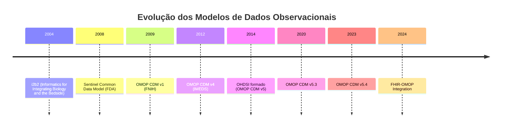

# SOP-005: OMOP CDM e Análise de Dados com FHIR IGs
**Standard Operating Procedure para Integração OMOP Common Data Model com Implementation Guides FHIR**

## 1. INTRODUÇÃO

### 1.1 Objetivo
Estabelecer procedimentos para integração entre OMOP CDM (Observational Medical Outcomes Partnership Common Data Model) e FHIR IGs, facilitando análises observacionais e pesquisa em mundo real.

### 1.2 Escopo
Aplicável a projetos de análise de dados observacionais, estudos de coorte, farmacovigilância e pesquisa de efetividade comparativa usando dados harmonizados.

### 1.3 Referências Fundamentais
- OHDSI Documentation¹: https://ohdsi.github.io/TheBookOfOhdsi/
- OMOP CDM v5.4²: https://ohdsi.github.io/CommonDataModel/
- FHIR to OMOP Mapping³: https://build.fhir.org/ig/HL7/fhir-omop-ig/
- Sentinel Initiative⁴: https://www.sentinelinitiative.org/
- i2b2 (Predecessor)⁵: https://www.i2b2.org/

## 2. FUNDAMENTOS OMOP CDM

### 2.1 Evolução Histórica⁶

#### 2.1.1 Antecessores do OMOP


#### 2.1.2 Benefícios da Integração OMOP-FHIR⁷
1. **Interoperabilidade**: FHIR para troca de dados
2. **Análise**: OMOP para pesquisa observacional
3. **Padronização**: Vocabulários harmonizados
4. **Escalabilidade**: Análises em rede distribuída
5. **Reprodutibilidade**: Estudos padronizados

### 2.2 Estrutura do OMOP CDM⁸

#### 2.2.1 Domínios Principais
```sql
-- Estrutura básica OMOP CDM v5.4
CREATE SCHEMA omop;

-- Domínio Clínico
CREATE TABLE omop.person (
    person_id INTEGER PRIMARY KEY,
    gender_concept_id INTEGER NOT NULL,
    year_of_birth INTEGER NOT NULL,
    month_of_birth INTEGER,
    day_of_birth INTEGER,
    birth_datetime TIMESTAMP,
    race_concept_id INTEGER NOT NULL,
    ethnicity_concept_id INTEGER NOT NULL,
    location_id INTEGER,
    provider_id INTEGER,
    care_site_id INTEGER,
    person_source_value VARCHAR(50),
    gender_source_value VARCHAR(50),
    race_source_value VARCHAR(50),
    ethnicity_source_value VARCHAR(50)
);

CREATE TABLE omop.observation_period (
    observation_period_id INTEGER PRIMARY KEY,
    person_id INTEGER NOT NULL,
    observation_period_start_date DATE NOT NULL,
    observation_period_end_date DATE NOT NULL,
    period_type_concept_id INTEGER NOT NULL,
    FOREIGN KEY (person_id) REFERENCES omop.person(person_id)
);

CREATE TABLE omop.condition_occurrence (
    condition_occurrence_id INTEGER PRIMARY KEY,
    person_id INTEGER NOT NULL,
    condition_concept_id INTEGER NOT NULL,
    condition_start_date DATE NOT NULL,
    condition_start_datetime TIMESTAMP,
    condition_end_date DATE,
    condition_end_datetime TIMESTAMP,
    condition_type_concept_id INTEGER NOT NULL,
    stop_reason VARCHAR(20),
    provider_id INTEGER,
    visit_occurrence_id INTEGER,
    condition_source_value VARCHAR(50),
    condition_source_concept_id INTEGER,
    condition_status_source_value VARCHAR(50),
    condition_status_concept_id INTEGER
);
```

#### 2.2.2 Vocabulários Padronizados
```sql
-- Tabelas de vocabulário
CREATE TABLE omop.concept (
    concept_id INTEGER PRIMARY KEY,
    concept_name VARCHAR(255) NOT NULL,
    domain_id VARCHAR(20) NOT NULL,
    vocabulary_id VARCHAR(20) NOT NULL,
    concept_class_id VARCHAR(20) NOT NULL,
    standard_concept VARCHAR(1),
    concept_code VARCHAR(50) NOT NULL,
    valid_start_date DATE NOT NULL,
    valid_end_date DATE NOT NULL,
    invalid_reason VARCHAR(1)
);

CREATE TABLE omop.concept_relationship (
    concept_id_1 INTEGER NOT NULL,
    concept_id_2 INTEGER NOT NULL,
    relationship_id VARCHAR(20) NOT NULL,
    valid_start_date DATE NOT NULL,
    valid_end_date DATE NOT NULL,
    invalid_reason VARCHAR(1)
);

CREATE TABLE omop.concept_ancestor (
    ancestor_concept_id INTEGER NOT NULL,
    descendant_concept_id INTEGER NOT NULL,
    min_levels_of_separation INTEGER NOT NULL,
    max_levels_of_separation INTEGER NOT NULL
);
```

## 3. MAPEAMENTO FHIR-OMOP

### 3.1 Estratégias de ETL⁹

#### 3.1.1 FHIR Resources para OMOP Tables
```javascript
class FHIRToOMOPMapper {
    constructor(omopDb, fhirClient) {
        this.omop = omopDb;
        this.fhir = fhirClient;
        this.conceptMapper = new ConceptMapper();
    }
```

### 6.2 ACHILLES¹⁶

```r
# Executar ACHILLES para caracterização do CDM
library(Achilles)

achilles(
  connectionDetails = connectionDetails,
  cdmDatabaseSchema = "omop",
  resultsDatabaseSchema = "achilles_results",
  sourceName = "MyDataSource",
  createTable = TRUE,
  smallCellCount = 5,
  cdmVersion = "5.4",
  runHeel = TRUE,
  runCostAnalysis = FALSE
)

# Exportar resultados para JSON
exportToJson(
  connectionDetails = connectionDetails,
  cdmDatabaseSchema = "omop",
  resultsDatabaseSchema = "achilles_results",
  outputPath = "achilles_results"
)
```

## 7. QUALIDADE DE DADOS

### 7.1 Data Quality Dashboard¹⁷

```sql
-- Verificações de qualidade de dados
-- Baseado no OHDSI Data Quality Dashboard

-- Completude
SELECT 
    'person' as table_name,
    'gender_concept_id' as field_name,
    COUNT(*) as total_records,
    SUM(CASE WHEN gender_concept_id IS NULL OR gender_concept_id = 0 THEN 1 ELSE 0 END) as null_count,
    ROUND(100.0 * SUM(CASE WHEN gender_concept_id IS NULL OR gender_concept_id = 0 THEN 1 ELSE 0 END) / COUNT(*), 2) as null_percentage
FROM omop.person
UNION ALL
SELECT 
    'condition_occurrence',
    'condition_concept_id',
    COUNT(*),
    SUM(CASE WHEN condition_concept_id = 0 THEN 1 ELSE 0 END),
    ROUND(100.0 * SUM(CASE WHEN condition_concept_id = 0 THEN 1 ELSE 0 END) / COUNT(*), 2)
FROM omop.condition_occurrence;

-- Conformidade
SELECT 
    'Invalid concept mappings' as check_name,
    COUNT(*) as failed_records
FROM omop.condition_occurrence co
LEFT JOIN omop.concept c ON co.condition_concept_id = c.concept_id
WHERE c.concept_id IS NULL OR c.invalid_reason IS NOT NULL;

-- Plausibilidade
SELECT 
    'Future dates' as check_name,
    COUNT(*) as failed_records
FROM omop.condition_occurrence
WHERE condition_start_date > CURRENT_DATE;
```

### 7.2 Métricas de Mapeamento¹⁸

```python
# Análise de qualidade do mapeamento FHIR-OMOP
import pandas as pd
import numpy as np
from sqlalchemy import create_engine

class MappingQualityAnalyzer:
    def __init__(self, omop_engine, fhir_client):
        self.omop = omop_engine
        self.fhir = fhir_client
    
    def analyze_concept_coverage(self):
        """Analisa cobertura de conceitos mapeados"""
        
        query = """
        SELECT 
            vocabulary_id,
            COUNT(*) as total_concepts,
            SUM(CASE WHEN standard_concept = 'S' THEN 1 ELSE 0 END) as standard_concepts,
            SUM(CASE WHEN concept_id IN (
                SELECT DISTINCT condition_source_concept_id 
                FROM omop.condition_occurrence
                WHERE condition_source_concept_id != 0
            ) THEN 1 ELSE 0 END) as used_concepts
        FROM omop.concept
        WHERE invalid_reason IS NULL
        GROUP BY vocabulary_id
        """
        
        df = pd.read_sql(query, self.omop)
        df['coverage_rate'] = df['used_concepts'] / df['total_concepts'] * 100
        
        return df
    
    def validate_temporal_consistency(self):
        """Valida consistência temporal entre FHIR e OMOP"""
        
        # Comparar datas entre sistemas
        fhir_conditions = self.fhir.search('Condition', {
            '_count': 1000
        })
        
        fhir_dates = []
        for entry in fhir_conditions.entry:
            if entry.resource.onsetDateTime:
                fhir_dates.append({
                    'id': entry.resource.id,
                    'date': entry.resource.onsetDateTime
                })
        
        fhir_df = pd.DataFrame(fhir_dates)
        
        omop_query = """
        SELECT 
            condition_source_value as id,
            condition_start_date as date
        FROM omop.condition_occurrence
        WHERE condition_source_value IN ({})
        """.format(','.join([f"'{id}'" for id in fhir_df['id']]))
        
        omop_df = pd.read_sql(omop_query, self.omop)
        
        # Comparar datas
        merged = pd.merge(fhir_df, omop_df, on='id', suffixes=('_fhir', '_omop'))
        merged['date_match'] = merged['date_fhir'] == merged['date_omop']
        
        consistency_rate = merged['date_match'].mean() * 100
        
        return {
            'total_records': len(merged),
            'matching_dates': merged['date_match'].sum(),
            'consistency_rate': consistency_rate
        }
```

## 8. CASOS DE USO AVANÇADOS

### 8.1 Farmacovigilância¹⁹

```sql
-- Detecção de eventos adversos usando OMOP
WITH drug_exposure_cohort AS (
    SELECT 
        de.person_id,
        de.drug_exposure_start_date as index_date,
        de.drug_concept_id,
        c.concept_name as drug_name
    FROM omop.drug_exposure de
    JOIN omop.concept c ON de.drug_concept_id = c.concept_id
    WHERE de.drug_concept_id IN (
        SELECT descendant_concept_id
        FROM omop.concept_ancestor
        WHERE ancestor_concept_id = 1140088 -- ACE inhibitors
    )
),
outcome_cohort AS (
    SELECT 
        co.person_id,
        co.condition_start_date as outcome_date,
        co.condition_concept_id,
        c.concept_name as condition_name
    FROM omop.condition_occurrence co
    JOIN omop.concept c ON co.condition_concept_id = c.concept_id
    WHERE co.condition_concept_id = 432791 -- Angioedema
),
exposed_with_outcome AS (
    SELECT 
        dec.person_id,
        dec.drug_name,
        oc.condition_name,
        dec.index_date,
        oc.outcome_date,
        oc.outcome_date - dec.index_date as days_to_event
    FROM drug_exposure_cohort dec
    JOIN outcome_cohort oc ON 
        dec.person_id = oc.person_id AND
        oc.outcome_date BETWEEN dec.index_date AND dec.index_date + 30
)
SELECT 
    drug_name,
    condition_name,
    COUNT(DISTINCT person_id) as case_count,
    AVG(days_to_event) as avg_days_to_event,
    MIN(days_to_event) as min_days_to_event,
    MAX(days_to_event) as max_days_to_event
FROM exposed_with_outcome
GROUP BY drug_name, condition_name;
```

### 8.2 Efetividade Comparativa²⁰

```python
# Análise de efetividade comparativa
from pyspark.sql import SparkSession
from pyspark.sql.functions import *

class ComparativeEffectivenessAnalysis:
    def __init__(self, spark_session):
        self.spark = spark_session
    
    def compare_treatments(self, treatment_a_concept, treatment_b_concept, outcome_concept):
        """
        Compara efetividade de dois tratamentos
        """
        
        # Carregar dados OMOP
        drug_exposure = self.spark.table("omop.drug_exposure")
        condition_occurrence = self.spark.table("omop.condition_occurrence")
        person = self.spark.table("omop.person")
        
        # Identificar coortes de tratamento
        treatment_a = drug_exposure.filter(
            col("drug_concept_id") == treatment_a_concept
        ).select(
            col("person_id"),
            col("drug_exposure_start_date").alias("treatment_start"),
            lit("A").alias("treatment_group")
        )
        
        treatment_b = drug_exposure.filter(
            col("drug_concept_id") == treatment_b_concept
        ).select(
            col("person_id"),
            col("drug_exposure_start_date").alias("treatment_start"),
            lit("B").alias("treatment_group")
        )
        
        # Combinar coortes
        cohort = treatment_a.union(treatment_b)
        
        # Identificar outcomes
        outcomes = condition_occurrence.filter(
            col("condition_concept_id") == outcome_concept
        ).select(
            col("person_id"),
            col("condition_start_date").alias("outcome_date")
        )
        
        # Join e calcular time-to-event
        results = cohort.join(
            outcomes,
            (cohort.person_id == outcomes.person_id) &
            (outcomes.outcome_date > cohort.treatment_start),
            "left"
        ).withColumn(
            "time_to_event",
            datediff(col("outcome_date"), col("treatment_start"))
        ).withColumn(
            "had_outcome",
            when(col("outcome_date").isNotNull(), 1).otherwise(0)
        )
        
        # Calcular estatísticas
        stats = results.groupBy("treatment_group").agg(
            count("*").alias("n_patients"),
            sum("had_outcome").alias("n_outcomes"),
            avg("time_to_event").alias("avg_time_to_event"),
            stddev("time_to_event").alias("std_time_to_event")
        ).withColumn(
            "outcome_rate",
            col("n_outcomes") / col("n_patients")
        )
        
        return stats.toPandas()
```

## 9. INTEGRAÇÃO COM IG FHIR

### 9.1 IG para Pesquisa Observacional²¹

```fsh
// Implementation Guide para integração OMOP
ImplementationGuide: OMOPResearchIG
Id: omop-research-ig
Title: "OMOP Research Integration Guide"
Status: active
Version: 1.0.0
FhirVersion: 4.0.1

* definition.resource[+].reference.reference = "StructureDefinition/omop-patient"
* definition.resource[=].name = "OMOP Compatible Patient"
* definition.resource[=].description = "Patient profile for OMOP integration"
* definition.resource[=].exampleBoolean = false

* definition.resource[+].reference.reference = "StructureDefinition/omop-condition"
* definition.resource[=].name = "OMOP Compatible Condition"
* definition.resource[=].description = "Condition profile for OMOP integration"
* definition.resource[=].exampleBoolean = false

* definition.resource[+].reference.reference = "ConceptMap/fhir-to-omop-gender"
* definition.resource[=].name = "FHIR to OMOP Gender Mapping"
* definition.resource[=].description = "Maps FHIR gender to OMOP concepts"
* definition.resource[=].exampleBoolean = false

* definition.page.nameUrl = "index.html"
* definition.page.title = "OMOP Research Integration Guide"
* definition.page.generation = #html
* definition.page.page[+].nameUrl = "etl.html"
* definition.page.page[=].title = "ETL Guidelines"
* definition.page.page[=].generation = #markdown
* definition.page.page[+].nameUrl = "mapping.html"
* definition.page.page[=].title = "Vocabulary Mapping"
* definition.page.page[=].generation = #markdown
```

### 9.2 Operações Customizadas²²

```fsh
// Operação para converter FHIR Bundle para OMOP
OperationDefinition: ConvertToOMOP
Id: convert-to-omop
Title: "Convert FHIR to OMOP"
Status: active
Kind: operation
Code: convert-to-omop
System: false
Type: true
Instance: false
Resource: Bundle

* parameter[+].name = #input
* parameter[=].use = #in
* parameter[=].min = 1
* parameter[=].max = "1"
* parameter[=].type = #Bundle
* parameter[=].documentation = "FHIR Bundle to convert"

* parameter[+].name = #targetDatabase
* parameter[=].use = #in
* parameter[=].min = 1
* parameter[=].max = "1"
* parameter[=].type = #string
* parameter[=].documentation = "Target OMOP database identifier"

* parameter[+].name = #mappingVersion
* parameter[=].use = #in
* parameter[=].min = 0
* parameter[=].max = "1"
* parameter[=].type = #string
* parameter[=].documentation = "Version of mapping to use"

* parameter[+].name = #result
* parameter[=].use = #out
* parameter[=].min = 1
* parameter[=].max = "1"
* parameter[=].type = #OperationOutcome
* parameter[=].documentation = "Result of conversion"

* parameter[+].name = #statistics
* parameter[=].use = #out
* parameter[=].min = 0
* parameter[=].max = "1"
* parameter[=].part[+].name = #recordsProcessed
* parameter[=].part[=].type = #integer
* parameter[=].part[+].name = #recordsMapped
* parameter[=].part[=].type = #integer
* parameter[=].part[+].name = #errors
* parameter[=].part[=].type = #integer
```

## 10. MELHORES PRÁTICAS

### 10.1 Checklist de Integração²³
- [ ] Mapeamento de vocabulários documentado
- [ ] ETL pipeline testado
- [ ] Validação de dados implementada
- [ ] ACHILLES executado
- [ ] Data Quality Dashboard configurado
- [ ] Backup e recovery configurados
- [ ] Documentação de conceitos locais
- [ ] Treinamento da equipe

### 10.2 Recomendações
1. **Preservar dados fonte**: Sempre manter valores originais
2. **Mapear para conceitos padrão**: Usar vocabulários OMOP
3. **Validar continuamente**: Implementar checks automáticos
4. **Versionar mapeamentos**: Controlar mudanças
5. **Documentar decisões**: Manter log de mapeamentos

## 11. REFERÊNCIAS

1. OHDSI Collaborative. The Book of OHDSI. 2021. https://ohdsi.github.io/TheBookOfOhdsi/
2. OMOP CDM Working Group. OMOP Common Data Model v5.4. https://ohdsi.github.io/CommonDataModel/
3. HL7 International. FHIR to OMOP Implementation Guide. https://build.fhir.org/ig/HL7/fhir-omop-ig/
4. FDA. Sentinel Initiative. https://www.sentinelinitiative.org/
5. i2b2 tranSMART Foundation. Informatics for Integrating Biology and the Bedside. https://www.i2b2.org/
6. Overhage JM, et al. Validation of a common data model for active safety surveillance research. J Am Med Inform Assoc. 2012.
7. Zhang X, et al. FHIRChain: Applying Blockchain to Securely and Scalably Share Clinical Data. Comput Struct Biotechnol J. 2018.
8. OHDSI. OMOP CDM Documentation. https://ohdsi.github.io/CommonDataModel/cdm54.html
9. Reinecke I, et al. The FHIR to OMOP ETL. Stud Health Technol Inform. 2021.
10. HL7 FHIR. US Core Implementation Guide. http://hl7.org/fhir/us/core/
11. Garza M, et al. Evaluating common data models for use with a longitudinal community registry. J Biomed Inform. 2016.
12. Apache Spark. Healthcare Analytics with Spark. https://spark.apache.org/
13. Hripcsak G, et al. Characterizing treatment pathways at scale using the OHDSI network. PNAS. 2016.
14. Schuemie MJ, et al. Principles of Large-scale Evidence Generation and Evaluation across a Network of Databases. 2020.
15. OHDSI. ATLAS Documentation. https://github.com/OHDSI/Atlas/wiki
16. OHDSI. ACHILLES Documentation. https://github.com/OHDSI/Achilles
17. OHDSI. Data Quality Dashboard. https://github.com/OHDSI/DataQualityDashboard
18. Kahn MG, et al. A Harmonized Data Quality Assessment Terminology and Framework. JAMIA. 2016.
19. Ryan PB, et al. Defining a reference set to support methodological research in drug safety. Drug Saf. 2013.
20. Suchard MA, et al. Comprehensive comparative effectiveness and safety of first-line antihypertensive drug classes. Lancet. 2019.
21. FHIR Foundation. Implementation Guide Registry. https://registry.fhir.org/
22. HL7 FHIR. OperationDefinition Resource. http://hl7.org/fhir/operationdefinition.html
23. OHDSI. OMOP CDM Conventions. https://ohdsi.github.io/CommonDataModel/conventions.html

---
**Documento aprovado por:** [Comitê de Pesquisa e Análise de Dados]  
**Data de vigência:** 2024-2025  
**Próxima revisão:** Janeiro 2026
    
    async mapPatient(fhirPatient) {
        const omopPerson = {
            person_id: this.generatePersonId(fhirPatient.id),
            gender_concept_id: await this.mapGenderConcept(fhirPatient.gender),
            year_of_birth: new Date(fhirPatient.birthDate).getFullYear(),
            month_of_birth: new Date(fhirPatient.birthDate).getMonth() + 1,
            day_of_birth: new Date(fhirPatient.birthDate).getDate(),
            birth_datetime: fhirPatient.birthDate,
            race_concept_id: await this.mapRaceConcept(fhirPatient.extension),
            ethnicity_concept_id: await this.mapEthnicityConcept(fhirPatient.extension),
            person_source_value: fhirPatient.id,
            gender_source_value: fhirPatient.gender
        };
        
        // Mapear endereço
        if (fhirPatient.address?.[0]) {
            omopPerson.location_id = await this.mapLocation(fhirPatient.address[0]);
        }
        
        return omopPerson;
    }
    
    async mapCondition(fhirCondition) {
        const omopCondition = {
            condition_occurrence_id: this.generateConditionId(),
            person_id: await this.getPersonId(fhirCondition.subject),
            condition_concept_id: await this.mapConditionConcept(fhirCondition.code),
            condition_start_date: fhirCondition.onsetDateTime || fhirCondition.recordedDate,
            condition_start_datetime: fhirCondition.onsetDateTime,
            condition_end_date: fhirCondition.abatementDateTime,
            condition_type_concept_id: this.mapConditionType(fhirCondition.verificationStatus),
            condition_source_value: fhirCondition.code.coding[0]?.code,
            condition_source_concept_id: await this.getSourceConceptId(fhirCondition.code)
        };
        
        // Mapear encounter
        if (fhirCondition.encounter) {
            omopCondition.visit_occurrence_id = await this.getVisitId(fhirCondition.encounter);
        }
        
        return omopCondition;
    }
    
    async mapObservation(fhirObservation) {
        // Determinar domínio alvo (measurement ou observation)
        const domain = await this.determineDomain(fhirObservation.code);
        
        if (domain === 'Measurement') {
            return this.mapToMeasurement(fhirObservation);
        } else {
            return this.mapToObservation(fhirObservation);
        }
    }
    
    async mapToMeasurement(fhirObservation) {
        const measurement = {
            measurement_id: this.generateMeasurementId(),
            person_id: await this.getPersonId(fhirObservation.subject),
            measurement_concept_id: await this.mapMeasurementConcept(fhirObservation.code),
            measurement_date: fhirObservation.effectiveDateTime,
            measurement_datetime: fhirObservation.effectiveDateTime,
            measurement_type_concept_id: 44818702, // Lab result
            operator_concept_id: this.mapOperator(fhirObservation.value),
            value_as_number: this.extractNumericValue(fhirObservation.value),
            value_as_concept_id: await this.mapValueConcept(fhirObservation.value),
            unit_concept_id: await this.mapUnitConcept(fhirObservation.value?.unit),
            range_low: fhirObservation.referenceRange?.[0]?.low?.value,
            range_high: fhirObservation.referenceRange?.[0]?.high?.value,
            measurement_source_value: fhirObservation.code.coding[0]?.code,
            unit_source_value: fhirObservation.value?.unit
        };
        
        return measurement;
    }
}
```

#### 3.1.2 Mapeamento de Vocabulários
```javascript
class ConceptMapper {
    constructor() {
        this.cache = new Map();
    }
    
    async mapToStandardConcept(sourceCode, sourceVocabulary) {
        const cacheKey = `${sourceVocabulary}:${sourceCode}`;
        
        if (this.cache.has(cacheKey)) {
            return this.cache.get(cacheKey);
        }
        
        const query = `
            SELECT c2.concept_id
            FROM omop.concept c1
            JOIN omop.concept_relationship cr ON c1.concept_id = cr.concept_id_1
            JOIN omop.concept c2 ON cr.concept_id_2 = c2.concept_id
            WHERE c1.concept_code = $1
            AND c1.vocabulary_id = $2
            AND cr.relationship_id = 'Maps to'
            AND cr.invalid_reason IS NULL
            AND c2.standard_concept = 'S'
            AND c2.invalid_reason IS NULL
        `;
        
        const result = await this.db.query(query, [sourceCode, sourceVocabulary]);
        const conceptId = result.rows[0]?.concept_id || 0;
        
        this.cache.set(cacheKey, conceptId);
        return conceptId;
    }
    
    async mapFHIRToOMOPVocabulary(system) {
        const mapping = {
            'http://loinc.org': 'LOINC',
            'http://snomed.info/sct': 'SNOMED',
            'http://www.nlm.nih.gov/research/umls/rxnorm': 'RxNorm',
            'http://hl7.org/fhir/sid/icd-10-cm': 'ICD10CM',
            'http://hl7.org/fhir/sid/icd-9-cm': 'ICD9CM',
            'http://www.ama-assn.org/go/cpt': 'CPT4'
        };
        
        return mapping[system] || 'Unknown';
    }
}
```

### 3.2 Profile FHIR para OMOP¹⁰

```fsh
// Profile para compatibilidade OMOP
Profile: OMOPCompatiblePatient
Parent: Patient
Id: omop-patient
Title: "OMOP Compatible Patient"
Description: "Patient profile compatible with OMOP Person table"

* identifier 1..* MS
* identifier ^slicing.discriminator.type = #pattern
* identifier ^slicing.discriminator.path = "type"
* identifier contains omopPersonId 1..1 MS
* identifier[omopPersonId].system = "http://omop.org/person_id"
* identifier[omopPersonId].value 1..1

* gender 1..1 MS
* gender from http://hl7.org/fhir/ValueSet/administrative-gender (required)

* birthDate 1..1 MS

* extension contains
    race 0..1 MS and
    ethnicity 0..1 MS and
    observationPeriod 0..* MS

Extension: ObservationPeriod
Id: omop-observation-period
Title: "OMOP Observation Period"
Description: "Period during which patient data is available"
* value[x] only Period
* valuePeriod 1..1

// Mapeamento de conceitos
ConceptMap: GenderToOMOP
Id: gender-to-omop
Title: "FHIR Gender to OMOP Concept"
Source: http://hl7.org/fhir/ValueSet/administrative-gender
Target: http://omop.org/vocabulary/Gender
* group[0].element[0].code = #male
* group[0].element[0].target[0].code = #8507
* group[0].element[0].target[0].equivalence = #equivalent
* group[0].element[1].code = #female
* group[0].element[1].target[0].code = #8532
* group[0].element[1].target[0].equivalence = #equivalent
```

## 4. PIPELINE DE ANÁLISE

### 4.1 Arquitetura ETL¹¹

```yaml
# Pipeline configuration
pipeline:
  name: "FHIR to OMOP ETL Pipeline"
  version: "1.0.0"
  
  stages:
    - name: "extraction"
      type: "fhir_bulk_export"
      config:
        server: "https://fhir.example.org"
        resources:
          - Patient
          - Condition
          - Observation
          - MedicationRequest
          - Procedure
        format: "ndjson"
        
    - name: "transformation"
      type: "fhir_to_omop"
      config:
        mapping_rules: "/config/mappings.yaml"
        vocabulary_db: "postgresql://omop_vocab"
        parallel_workers: 4
        
    - name: "loading"
      type: "omop_loader"
      config:
        target_db: "postgresql://omop_cdm"
        batch_size: 1000
        validation: true
        
    - name: "quality_check"
      type: "achilles"
      config:
        analyses: "all"
        output_format: "json"
```

### 4.2 Implementação com Apache Spark¹²

```scala
// ETL com Spark para grande volume
import org.apache.spark.sql.SparkSession
import org.apache.spark.sql.functions._

class FHIRToOMOPETL(spark: SparkSession) {
  
  def transformPatients(fhirPatientsPath: String): DataFrame = {
    val patients = spark.read.json(fhirPatientsPath)
    
    patients
      .select(
        generatePersonId(col("id")).as("person_id"),
        mapGenderConcept(col("gender")).as("gender_concept_id"),
        year(col("birthDate")).as("year_of_birth"),
        month(col("birthDate")).as("month_of_birth"),
        dayofmonth(col("birthDate")).as("day_of_birth"),
        col("birthDate").as("birth_datetime"),
        mapRaceConcept(col("extension")).as("race_concept_id"),
        mapEthnicityConcept(col("extension")).as("ethnicity_concept_id"),
        col("id").as("person_source_value"),
        col("gender").as("gender_source_value")
      )
  }
  
  def transformConditions(fhirConditionsPath: String): DataFrame = {
    val conditions = spark.read.json(fhirConditionsPath)
    
    // Explodir códigos múltiplos
    val exploded = conditions
      .select(
        col("*"),
        explode(col("code.coding")).as("coding")
      )
    
    // Mapear para OMOP
    exploded
      .join(vocabularyMapping, 
        exploded("coding.system") === vocabularyMapping("source_vocabulary") &&
        exploded("coding.code") === vocabularyMapping("source_code"))
      .select(
        generateConditionId().as("condition_occurrence_id"),
        extractPersonId(col("subject.reference")).as("person_id"),
        col("target_concept_id").as("condition_concept_id"),
        coalesce(col("onsetDateTime"), col("recordedDate")).as("condition_start_date"),
        col("onsetDateTime").as("condition_start_datetime"),
        col("abatementDateTime").as("condition_end_date"),
        mapConditionType(col("verificationStatus")).as("condition_type_concept_id"),
        col("coding.code").as("condition_source_value")
      )
  }
  
  def runETL(config: ETLConfig): Unit = {
    // Extrair
    val patients = transformPatients(config.patientsPath)
    val conditions = transformConditions(config.conditionsPath)
    val observations = transformObservations(config.observationsPath)
    
    // Carregar
    patients.write
      .mode("append")
      .jdbc(config.omopUrl, "omop.person", config.dbProperties)
      
    conditions.write
      .mode("append")
      .jdbc(config.omopUrl, "omop.condition_occurrence", config.dbProperties)
      
    // Atualizar estatísticas
    updateAchillesStats(config.omopUrl)
  }
}
```

## 5. ANÁLISES OBSERVACIONAIS

### 5.1 Estudos de Coorte¹³

```sql
-- Definição de coorte usando OMOP
WITH diabetes_cohort AS (
    SELECT DISTINCT
        co.person_id,
        MIN(co.condition_start_date) as index_date
    FROM omop.condition_occurrence co
    JOIN omop.concept c ON co.condition_concept_id = c.concept_id
    WHERE c.concept_id IN (
        SELECT descendant_concept_id
        FROM omop.concept_ancestor
        WHERE ancestor_concept_id = 201826 -- Type 2 diabetes mellitus
    )
    GROUP BY co.person_id
),
baseline_characteristics AS (
    SELECT
        dc.person_id,
        dc.index_date,
        p.gender_concept_id,
        EXTRACT(YEAR FROM dc.index_date) - p.year_of_birth as age_at_index,
        -- Comorbidades
        MAX(CASE WHEN ht.condition_concept_id IS NOT NULL THEN 1 ELSE 0 END) as has_hypertension,
        MAX(CASE WHEN ckd.condition_concept_id IS NOT NULL THEN 1 ELSE 0 END) as has_ckd
    FROM diabetes_cohort dc
    JOIN omop.person p ON dc.person_id = p.person_id
    LEFT JOIN omop.condition_occurrence ht ON 
        dc.person_id = ht.person_id AND
        ht.condition_concept_id IN (316866, 320128) AND -- Hypertension
        ht.condition_start_date <= dc.index_date
    LEFT JOIN omop.condition_occurrence ckd ON
        dc.person_id = ckd.person_id AND
        ckd.condition_concept_id IN (46271022) AND -- CKD
        ckd.condition_start_date <= dc.index_date
    GROUP BY dc.person_id, dc.index_date, p.gender_concept_id, p.year_of_birth
)
SELECT * FROM baseline_characteristics;
```

### 5.2 Análise de Tratamento¹⁴

```r
# Análise usando R e OHDSI tools
library(DatabaseConnector)
library(CohortMethod)
library(FeatureExtraction)

# Conectar ao OMOP CDM
connectionDetails <- createConnectionDetails(
  dbms = "postgresql",
  server = "localhost/omop",
  user = "omop_user",
  password = "password"
)

conn <- connect(connectionDetails)

# Definir coortes de exposição
sql <- "
INSERT INTO @cohort_database_schema.@cohort_table (
  cohort_definition_id, 
  subject_id, 
  cohort_start_date, 
  cohort_end_date
)
SELECT 
  1 as cohort_definition_id,
  person_id,
  drug_exposure_start_date,
  drug_exposure_end_date
FROM @cdm_database_schema.drug_exposure
WHERE drug_concept_id IN (
  SELECT descendant_concept_id
  FROM @cdm_database_schema.concept_ancestor
  WHERE ancestor_concept_id = 1503297 -- Metformin
)"

renderTranslateExecuteSql(
  connection = conn,
  sql = sql,
  cdm_database_schema = "omop",
  cohort_database_schema = "results",
  cohort_table = "cohort"
)

# Extrair features
covariateSettings <- createCovariateSettings(
  useDemographicsGender = TRUE,
  useDemographicsAge = TRUE,
  useConditionOccurrenceAnyTimePrior = TRUE,
  useDrugExposureAnyTimePrior = TRUE,
  useMeasurementAnyTimePrior = TRUE
)

covariateData <- getDbCovariateData(
  connectionDetails = connectionDetails,
  cdmDatabaseSchema = "omop",
  cohortDatabaseSchema = "results",
  cohortTable = "cohort",
  cohortId = 1,
  covariateSettings = covariateSettings
)

# Análise de propensity score
ps <- createPs(
  cohortMethodData = cohortMethodData,
  population = studyPop,
  prior = createPrior("laplace", variance = 1),
  control = createControl(
    cvType = "auto",
    startingVariance = 0.01,
    noiseLevel = "quiet"
  )
)
```

## 6. INTEGRAÇÃO COM FERRAMENTAS OHDSI

### 6.1 ATLAS¹⁵

```javascript
// Integração com ATLAS via WebAPI
class ATLASIntegration {
    constructor(webApiUrl) {
        this.webApi = webApiUrl;
    }
    
    async createCohortDefinition(definition) {
        const response = await fetch(`${this.webApi}/cohortdefinition`, {
            method: 'POST',
            headers: {
                'Content-Type': 'application/json'
            },
            body: JSON.stringify({
                name: definition.name,
                description: definition.description,
                expressionType: 'SIMPLE_EXPRESSION',
                expression: {
                    ConceptSets: definition.conceptSets,
                    PrimaryCriteria: definition.primaryCriteria,
                    QualifiedLimit: {
                        Type: 'First'
                    },
                    ExpressionLimit: {
                        Type: 'All'
                    },
                    InclusionRules: definition.inclusionRules,
                    CensoringCriteria: [],
                    CollapseSettings: {
                        CollapseType: 'ERA',
                        EraPad: 0
                    }
                }
            })
        });
        
        return response.json();
    }
    
    async generateCohort(cohortId, sourceKey) {
        const response = await fetch(
            `${this.webApi}/cohortdefinition/${cohortId}/generate/${sourceKey}`,
            {
                method: 'GET'
            }
        );
        
        return response.json();
    }
    
    async getCohortResults(cohortId, sourceKey) {
        const response = await fetch(
            `${this.webApi}/cohortresults/${sourceKey}/${cohortId}/breakdown`,
            {
                method: 'GET'
            }
        );
        
        return response.json();
    }
}