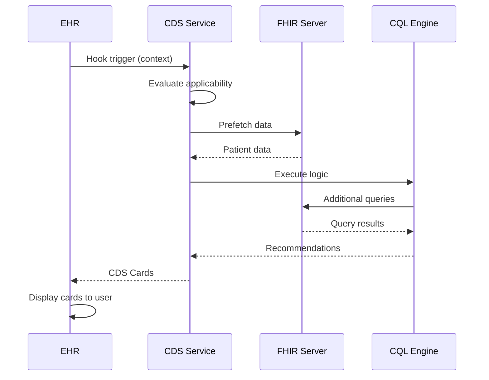

# SOP-006: Clinical Decision Support Systems com HL7 FHIR
**Standard Operating Procedure para Implementação de Sistemas de Apoio à Decisão Clínica**

## 1. INTRODUÇÃO

### 1.1 Objetivo
Estabelecer procedimentos para desenvolvimento e integração de Clinical Decision Support Systems (CDSS) usando padrões HL7 FHIR, CDS Hooks, SMART on FHIR e Clinical Quality Language (CQL).

### 1.2 Escopo
Aplicável a sistemas de alertas clínicos, recomendações terapêuticas, protocolos clínicos, medidas de qualidade e apoio à decisão em tempo real.

### 1.3 Referências Fundamentais
- CDS Hooks Specification¹: https://cds-hooks.org/
- SMART on FHIR²: https://docs.smarthealthit.org/
- Clinical Quality Language (CQL)³: https://cql.hl7.org/
- Clinical Quality Framework⁴: https://hl7.org/fhir/clinicalreasoning-module.html
- HL7 Decision Support Service (DSS)⁵: http://www.hl7.org/implement/standards/product_brief.cfm?product_id=12

## 2. ARQUITETURA CDS

### 2.1 Componentes Fundamentais⁶

```

### 4.2 Execução CQL em FHIR¹¹

```javascript
// Executor CQL integrado com FHIR
const cql = require('cql-execution');
const cqlFhir = require('cql-exec-fhir');
const fs = require('fs');

class CQLExecutor {
    constructor(fhirClient) {
        this.fhirClient = fhirClient;
        this.patientSource = cqlFhir.PatientSource.FHIRv401();
    }
    
    async execute(elmJson, parameters = {}) {
        // Carregar biblioteca ELM (CQL compilado)
        const library = new cql.Library(elmJson);
        const executor = new cql.Executor(library);
        
        // Configurar parâmetros
        const params = {
            MeasurementPeriod: new cql.Interval(
                new Date(parameters.periodStart || '2024-01-01'),
                new Date(parameters.periodEnd || '2024-12-31')
            )
        };
        
        // Configurar código e value sets
        const codeService = new cql.CodeService({
            'http://cts.nlm.nih.gov/fhir/ValueSet/2.16.840.1.113883.3.464.1003.103.12.1001': {
                '2.16.840.1.113883.6.96': ['73211009', '44054006'] // SNOMED codes for diabetes
            }
        });
        
        // Buscar pacientes
        const patients = await this.fhirClient.search('Patient', {
            _count: 100
        });
        
        const results = [];
        
        for (const patientEntry of patients.entry) {
            const patient = patientEntry.resource;
            
            // Criar bundle com dados do paciente
            const bundle = await this.createPatientBundle(patient.id);
            
            // Configurar data source
            const patientSource = cqlFhir.PatientSource.FHIRv401();
            patientSource.loadBundles([bundle]);
            
            // Executar CQL
            const result = executor.exec(
                patientSource,
                params,
                codeService
            );
            
            results.push({
                patientId: patient.id,
                results: result.patientResults[patient.id]
            });
        }
        
        return results;
    }
    
    async createPatientBundle(patientId) {
        // Buscar todos os recursos do paciente
        const [patient, conditions, observations, medications] = await Promise.all([
            this.fhirClient.read('Patient', patientId),
            this.fhirClient.search('Condition', { patient: patientId }),
            this.fhirClient.search('Observation', { patient: patientId }),
            this.fhirClient.search('MedicationRequest', { patient: patientId })
        ]);
        
        return {
            resourceType: 'Bundle',
            type: 'collection',
            entry: [
                { resource: patient },
                ...(conditions.entry || []),
                ...(observations.entry || []),
                ...(medications.entry || [])
            ]
        };
    }
}
```

### 4.3 Medidas de Qualidade com CQL¹²

```cql
// Medida de qualidade FHIR
library DiabetesQualityMeasure version '1.0.0'

using FHIR version '4.0.1'

// Populações da medida
define "Initial Population":
  AgeInYearsAt(start of "Measurement Period") >= 18
    and "Has Diabetes"

define "Denominator":
  "Initial Population"

define "Denominator Exclusions":
  exists([Condition: "End Stage Renal Disease"])
    or exists([Condition: "Pregnancy"])

define "Numerator":
  "Most Recent HbA1c" is not null
    and "HbA1c Value" < 8.0 '%'
    and "Has Eye Exam in Period"
    and "Has Foot Exam in Period"

define "Has Eye Exam in Period":
  exists([Procedure: "Diabetic Eye Exam"] P
    where P.status = 'completed'
      and P.performed during "Measurement Period")

define "Has Foot Exam in Period":
  exists([Procedure: "Diabetic Foot Exam"] P
    where P.status = 'completed'
      and P.performed during "Measurement Period")

// Estratificação
define "Stratification 1":
  AgeInYearsAt(start of "Measurement Period") between 18 and 64

define "Stratification 2":
  AgeInYearsAt(start of "Measurement Period") >= 65
```

## 5. SMART ON FHIR

### 5.1 Aplicação SMART¹³

```javascript
// App SMART on FHIR
import FHIR from 'fhirclient';

class SmartCDSApp {
    async init() {
        // Autorização OAuth2
        const client = await FHIR.oauth2.ready();
        
        // Obter contexto
        this.patient = await client.patient.read();
        this.user = await client.user.read();
        this.encounter = client.encounter ? 
            await client.encounter.read() : null;
        
        // Configurar CDS
        await this.setupCDS(client);
    }
    
    async setupCDS(client) {
        // Descobrir serviços CDS
        const services = await this.discoverCDSServices();
        
        // Registrar hooks
        for (const service of services) {
            this.registerHook(service, client);
        }
    }
    
    async discoverCDSServices() {
        const response = await fetch('/cds-services');
        return response.json();
    }
    
    registerHook(service, fhirClient) {
        // Configurar listener para hook
        switch(service.hook) {
            case 'patient-view':
                this.onPatientView(service, fhirClient);
                break;
            case 'medication-prescribe':
                this.onMedicationPrescribe(service, fhirClient);
                break;
        }
    }
    
    async onPatientView(service, fhirClient) {
        // Preparar contexto
        const context = {
            userId: this.user.id,
            patientId: this.patient.id,
            encounterId: this.encounter?.id
        };
        
        // Prefetch dados
        const prefetch = {};
        for (const [key, query] of Object.entries(service.prefetch)) {
            const url = query.replace('{{context.patientId}}', this.patient.id);
            prefetch[key] = await fhirClient.request(url);
        }
        
        // Chamar serviço CDS
        const response = await fetch(`/cds-services/${service.id}`, {
            method: 'POST',
            headers: {
                'Content-Type': 'application/json',
                'Authorization': `Bearer ${fhirClient.state.tokenResponse.access_token}`
            },
            body: JSON.stringify({ context, prefetch })
        });
        
        const result = await response.json();
        this.displayCards(result.cards);
    }
    
    displayCards(cards) {
        const container = document.getElementById('cds-cards');
        container.innerHTML = '';
        
        cards.forEach(card => {
            const cardElement = this.createCardElement(card);
            container.appendChild(cardElement);
        });
    }
    
    createCardElement(card) {
        const div = document.createElement('div');
        div.className = `cds-card ${card.indicator}`;
        
        div.innerHTML = `
            <div class="card-header">
                <span class="indicator-icon">${this.getIndicatorIcon(card.indicator)}</span>
                <h3>${card.summary}</h3>
            </div>
            <div class="card-body">
                <p>${card.detail}</p>
                ${card.source ? `
                    <div class="source">
                        <a href="${card.source.url}" target="_blank">
                            ${card.source.label}
                        </a>
                    </div>
                ` : ''}
                ${card.suggestions ? `
                    <div class="suggestions">
                        ${card.suggestions.map(s => `
                            <button onclick="applySuggestion('${s.uuid}')">
                                ${s.label}
                            </button>
                        `).join('')}
                    </div>
                ` : ''}
            </div>
        `;
        
        return div;
    }
    
    getIndicatorIcon(indicator) {
        const icons = {
            info: 'ℹ️',
            warning: '⚠️',
            critical: '🚨',
            success: '✅'
        };
        return icons[indicator] || 'ℹ️';
    }
}

// Inicializar app
const app = new SmartCDSApp();
app.init();
```

### 5.2 Configuração SMART¹⁴

```json
{
  "client_id": "cds-smart-app",
  "scope": "patient/*.read user/*.read launch/patient launch/encounter openid profile",
  "redirect_uri": "https://app.example.com/callback",
  "launch_uri": "https://app.example.com/launch",
  "client_name": "CDS SMART App",
  "token_endpoint_auth_method": "client_secret_basic",
  "grant_types": ["authorization_code", "refresh_token"],
  "response_types": ["code"],
  "fhir_versions": ["4.0.1"],
  "capabilities": [
    "launch-ehr",
    "launch-standalone",
    "client-public",
    "client-confidential-symmetric",
    "context-patient",
    "context-encounter",
    "permission-patient",
    "permission-user"
  ]
}
```

## 6. INTEGRAÇÃO COM SISTEMAS HL7

### 6.1 HL7 v2 para CDS¹⁵

```javascript
// Integração HL7 v2 com CDS
const hl7 = require('hl7-standard');

class HL7CDSBridge {
    constructor(cdsService) {
        this.cds = cdsService;
    }
    
    async processMessage(hl7Message) {
        const msg = hl7.parse(hl7Message);
        
        // Identificar tipo de mensagem
        const messageType = msg.header.messageType;
        
        switch(messageType) {
            case 'ADT^A01': // Admissão
                return this.handleAdmission(msg);
            case 'ORM^O01': // Nova ordem
                return this.handleNewOrder(msg);
            case 'ORU^R01': // Resultado de exame
                return this.handleLabResult(msg);
        }
    }
    
    async handleNewOrder(msg) {
        // Extrair informações da ordem
        const patient = this.extractPatient(msg.PID);
        const order = this.extractOrder(msg.ORC, msg.OBR);
        
        // Converter para FHIR
        const fhirBundle = this.convertToFHIR(patient, order);
        
        // Chamar CDS
        const recommendations = await this.cds.evaluate({
            hook: 'order-select',
            context: {
                patientId: patient.id,
                selections: [order]
            },
            prefetch: fhirBundle
        });
        
        // Gerar resposta HL7
        return this.generateHL7Response(recommendations);
    }
    
    convertToFHIR(patient, order) {
        return {
            resourceType: 'Bundle',
            type: 'collection',
            entry: [
                {
                    resource: {
                        resourceType: 'Patient',
                        id: patient.id,
                        identifier: [{
                            system: 'urn:oid:2.16.840.1.113883.3.1234',
                            value: patient.mrn
                        }],
                        name: [{
                            family: patient.lastName,
                            given: [patient.firstName]
                        }],
                        birthDate: patient.birthDate,
                        gender: patient.gender.toLowerCase()
                    }
                },
                {
                    resource: {
                        resourceType: 'ServiceRequest',
                        id: order.id,
                        status: 'draft',
                        intent: 'order',
                        code: {
                            coding: [{
                                system: 'http://loinc.org',
                                code: order.code,
                                display: order.description
                            }]
                        },
                        subject: {
                            reference: `Patient/${patient.id}`
                        }
                    }
                }
            ]
        };
    }
}
```

### 6.2 HL7 CDA para CDS¹⁶

```xml
<!-- Template CDA com CDS integrado -->
<ClinicalDocument xmlns="urn:hl7-org:v3">
    <typeId root="2.16.840.1.113883.1.3" extension="POCD_HD000040"/>
    <templateId root="2.16.840.1.113883.10.20.22.1.1"/>
    
    <component>
        <structuredBody>
            <!-- Seção de Alertas CDS -->
            <component>
                <section>
                    <templateId root="2.16.840.1.113883.10.20.22.2.1"/>
                    <code code="48765-2" codeSystem="2.16.840.1.113883.6.1" 
                          displayName="Allergies and Adverse Reactions"/>
                    <title>Clinical Decision Support Alerts</title>
                    <text>
                        <list>
                            <item>
                                <content ID="alert1">
                                    High Risk: Drug-Drug Interaction
                                </content>
                            </item>
                            <item>
                                <content ID="alert2">
                                    Reminder: Annual diabetic eye exam due
                                </content>
                            </item>
                        </list>
                    </text>
                    <!-- Entries estruturadas -->
                    <entry>
                        <observation classCode="OBS" moodCode="EVN">
                            <templateId root="2.16.840.1.113883.10.20.22.4.7"/>
                            <code code="CDS001" codeSystem="2.16.840.1.113883.6.1"/>
                            <statusCode code="active"/>
                            <effectiveTime value="20240115"/>
                            <value xsi:type="ST">Drug interaction alert</value>
                        </observation>
                    </entry>
                </section>
            </component>
        </structuredBody>
    </component>
</ClinicalDocument>
```

## 7. MACHINE LEARNING E AI

### 7.1 Integração ML com CDS¹⁷

```python
# Serviço ML para CDS
from fastapi import FastAPI, HTTPException
from pydantic import BaseModel
import joblib
import numpy as np
import pandas as pd

app = FastAPI()

# Carregar modelo treinado
model = joblib.load('diabetes_risk_model.pkl')

class PatientData(BaseModel):
    age: int
    bmi: float
    hba1c: float
    systolic_bp: int
    diastolic_bp: int
    cholesterol: float
    smoking: bool
    family_history: bool

class CDSRequest(BaseModel):
    hook: str
    context: dict
    prefetch: dict

@app.post("/ml-cds/diabetes-risk")
async def predict_diabetes_risk(request: CDSRequest):
    """
    Predição de risco de complicações diabéticas
    """
    try:
        # Extrair dados do paciente
        patient_data = extract_patient_features(request.prefetch)
        
        # Preparar features
        features = prepare_features(patient_data)
        
        # Fazer predição
        risk_score = model.predict_proba(features)[0][1]
        
        # Gerar recomendações baseadas no risco
        cards = []
        
        if risk_score > 0.7:
            cards.append({
                "uuid": str(uuid.uuid4()),
                "summary": "Alto risco de complicações diabéticas",
                "indicator": "critical",
                "detail": f"Score de risco: {risk_score:.2%}. Intervenção intensiva recomendada.",
                "source": {
                    "label": "ML Diabetes Risk Model v2.0",
                    "url": "https://model.docs/diabetes-risk"
                },
                "suggestions": [
                    {
                        "label": "Iniciar protocolo de controle intensivo",
                        "uuid": str(uuid.uuid4()),
                        "actions": generate_intensive_protocol_actions(patient_data)
                    }
                ]
            })
        elif risk_score > 0.4:
            cards.append({
                "uuid": str(uuid.uuid4()),
                "summary": "Risco moderado de complicações",
                "indicator": "warning",
                "detail": f"Score de risco: {risk_score:.2%}. Monitoramento aumentado recomendado.",
                "source": {
                    "label": "ML Diabetes Risk Model v2.0",
                    "url": "https://model.docs/diabetes-risk"
                }
            })
        
        # Análise de fatores contribuintes
        feature_importance = analyze_risk_factors(features, model)
        
        if feature_importance:
            cards.append({
                "uuid": str(uuid.uuid4()),
                "summary": "Principais fatores de risco",
                "indicator": "info",
                "detail": format_risk_factors(feature_importance),
                "source": {
                    "label": "Feature Analysis",
                    "url": "https://model.docs/feature-importance"
                }
            })
        
        return {"cards": cards}
        
    except Exception as e:
        raise HTTPException(status_code=500, detail=str(e))

def extract_patient_features(prefetch):
    """
    Extrai features do bundle FHIR
    """
    features = {}
    
    # Extrair idade do paciente
    patient = prefetch.get('patient')
    if patient:
        birth_date = pd.to_datetime(patient['birthDate'])
        features['age'] = (pd.Timestamp.now() - birth_date).days // 365
    
    # Extrair observações
    observations = prefetch.get('observations', {}).get('entry', [])
    for obs in observations:
        resource = obs['resource']
        code = resource['code']['coding'][0]['code']
        
        if code == '39156-5':  # BMI
            features['bmi'] = resource['valueQuantity']['value']
        elif code == '4548-4':  # HbA1c
            features['hba1c'] = resource['valueQuantity']['value']
        elif code == '8480-6':  # Systolic BP
            features['systolic_bp'] = resource['valueQuantity']['value']
    
    return features

def prepare_features(patient_data):
    """
    Prepara features para o modelo
    """
    feature_names = ['age', 'bmi', 'hba1c', 'systolic_bp', 
                    'diastolic_bp', 'cholesterol', 'smoking', 'family_history']
    
    features = []
    for name in feature_names:
        value = patient_data.get(name, 0)
        if isinstance(value, bool):
            value = int(value)
        features.append(value)
    
    return np.array(features).reshape(1, -1)
```

## 8. IMPLEMENTAÇÃO DE PROTOCOLOS

### 8.1 Protocolo Clínico como CDS¹⁸

```typescript
// Implementação de protocolo clínico
interface ClinicalProtocol {
    id: string;
    name: string;
    version: string;
    steps: ProtocolStep[];
}

interface ProtocolStep {
    id: string;
    name: string;
    criteria: CQLExpression;
    actions: CDSAction[];
    nextSteps: string[];
}

class ProtocolEngine {
    private protocols: Map<string, ClinicalProtocol>;
    private cqlExecutor: CQLExecutor;
    
    async executeProtocol(
        protocolId: string, 
        patient: Patient,
        context: any
    ): Promise<CDSCard[]> {
        const protocol = this.protocols.get(protocolId);
        if (!protocol) {
            throw new Error(`Protocol ${protocolId} not found`);
        }
        
        const cards: CDSCard[] = [];
        const visitedSteps = new Set<string>();
        
        // Começar pelo primeiro step
        await this.executeStep(
            protocol.steps[0],
            patient,
            context,
            cards,
            visitedSteps,
            protocol
        );
        
        return cards;
    }
    
    private async executeStep(
        step: ProtocolStep,
        patient: Patient,
        context: any,
        cards: CDSCard[],
        visitedSteps: Set<string>,
        protocol: ClinicalProtocol
    ) {
        // Evitar loops
        if (visitedSteps.has(step.id)) return;
        visitedSteps.add(step.id);
        
        // Avaliar critérios
        const meetsCriteria = await this.cqlExecutor.evaluate(
            step.criteria,
            patient,
            context
        );
        
        if (meetsCriteria) {
            // Executar ações
            for (const action of step.actions) {
                const card = this.createCardFromAction(action, step, protocol);
                cards.push(card);
            }
            
            // Processar próximos passos
            for (const nextStepId of step.nextSteps) {
                const nextStep = protocol.steps.find(s => s.id === nextStepId);
                if (nextStep) {
                    await this.executeStep(
                        nextStep,
                        patient,
                        context,
                        cards,
                        visitedSteps,
                        protocol
                    );
                }
            }
        }
    }
}
```

## 9. MONITORAMENTO E MÉTRICAS

### 9.1 Analytics de CDS¹⁹

```sql
-- Análise de uso e efetividade do CDS
CREATE TABLE cds_analytics (
    id SERIAL PRIMARY KEY,
    timestamp TIMESTAMPTZ NOT NULL,
    hook VARCHAR(50) NOT NULL,
    service_id VARCHAR(100) NOT NULL,
    user_id VARCHAR(100),
    patient_id VARCHAR(100),
    cards_shown INTEGER,
    cards_accepted INTEGER,
    response_time_ms INTEGER,
    outcome VARCHAR(50)
);

-- Métricas de adoção
SELECT 
    service_id,
    COUNT(*) as total_calls,
    COUNT(DISTINCT user_id) as unique_users,
    AVG(cards_accepted::FLOAT / NULLIF(cards_shown, 0)) as acceptance_rate,
    AVG(response_time_ms) as avg_response_time,
    PERCENTILE_CONT(0.95) WITHIN GROUP (ORDER BY response_time_ms) as p95_response_time
FROM cds_analytics
WHERE timestamp >= NOW() - INTERVAL '30 days'
GROUP BY service_id;

-- Análise de impacto
WITH before_cds AS (
    SELECT 
        AVG(hba1c_value) as avg_hba1c_before
    FROM patient_labs
    WHERE lab_date < '2024-01-01' -- Data de implementação do CDS
      AND lab_type = 'HbA1c'
),
after_cds AS (
    SELECT 
        AVG(hba1c_value) as avg_hba1c_after
    FROM patient_labs
    WHERE lab_date >= '2024-01-01'
      AND lab_type = 'HbA1c'
)
SELECT 
    b.avg_hba1c_before,
    a.avg_hba1c_after,
    a.avg_hba1c_after - b.avg_hba1c_before as improvement
FROM before_cds b, after_cds a;
```

## 10. CHECKLIST DE IMPLEMENTAÇÃO

### 10.1 Pré-requisitos
- [ ] Servidor FHIR configurado
- [ ] OAuth2/SMART configurado
- [ ] Serviços de terminologia disponíveis
- [ ] CQL engine instalado
- [ ] Infraestrutura de hooks configurada

### 10.2 Desenvolvimento
- [ ] Hooks identificados e mapeados
- [ ] Lógica CQL desenvolvida e testada
- [ ] Prefetch otimizado
- [ ] Cards com ações apropriadas
- [ ] Testes de integração completos

### 10.3 Deployment
- [ ] Performance validada (<500ms)
- [ ] Monitoramento configurado
- [ ] Documentação completa
- [ ] Treinamento de usuários
- [ ] Plano de rollback

## 11. REFERÊNCIAS

1. CDS Hooks. Specification 2.0. https://cds-hooks.org/specification/2.0/
2. SMART Health IT. SMART on FHIR. https://docs.smarthealthit.org/
3. HL7. Clinical Quality Language. https://cql.hl7.org/
4. HL7 FHIR. Clinical Reasoning Module. https://hl7.org/fhir/clinicalreasoning-module.html
5. HL7. Decision Support Service Standard. http://www.hl7.org/implement/standards/product_brief.cfm?product_id=12
6. Wright A, et al. Analysis of clinical decision support system malfunctions. J Am Med Inform Assoc. 2016.
7. Osheroff JA, et al. Improving Outcomes with Clinical Decision Support. HIMSS. 2012.
8. Mandel JC, et al. CDS Hooks: A Standard for Vendor-Agnostic Clinical Decision Support. AMIA. 2020.
9. CDS Hooks Community. Hook Catalog. https://cds-hooks.org/hooks/
10. Brandt PS, et al. Design and validation of Clinical Quality Language. Int J Med Inform. 2022.
11. NCQA. Healthcare Effectiveness Data and Information Set (HEDIS). https://www.ncqa.org/hedis/
12. CMS. Quality Measures. https://www.cms.gov/medicare/quality/measures
13. Mandel JC, et al. SMART on FHIR: a standards-based, interoperable apps platform. J Am Med Inform Assoc. 2016.
14. SMART Health IT. App Gallery. https://apps.smarthealthit.org/
15. HL7. Version 2.9 Standard. http://www.hl7.org/implement/standards/product_brief.cfm?product_id=516
16. HL7. Clinical Document Architecture R2. http://www.hl7.org/implement/standards/product_brief.cfm?product_id=7
17. Sutton RT, et al. An overview of clinical decision support systems. npj Digital Medicine. 2020.
18. Boxwala AA, et al. GLIF3: a representation format for sharable computer-interpretable clinical practice guidelines. J Biomed Inform. 2004.
19. Kawamoto K, et al. Improving clinical practice using clinical decision support systems. BMJ. 2005.

---
**Documento aprovado por:** [Comitê de Informática Médica e Qualidade]  
**Data de vigência:** 2024-2025  
**Próxima revisão:** Janeiro 2026yaml
# Arquitetura CDS completa
cds_architecture:
  layers:
    presentation:
      - "EHR UI with CDS integration points"
      - "SMART on FHIR apps"
      - "CDS Cards display"
      
    integration:
      - "CDS Hooks service discovery"
      - "FHIR server"
      - "Authentication/Authorization (OAuth2)"
      
    logic:
      - "CQL execution engine"
      - "Rule engines (Drools, etc.)"
      - "ML/AI services"
      
    data:
      - "FHIR repository"
      - "Terminology services"
      - "Knowledge base"
```

### 2.2 Fluxo de Decisão⁷



## 3. CDS HOOKS

### 3.1 Implementação de Serviço CDS Hooks⁸

```javascript
// Servidor CDS Hooks em Node.js
const express = require('express');
const app = express();

// Discovery endpoint
app.get('/cds-services', (req, res) => {
    res.json({
        services: [
            {
                hook: 'patient-view',
                title: 'Diabetes Management',
                description: 'Provides diabetes care recommendations',
                id: 'diabetes-management',
                prefetch: {
                    patient: 'Patient/{{context.patientId}}',
                    conditions: 'Condition?patient={{context.patientId}}&code=http://snomed.info/sct|73211009',
                    medications: 'MedicationRequest?patient={{context.patientId}}&status=active',
                    labs: 'Observation?patient={{context.patientId}}&code=http://loinc.org|4548-4,http://loinc.org|17856-6'
                }
            },
            {
                hook: 'medication-prescribe',
                title: 'Drug Interaction Check',
                description: 'Checks for drug-drug interactions',
                id: 'drug-interaction-check',
                prefetch: {
                    patient: 'Patient/{{context.patientId}}',
                    medications: 'MedicationRequest?patient={{context.patientId}}&status=active'
                }
            }
        ]
    });
});

// Service endpoint
app.post('/cds-services/diabetes-management', async (req, res) => {
    const { context, prefetch } = req.body;
    
    // Analisar dados do paciente
    const patient = prefetch.patient;
    const conditions = prefetch.conditions?.entry || [];
    const medications = prefetch.medications?.entry || [];
    const labs = prefetch.labs?.entry || [];
    
    const cards = [];
    
    // Verificar HbA1c
    const hba1c = labs.find(lab => 
        lab.resource.code.coding.some(c => c.code === '4548-4')
    );
    
    if (hba1c) {
        const value = hba1c.resource.valueQuantity.value;
        if (value > 7.0) {
            cards.push({
                uuid: generateUUID(),
                summary: 'HbA1c acima da meta',
                indicator: 'warning',
                detail: `HbA1c atual: ${value}%. Meta recomendada: < 7.0%`,
                source: {
                    label: 'ADA Guidelines 2024',
                    url: 'https://diabetesjournals.org/care/issue/47/Supplement_1'
                },
                suggestions: [
                    {
                        label: 'Ajustar medicação',
                        uuid: generateUUID(),
                        actions: [
                            {
                                type: 'create',
                                description: 'Adicionar Metformina',
                                resource: {
                                    resourceType: 'MedicationRequest',
                                    status: 'draft',
                                    intent: 'order',
                                    medicationCodeableConcept: {
                                        coding: [{
                                            system: 'http://www.nlm.nih.gov/research/umls/rxnorm',
                                            code: '860975',
                                            display: 'metformin hydrochloride 500 MG Oral Tablet'
                                        }]
                                    },
                                    subject: {
                                        reference: `Patient/${context.patientId}`
                                    },
                                    dosageInstruction: [{
                                        text: '500mg duas vezes ao dia',
                                        timing: {
                                            repeat: {
                                                frequency: 2,
                                                period: 1,
                                                periodUnit: 'd'
                                            }
                                        }
                                    }]
                                }
                            }
                        ]
                    }
                ]
            });
        }
    }
    
    // Verificar pressão arterial
    const hasHypertension = conditions.some(c => 
        c.resource.code.coding.some(code => 
            code.system === 'http://snomed.info/sct' && 
            code.code === '38341003'
        )
    );
    
    if (hasHypertension && !medications.some(m => isACEInhibitor(m.resource))) {
        cards.push({
            uuid: generateUUID(),
            summary: 'Considerar IECA/BRA para proteção renal',
            indicator: 'info',
            detail: 'Paciente diabético com hipertensão sem IECA/BRA',
            source: {
                label: 'KDIGO Guidelines',
                url: 'https://kdigo.org/guidelines/'
            }
        });
    }
    
    res.json({ cards });
});

// Drug interaction service
app.post('/cds-services/drug-interaction-check', async (req, res) => {
    const { context, prefetch } = req.body;
    const cards = [];
    
    // Novo medicamento sendo prescrito
    const newMedication = context.medications[0];
    const activeMedications = prefetch.medications?.entry || [];
    
    // Verificar interações
    for (const med of activeMedications) {
        const interaction = await checkInteraction(
            newMedication.code,
            med.resource.medicationCodeableConcept
        );
        
        if (interaction) {
            cards.push({
                uuid: generateUUID(),
                summary: `Interação medicamentosa: ${interaction.severity}`,
                indicator: interaction.severity === 'high' ? 'critical' : 'warning',
                detail: interaction.description,
                source: {
                    label: 'Drug Interaction Database',
                    url: 'https://www.drugs.com/drug_interactions.html'
                },
                suggestions: interaction.alternatives.map(alt => ({
                    label: `Substituir por ${alt.name}`,
                    uuid: generateUUID(),
                    actions: [{
                        type: 'delete',
                        description: 'Remover medicamento atual'
                    }, {
                        type: 'create',
                        description: `Prescrever ${alt.name}`,
                        resource: createMedicationRequest(alt, context.patientId)
                    }]
                }))
            });
        }
    }
    
    res.json({ cards });
});

app.listen(3000, () => {
    console.log('CDS Hooks service running on port 3000');
});
```

### 3.2 Hooks Disponíveis⁹

```typescript
// Definição de tipos para CDS Hooks
interface CDSHook {
    hook: string;
    context: any;
    prefetch?: Record<string, any>;
}

// Hooks padrão
enum StandardHooks {
    // Workflow hooks
    PATIENT_VIEW = 'patient-view',
    ENCOUNTER_START = 'encounter-start',
    ENCOUNTER_DISCHARGE = 'encounter-discharge',
    
    // Ordering hooks
    ORDER_SELECT = 'order-select',
    ORDER_SIGN = 'order-sign',
    MEDICATION_PRESCRIBE = 'medication-prescribe',
    
    // Documentation hooks
    NOTE_CREATE = 'note-create',
    NOTE_SIGN = 'note-sign',
    
    // Appointment hooks
    APPOINTMENT_BOOK = 'appointment-book'
}

// Contexto específico por hook
interface PatientViewContext {
    userId: string;
    patientId: string;
    encounterId?: string;
}

interface MedicationPrescribeContext {
    userId: string;
    patientId: string;
    encounterId?: string;
    medications: DraftMedicationRequest[];
}

interface OrderSignContext {
    userId: string;
    patientId: string;
    encounterId?: string;
    draftOrders: DraftOrder[];
}
```

## 4. CLINICAL QUALITY LANGUAGE (CQL)

### 4.1 Estrutura CQL¹⁰

```cql
// Biblioteca CQL para diabetes
library DiabetesManagement version '2.0.0'

using FHIR version '4.0.1'
include FHIRHelpers version '4.0.1'

// Terminologias
codesystem "LOINC": 'http://loinc.org'
codesystem "SNOMED": 'http://snomed.info/sct'
codesystem "RxNorm": 'http://www.nlm.nih.gov/research/umls/rxnorm'

// Value Sets
valueset "Diabetes": 'http://cts.nlm.nih.gov/fhir/ValueSet/2.16.840.1.113883.3.464.1003.103.12.1001'
valueset "HbA1c Laboratory Test": 'http://cts.nlm.nih.gov/fhir/ValueSet/2.16.840.1.113883.3.464.1003.198.12.1013'
valueset "ACE Inhibitor or ARB": 'http://cts.nlm.nih.gov/fhir/ValueSet/2.16.840.1.113883.3.526.3.1139'

// Parâmetros
parameter "MeasurementPeriod" Interval<DateTime>

// Contexto do paciente
context Patient

// Definições
define "Has Diabetes":
  exists([Condition: "Diabetes"] C
    where C.clinicalStatus ~ ToConcept('active')
      and C.verificationStatus ~ ToConcept('confirmed'))

define "Most Recent HbA1c":
  Last([Observation: "HbA1c Laboratory Test"] O
    where O.status in {'final', 'amended', 'corrected'}
      and O.effective in "MeasurementPeriod"
    sort by effective)

define "HbA1c Value":
  "Most Recent HbA1c".value as Quantity

define "HbA1c Above Target":
  "HbA1c Value" > 7.0 '%'

define "On ACE or ARB":
  exists([MedicationRequest: "ACE Inhibitor or ARB"] M
    where M.status = 'active'
      and M.authoredOn during "MeasurementPeriod")

define "Needs Medication Adjustment":
  "Has Diabetes" 
    and "HbA1c Above Target"
    and not "On ACE or ARB"

// Recomendações
define "Recommendations":
  if "Needs Medication Adjustment" then
    'Consider adding or adjusting diabetes medication. Current HbA1c: ' + 
    ToString("HbA1c Value") + '. Target: < 7.0%'
  else if "Has Diabetes" and "HbA1c Value" is null then
    'HbA1c testing recommended for diabetes monitoring'
  else
    'Continue current management'

// Função auxiliar
define function ToConcept(code String):
  Concept { codes: { Code { code: code } } }