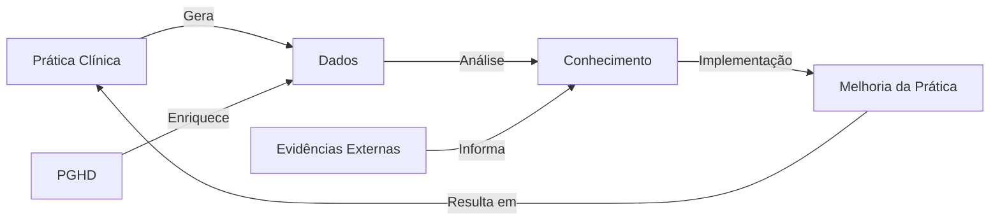

# SOP-013: Learning Health System - Estrutura Integradora para Medicina do Estilo de Vida

## Resumo Executivo

Este Standard Operating Procedure define a estrutura completa de um Learning Health System (LHS) que integra todos os componentes descritos nos SOPs anteriores¹, criando um ecossistema adaptativo de melhoria contínua da saúde². O LHS representa a convergência de dados clínicos³, evidências científicas⁴, tecnologia de informação⁵ e prática clínica⁶ em um ciclo virtuoso de aprendizado e melhoria.

## 1. Fundamentos do Learning Health System

### 1.1 Definição e Conceitos Centrais

**Definição IOM (Institute of Medicine)**: "Um sistema em que ciência, informática, incentivos e cultura estão alinhados para melhoria e inovação contínuas, com melhores práticas seamlessly incorporadas ao processo de cuidado e novos conhecimentos capturados como subproduto integral da experiência de cuidado."⁷

**Componentes Essenciais do LHS**⁸:
1. **Infraestrutura de Dados**: Captura e integração contínua de dados
2. **Análise e Insights**: Transformação de dados em conhecimento acionável
3. **Implementação**: Tradução de conhecimento em prática
4. **Avaliação**: Medição de impacto e resultados
5. **Feedback Loop**: Retroalimentação para melhoria contínua

### 1.2 Ciclo de Aprendizado Contínuo



**Características do Ciclo**⁹:
- **Velocidade**: Redução do tempo entre descoberta e implementação
- **Escala**: Aplicação em toda a população atendida
- **Personalização**: Adaptação para indivíduos e subgrupos
- **Transparência**: Processos e resultados visíveis e auditáveis

## 2. Arquitetura Técnica Integrada

### 2.1 Camadas da Arquitetura LHS

```python
class LearningHealthSystemArchitecture:
    """Arquitetura completa do Learning Health System"""¹⁰
    
    def __init__(self):
        # Camada de Dados (SOPs 10, 12)
        self.data_layer = {
            'ehr_system': FHIRServer(),¹¹  # SOP-012
            'pghd_collector': PGHDPlatform(),¹²  # SOP-010
            'clinical_repository': ClinicalDataWarehouse(),
            'research_database': ResearchDataMart()
        }
        
        # Camada de Conhecimento (SOPs 8, 9)
        self.knowledge_layer = {
            'evidence_synthesizer': LivingSystematicReview(),¹³  # SOP-009
            'ai_models': SmallLanguageModels(),¹⁴  # SOP-008
            'clinical_guidelines': GuidelineRepository(),
            'decision_support': CDSServices()
        }
        
        # Camada de Interoperabilidade (SOPs 1-7)
        self.interop_layer = {
            'fhir_ig': ImplementationGuides(),¹⁵  # SOP-001
            'terminology': TerminologyServices(),¹⁶  # SOP-002
            'security': SecurityFramework(),¹⁷  # SOP-003
            'standards_mapping': StandardsMapper()¹⁸  # SOPs 4-7
        }
        
        # Camada de Aplicação
        self.application_layer = {
            'clinical_apps': ClinicalApplications(),
            'patient_portals': PatientEngagementPlatform(),
            'analytics_dashboards': AnalyticsDashboards(),
            'research_tools': ResearchPlatform()
        }
```

### 2.2 Fluxo de Dados Integrado

```python
class IntegratedDataFlow:
    """Fluxo de dados através do LHS"""¹⁹
    
    async def process_health_data(self, data_source: str) -> Dict:
        """Processa dados de saúde através do sistema"""
        
        # 1. Ingestão de dados
        raw_data = await self.ingest_data(data_source)
        
        # 2. Padronização FHIR²⁰
        fhir_resources = self.standardize_to_fhir(raw_data)
        
        # 3. Enriquecimento com terminologias²¹
        enriched_data = self.enrich_with_terminologies(fhir_resources)
        
        # 4. Análise com SLMs²²
        insights = await self.analyze_with_ai(enriched_data)
        
        # 5. Comparação com evidências²³
        evidence_context = await self.compare_with_evidence(insights)
        
        # 6. Geração de recomendações
        recommendations = self.generate_recommendations(
            insights, evidence_context
        )
        
        # 7. Feedback para o sistema
        self.update_knowledge_base(recommendations)
        
        return {
            'data': enriched_data,
            'insights': insights,
            'recommendations': recommendations,
            'timestamp': datetime.now().isoformat()
        }
```

## 3. Governança e Gestão do LHS

### 3.1 Estrutura de Governança

```python
class LHSGovernance:
    """Sistema de governança do LHS"""²⁴
    
    def __init__(self):
        self.governance_structure = {
            'steering_committee': {
                'members': ['clinical_leaders', 'it_leaders', 'patient_representatives'],
                'responsibilities': ['strategic_direction', 'resource_allocation', 'oversight']
            },
            'data_governance': {
                'committee': DataGovernanceCommittee(),²⁵
                'policies': ['data_use', 'privacy', 'security', 'quality'],
                'standards': ['FHIR', 'HL7', 'ISO', 'HIPAA']
            },
            'ethics_board': {
                'committee': EthicsReviewBoard(),²⁶
                'scope': ['research_protocols', 'ai_algorithms', 'data_use'],
                'review_frequency': 'monthly'
            },
            'quality_assurance': {
                'team': QualityAssuranceTeam(),²⁷
                'metrics': ['data_quality', 'clinical_outcomes', 'patient_satisfaction'],
                'reporting': 'quarterly'
            }
        }
```

### 3.2 Políticas e Procedimentos

```yaml
lhs_policies:
  data_governance:
    access_control:²⁸
      - role_based_access
      - attribute_based_access
      - consent_management
    data_quality:²⁹
      - completeness_standards
      - accuracy_validation
      - timeliness_requirements
    retention:³⁰
      - clinical_data: 7_years
      - research_data: indefinite
      - pghd_data: 2_years
    
  privacy_security:³¹
    encryption:
      - at_rest: AES-256
      - in_transit: TLS_1.3
    authentication:³²
      - multi_factor: required
      - biometric: optional
    audit_logging:³³
      - all_access: logged
      - retention: 3_years