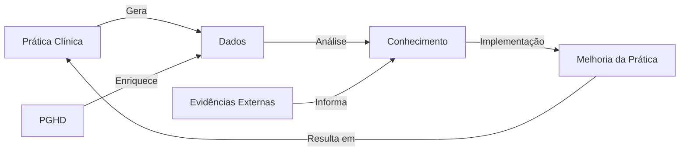

# SOP-013: Learning Health System - Estrutura Integradora para Medicina do Estilo de Vida

## Resumo Executivo

Este Standard Operating Procedure define a estrutura completa de um Learning Health System (LHS) que integra todos os componentes descritos nos SOPs anteriores¹, criando um ecossistema adaptativo de melhoria contínua da saúde². O LHS representa a convergência de dados clínicos³, evidências científicas⁴, tecnologia de informação⁵ e prática clínica⁶ em um ciclo virtuoso de aprendizado e melhoria.

## 1. Fundamentos do Learning Health System

### 1.1 Definição e Conceitos Centrais

**Definição IOM (Institute of Medicine)**: "Um sistema em que ciência, informática, incentivos e cultura estão alinhados para melhoria e inovação contínuas, com melhores práticas seamlessly incorporadas ao processo de cuidado e novos conhecimentos capturados como subproduto integral da experiência de cuidado."⁷

**Componentes Essenciais do LHS**⁸:
1. **Infraestrutura de Dados**: Captura e integração contínua de dados
2. **Análise e Insights**: Transformação de dados em conhecimento acionável
3. **Implementação**: Tradução de conhecimento em prática
4. **Avaliação**: Medição de impacto e resultados
5. **Feedback Loop**: Retroalimentação para melhoria contínua

### 1.2 Ciclo de Aprendizado Contínuo



**Características do Ciclo**⁹:
- **Velocidade**: Redução do tempo entre descoberta e implementação
- **Escala**: Aplicação em toda a população atendida
- **Personalização**: Adaptação para indivíduos e subgrupos
- **Transparência**: Processos e resultados visíveis e auditáveis

## 2. Arquitetura Técnica Integrada

### 2.1 Camadas da Arquitetura LHS

```python
class LearningHealthSystemArchitecture:
    """Arquitetura completa do Learning Health System"""¹⁰
    
    def __init__(self):
        # Camada de Dados (SOPs 10, 12)
        self.data_layer = {
            'ehr_system': FHIRServer(),¹¹  # SOP-012
            'pghd_collector': PGHDPlatform(),¹²  # SOP-010
            'clinical_repository': ClinicalDataWarehouse(),
            'research_database': ResearchDataMart(),
            'genomics_platform': GenomicsDataPlatform(),¹³
            'social_determinants': SDOHRepository()¹⁴
        }
        
        # Camada de Conhecimento (SOPs 8, 9)
        self.knowledge_layer = {
            'evidence_synthesizer': LivingSystematicReview(),¹⁵  # SOP-009
            'ai_models': SmallLanguageModels(),¹⁶  # SOP-008
            'clinical_guidelines': GuidelineRepository(),
            'decision_support': CDSServices(),
            'predictive_analytics': PredictiveModels(),¹⁷
            'risk_stratification': RiskEngine()¹⁸
        }
        
        # Camada de Interoperabilidade (SOPs 1-7)
        self.interop_layer = {
            'fhir_ig': ImplementationGuides(),¹⁹  # SOP-001
            'terminology': TerminologyServices(),²⁰  # SOP-002
            'security': SecurityFramework(),²¹  # SOP-003
            'standards_mapping': StandardsMapper(),²²  # SOPs 4-7
            'api_management': APIGateway(),²³
            'event_streaming': EventBus()²⁴
        }
        
        # Camada de Aplicação
        self.application_layer = {
            'clinical_apps': ClinicalApplications(),
            'patient_portals': PatientEngagementPlatform(),
            'analytics_dashboards': AnalyticsDashboards(),
            'research_tools': ResearchPlatform(),
            'mobile_health': mHealthApplications(),²⁵
            'telehealth': TelehealthPlatform()²⁶
        }
```

### 2.2 Fluxo de Dados Integrado

```python
class IntegratedDataFlow:
    """Fluxo de dados através do LHS"""²⁷
    
    async def process_health_data(self, data_source: str) -> Dict:
        """Processa dados de saúde através do sistema"""
        
        # 1. Ingestão de dados
        raw_data = await self.ingest_data(data_source)
        
        # 2. Padronização FHIR²⁸
        fhir_resources = self.standardize_to_fhir(raw_data)
        
        # 3. Enriquecimento com terminologias²⁹
        enriched_data = self.enrich_with_terminologies(fhir_resources)
        
        # 4. Análise com SLMs³⁰
        insights = await self.analyze_with_ai(enriched_data)
        
        # 5. Comparação com evidências³¹
        evidence_context = await self.compare_with_evidence(insights)
        
        # 6. Geração de recomendações
        recommendations = self.generate_recommendations(
            insights, evidence_context
        )
        
        # 7. Avaliação de qualidade³²
        quality_metrics = self.assess_quality(recommendations)
        
        # 8. Feedback para o sistema
        self.update_knowledge_base(recommendations, quality_metrics)
        
        # 9. Auditoria e logging³³
        audit_trail = self.create_audit_trail(
            data_source, recommendations, quality_metrics
        )
        
        return {
            'data': enriched_data,
            'insights': insights,
            'recommendations': recommendations,
            'quality_metrics': quality_metrics,
            'audit_trail': audit_trail,
            'timestamp': datetime.now().isoformat()
        }
```

## 3. Governança e Gestão do LHS

### 3.1 Estrutura de Governança

```python
class LHSGovernance:
    """Sistema de governança do LHS"""³⁴
    
    def __init__(self):
        self.governance_structure = {
            'steering_committee': {
                'members': ['clinical_leaders', 'it_leaders', 
                           'patient_representatives', 'researchers'],
                'responsibilities': ['strategic_direction', 
                                   'resource_allocation', 'oversight'],
                'meeting_frequency': 'monthly'
            },
            'data_governance': {
                'committee': DataGovernanceCommittee(),³⁵
                'policies': ['data_use', 'privacy', 'security', 
                           'quality', 'sharing', 'retention'],
                'standards': ['FHIR', 'HL7', 'ISO', 'HIPAA', 'GDPR'],
                'data_stewards': ['clinical', 'research', 'operational']
            },
            'ethics_board': {
                'committee': EthicsReviewBoard(),³⁶
                'scope': ['research_protocols', 'ai_algorithms', 
                         'data_use', 'patient_consent'],
                'review_frequency': 'monthly',
                'expedited_review': 'available_for_minimal_risk'
            },
            'quality_assurance': {
                'team': QualityAssuranceTeam(),³⁷
                'metrics': ['data_quality', 'clinical_outcomes', 
                           'patient_satisfaction', 'system_performance'],
                'reporting': 'quarterly',
                'continuous_monitoring': True
            },
            'innovation_committee': {
                'members': ['clinicians', 'researchers', 'technologists'],
                'focus': ['emerging_technologies', 'pilot_programs', 
                         'partnerships'],
                'budget_allocation': '10%_of_total'
            }
        }
```

### 3.2 Políticas e Procedimentos

```yaml
lhs_policies:
  data_governance:
    access_control:³⁸
      - role_based_access
      - attribute_based_access
      - consent_management
      - break_glass_procedures
    
    data_quality:³⁹
      completeness_standards:
        - required_fields: 95%
        - optional_fields: 70%
      accuracy_validation:
        - automated_checks: real_time
        - manual_audits: monthly
      timeliness_requirements:
        - real_time_data: <5_minutes
        - batch_data: <24_hours
    
    retention:⁴⁰
      - clinical_data: 7_years_minimum
      - research_data: indefinite_with_consent
      - pghd_data: 2_years_active_3_years_archive
      - audit_logs: 3_years
    
  privacy_security:⁴¹
    encryption:
      - at_rest: AES-256
      - in_transit: TLS_1.3
      - key_management: HSM_based
    
    authentication:⁴²
      - multi_factor: required_for_all_users
      - biometric: optional_enhanced_security
      - session_timeout: 15_minutes_idle
      - password_policy: NIST_800-63B
    
    audit_logging:⁴³
      - all_access: logged_with_context
      - retention: 3_years_minimum
      - review_frequency: weekly_automated_daily_critical
      - immutable_storage: blockchain_anchored
    
  consent_management:⁴⁴
    - granular_consent: resource_level
    - withdrawal_process: immediate_effect
    - consent_tracking: blockchain_based
    - purpose_limitation: strictly_enforced
```

## 4. Implementação de Machine Learning e IA

### 4.1 Pipeline de ML para LHS

```python
class MLPipeline:
    """Pipeline de Machine Learning para o LHS"""⁴⁵
    
    def __init__(self):
        self.pipeline_stages = {
            'data_preparation': DataPreparationStage(),
            'feature_engineering': FeatureEngineeringStage(),
            'model_training': ModelTrainingStage(),
            'validation': ValidationStage(),
            'deployment': DeploymentStage(),
            'monitoring': MonitoringStage()
        }
    
    async def execute_pipeline(self, dataset: Dataset) -> Model:
        """Executa o pipeline completo de ML"""
        
        # 1. Preparação de dados⁴⁶
        prepared_data = await self.prepare_data(dataset)
        
        # 2. Feature engineering⁴⁷
        features = await self.engineer_features(prepared_data)
        
        # 3. Seleção de modelo⁴⁸
        model_candidates = self.select_models(features)
        
        # 4. Treinamento com validação cruzada⁴⁹
        trained_models = await self.train_models(
            model_candidates, features
        )
        
        # 5. Avaliação e seleção⁵⁰
        best_model = self.evaluate_and_select(trained_models)
        
        # 6. Validação externa⁵¹
        validation_results = await self.validate_externally(best_model)
        
        # 7. Interpretabilidade⁵²
        interpretability_report = self.generate_interpretability(
            best_model
        )
        
        # 8. Deployment com monitoramento⁵³
        deployed_model = await self.deploy_with_monitoring(
            best_model, validation_results, interpretability_report
        )
        
        return deployed_model
```

### 4.2 Modelos Específicos para Medicina do Estilo de Vida

```python
class LifestyleMedicineModels:
    """Modelos de IA específicos para medicina do estilo de vida"""⁵⁴
    
    def __init__(self):
        self.models = {
            'risk_prediction': {
                'cardiovascular_risk': CVDRiskModel(),⁵⁵
                'diabetes_risk': DiabetesRiskModel(),⁵⁶
                'mental_health_risk': MentalHealthRiskModel()⁵⁷
            },
            'behavior_change': {
                'adherence_predictor': AdherenceModel(),⁵⁸
                'intervention_recommender': InterventionRecommender(),⁵⁹
                'motivation_assessor': MotivationAssessmentModel()⁶⁰
            },
            'outcome_prediction': {
                'weight_loss': WeightLossPredictor(),⁶¹
                'fitness_improvement': FitnessProgressModel(),⁶²
                'habit_formation': HabitFormationPredictor()⁶³
            },
            'personalization': {
                'nutrition_planner': PersonalizedNutritionModel(),⁶⁴
                'exercise_prescriber': ExercisePrescriptionModel(),⁶⁵
                'sleep_optimizer': SleepOptimizationModel()⁶⁶
            }
        }
    
    async def predict_lifestyle_intervention_success(
        self, patient_data: PatientData, intervention: Intervention
    ) -> PredictionResult:
        """Prediz o sucesso de uma intervenção de estilo de vida"""
        
        # Análise multidimensional⁶⁷
        dimensions = {
            'clinical': await self.analyze_clinical_factors(patient_data),
            'behavioral': await self.analyze_behavioral_patterns(patient_data),
            'social': await self.analyze_social_determinants(patient_data),
            'psychological': await self.analyze_psychological_factors(patient_data)
        }
        
        # Modelo ensemble⁶⁸
        predictions = []
        for model_name, model in self.models['outcome_prediction'].items():
            prediction = await model.predict(dimensions, intervention)
            predictions.append(prediction)
        
        # Agregação de predições⁶⁹
        final_prediction = self.aggregate_predictions(predictions)
        
        # Explicação do modelo⁷⁰
        explanation = self.explain_prediction(
            final_prediction, dimensions, intervention
        )
        
        return PredictionResult(
            success_probability=final_prediction,
            confidence_interval=self.calculate_confidence(predictions),
            key_factors=explanation.top_factors,
            recommendations=self.generate_recommendations(explanation)
        )
```

## 5. Integração com Patient-Generated Health Data (PGHD)

### 5.1 Framework de Integração PGHD

```python
class PGHDIntegrationFramework:
    """Framework para integração de dados gerados pelo paciente"""⁷¹
    
    def __init__(self):
        self.data_sources = {
            'wearables': {
                'fitness_trackers': ['Fitbit', 'Garmin', 'Apple Watch'],⁷²
                'medical_devices': ['CGM', 'Blood Pressure', 'Pulse Ox'],⁷³
                'smart_scales': ['Withings', 'Fitbit Aria', 'Garmin Index']⁷⁴
            },
            'mobile_apps': {
                'nutrition': ['MyFitnessPal', 'Cronometer', 'Lose It'],⁷⁵
                'exercise': ['Strava', 'Nike Run Club', 'Peloton'],⁷⁶
                'mindfulness': ['Headspace', 'Calm', 'Insight Timer']⁷⁷
            },
            'patient_reported': {
                'surveys': ['PROs', 'PHQ-9', 'GAD-7'],⁷⁸
                'diaries': ['Food logs', 'Symptom trackers', 'Mood logs'],⁷⁹
                'ecological_momentary': ['Real-time assessments', 'Context data']⁸⁰
            }
        }
    
    async def process_pghd_stream(self, patient_id: str) -> ProcessedPGHD:
        """Processa stream contínuo de PGHD"""
        
        # 1. Coleta multi-fonte⁸¹
        raw_streams = await self.collect_from_all_sources(patient_id)
        
        # 2. Normalização e padronização⁸²
        normalized_data = self.normalize_data_formats(raw_streams)
        
        # 3. Validação de qualidade⁸³
        validated_data = await self.validate_data_quality(normalized_data)
        
        # 4. Detecção de anomalias⁸⁴
        anomalies = self.detect_anomalies(validated_data)
        
        # 5. Agregação temporal⁸⁵
        aggregated_data = self.aggregate_temporal(
            validated_data, 
            granularity=['minute', 'hour', 'day', 'week']
        )
        
        # 6. Extração de padrões⁸⁶
        patterns = await self.extract_patterns(aggregated_data)
        
        # 7. Correlação com dados clínicos⁸⁷
        clinical_correlation = await self.correlate_with_clinical(
            aggregated_data, patient_id
        )
        
        # 8. Geração de insights⁸⁸
        insights = self.generate_insights(
            patterns, clinical_correlation, anomalies
        )
        
        return ProcessedPGHD(
            patient_id=patient_id,
            data=aggregated_data,
            patterns=patterns,
            anomalies=anomalies,
            insights=insights,
            quality_score=self.calculate_quality_score(validated_data)
        )
```

### 5.2 Análise de Padrões Comportamentais

```python
class BehavioralPatternAnalyzer:
    """Analisador de padrões comportamentais em PGHD"""⁸⁹
    
    async def analyze_lifestyle_patterns(
        self, patient_data: ProcessedPGHD
    ) -> LifestylePatterns:
        """Analisa padrões de estilo de vida do paciente"""
        
        patterns = {
            'activity': await self.analyze_activity_patterns(patient_data),⁹⁰
            'nutrition': await self.analyze_nutrition_patterns(patient_data),⁹¹
            'sleep': await self.analyze_sleep_patterns(patient_data),⁹²
            'stress': await self.analyze_stress_patterns(patient_data),⁹³
            'social': await self.analyze_social_patterns(patient_data)⁹⁴
        }
        
        # Identificar ciclos e tendências⁹⁵
        for domain, pattern_data in patterns.items():
            pattern_data['cycles'] = self.identify_cycles(pattern_data)
            pattern_data['trends'] = self.identify_trends(pattern_data)
            pattern_data['triggers'] = self.identify_triggers(pattern_data)
        
        # Análise de interdependências⁹⁶
        interactions = self.analyze_pattern_interactions(patterns)
        
        # Identificação de barreiras e facilitadores⁹⁷
        barriers = self.identify_barriers(patterns, patient_data)
        facilitators = self.identify_facilitators(patterns, patient_data)
        
        return LifestylePatterns(
            patterns=patterns,
            interactions=interactions,
            barriers=barriers,
            facilitators=facilitators,
            recommendations=self.generate_personalized_recommendations(
                patterns, interactions, barriers, facilitators
            )
        )
```

## 6. Sistema de Feedback e Melhoria Contínua

### 6.1 Mecanismos de Feedback

```python
class FeedbackSystem:
    """Sistema de feedback para melhoria contínua"""⁹⁸
    
    def __init__(self):
        self.feedback_channels = {
            'clinical_outcomes': ClinicalOutcomeTracker(),⁹⁹
            'patient_reported': PatientFeedbackCollector(),¹⁰⁰
            'system_performance': PerformanceMonitor(),¹⁰¹
            'user_experience': UXFeedbackSystem()¹⁰²
        }
    
    async def collect_and_process_feedback(self) -> FeedbackAnalysis:
        """Coleta e processa feedback de múltiplas fontes"""
        
        # 1. Coleta de feedback multi-canal¹⁰³
        feedback_data = {}
        for channel_name, channel in self.feedback_channels.items():
            feedback_data[channel_name] = await channel.collect()
        
        # 2. Análise de sentimento e satisfação¹⁰⁴
        sentiment_analysis = await self.analyze_sentiment(feedback_data)
        
        # 3. Identificação de temas e problemas¹⁰⁵
        themes = self.identify_themes(feedback_data)
        issues = self.identify_issues(feedback_data)
        
        # 4. Priorização de melhorias¹⁰⁶
        priorities = self.prioritize_improvements(
            themes, issues, sentiment_analysis
        )
        
        # 5. Geração de ações¹⁰⁷
        action_items = self.generate_action_items(priorities)
        
        # 6. Tracking de implementação¹⁰⁸
        implementation_plan = self.create_implementation_plan(action_items)
        
        return FeedbackAnalysis(
            raw_feedback=feedback_data,
            sentiment=sentiment_analysis,
            themes=themes,
            issues=issues,
            priorities=priorities,
            action_items=action_items,
            implementation_plan=implementation_plan
        )
```

### 6.2 Métricas de Performance do LHS

```python
class LHSPerformanceMetrics:
    """Sistema de métricas de performance do LHS"""¹⁰⁹
    
    def calculate_lhs_metrics(self) -> Dict[str, float]:
        """Calcula métricas chave de performance do LHS"""
        
        metrics = {
            # Métricas de processo¹¹⁰
            'time_to_insight': self.calculate_time_to_insight(),
            'data_completeness': self.calculate_data_completeness(),
            'integration_rate': self.calculate_integration_rate(),
            
            # Métricas de resultado¹¹¹
            'clinical_improvement': self.calculate_clinical_improvement(),
            'patient_satisfaction': self.calculate_patient_satisfaction(),
            'cost_effectiveness': self.calculate_cost_effectiveness(),
            
            # Métricas de aprendizado¹¹²
            'knowledge_generation_rate': self.calculate_knowledge_generation(),
            'practice_change_adoption': self.calculate_adoption_rate(),
            'evidence_to_practice_time': self.calculate_e2p_time(),
            
            # Métricas de engajamento¹¹³
            'provider_engagement': self.calculate_provider_engagement(),
            'patient_engagement': self.calculate_patient_engagement(),
            'researcher_participation': self.calculate_researcher_participation()
        }
        
        # Cálculo de índice composto¹¹⁴
        metrics['lhs_maturity_index'] = self.calculate_maturity_index(metrics)
        
        return metrics
```

## 7. Casos de Uso Específicos em Medicina do Estilo de Vida

### 7.1 Prevenção de Doenças Crônicas

```python
class ChronicDiseasePreventionUseCase:
    """Caso de uso: Prevenção de doenças crônicas através do LHS"""¹¹⁵
    
    async def implement_prevention_program(
        self, population: Population
    ) -> PreventionOutcomes:
        """Implementa programa de prevenção baseado em LHS"""
        
        # 1. Estratificação de risco populacional¹¹⁶
        risk_groups = await self.stratify_population_risk(population)
        
        # 2. Personalização de intervenções¹¹⁷
        interventions = {}
        for risk_level, group in risk_groups.items():
            interventions[risk_level] = self.design_interventions(
                risk_level, group
            )
        
        # 3. Implementação com monitoramento contínuo¹¹⁸
        implementation_results = await self.implement_interventions(
            interventions
        )
        
        # 4. Análise de efetividade¹¹⁹
        effectiveness = await self.analyze_effectiveness(
            implementation_results
        )
        
        # 5. Ajustes baseados em aprendizado¹²⁰
        adjusted_interventions = self.adjust_based_on_learning(
            interventions, effectiveness
        )
        
        # 6. Disseminação de melhores práticas¹²¹
        best_practices = self.identify_best_practices(
            effectiveness
        )
        
        return PreventionOutcomes(
            risk_reduction=effectiveness['risk_reduction'],
            cost_savings=effectiveness['cost_savings'],
            quality_of_life_improvement=effectiveness['qol_improvement'],
            best_practices=best_practices,
            lessons_learned=self.extract_lessons_learned(implementation_results)
        )
```

### 7.2 Gestão de Mudança Comportamental

```python
class BehaviorChangeManagement:
    """Gestão de mudança comportamental através do LHS"""¹²²
    
    async def manage_behavior_change(
        self, patient: Patient, target_behaviors: List[str]
    ) -> BehaviorChangeOutcome:
        """Gerencia processo de mudança comportamental"""
        
        # 1. Avaliação inicial¹²³
        baseline = await self.assess_baseline(patient, target_behaviors)
        
        # 2. Seleção de estratégias baseada em evidências¹²⁴
        strategies = await self.select_evidence_based_strategies(
            patient, baseline, target_behaviors
        )
        
        # 3. Implementação adaptativa¹²⁵
        implementation = await self.implement_adaptive_interventions(
            patient, strategies
        )
        
        # 4. Monitoramento em tempo real¹²⁶
        monitoring_data = await self.monitor_real_time(
            patient, implementation
        )
        
        # 5. Ajustes dinâmicos¹²⁷
        adjustments = self.make_dynamic_adjustments(
            monitoring_data, strategies
        )
        
        # 6. Avaliação de sustentabilidade¹²⁸
        sustainability = await self.assess_sustainability(
            patient, monitoring_data
        )
        
        return BehaviorChangeOutcome(
            success_rate=self.calculate_success_rate(monitoring_data),
            sustained_changes=sustainability['sustained'],
            relapse_patterns=sustainability['relapses'],
            key_success_factors=self.identify_success_factors(monitoring_data),
            recommendations=self.generate_future_recommendations(
                monitoring_data, sustainability
            )
        )
```

## 8. Implementação e Roadmap

### 8.1 Fases de Implementação

```python
class LHSImplementationRoadmap:
    """Roadmap para implementação do LHS"""¹²⁹
    
    def __init__(self):
        self.phases = {
            'phase_1_foundation': {
                'duration': '6_months',
                'objectives': [
                    'Establish data infrastructure',¹³⁰
                    'Implement FHIR standards',
                    'Deploy initial security framework'
                ],
                'deliverables': [
                    'FHIR server operational',
                    'Data governance policies',
                    'Security protocols implemented'
                ]
            },
            'phase_2_integration': {
                'duration': '9_months',
                'objectives': [
                    'Integrate clinical systems',¹³¹
                    'Connect PGHD sources',
                    'Implement analytics platform'
                ],
                'deliverables': [
                    'EHR integration complete',
                    'Wearable data pipeline',
                    'Analytics dashboards'
                ]
            },
            'phase_3_intelligence': {
                'duration': '12_months',
                'objectives': [
                    'Deploy AI/ML models',¹³²
                    'Implement decision support',
                    'Launch predictive analytics'
                ],
                'deliverables': [
                    'Risk prediction models',
                    'CDS tools deployed',
                    'Personalization engine'
                ]
            },
            'phase_4_optimization': {
                'duration': 'ongoing',
                'objectives': [
                    'Continuous improvement',¹³³
                    'Scale successful interventions',
                    'Expand research capabilities'
                ],
                'deliverables': [
                    'Performance metrics dashboard',
                    'Research platform',
                    'Innovation pipeline'
                ]
            }
        }
```

### 8.2 Checklist de Implementação

```markdown
## Checklist de Implementação do LHS¹³⁴

### Infraestrutura Técnica
- [ ] Servidor FHIR configurado e operacional
- [ ] Banco de dados clínico implementado
- [ ] Plataforma de analytics instalada
- [ ] APIs de integração desenvolvidas
- [ ] Sistema de segurança implementado

### Governança e Políticas
- [ ] Comitê de governança estabelecido
- [ ] Políticas de dados aprovadas
- [ ] Protocolos de privacidade definidos
- [ ] Processos de consentimento implementados
- [ ] Framework ético aprovado

### Integração de Dados
- [ ] EHR integrado
- [ ] Dispositivos wearables conectados
- [ ] Dados laboratoriais integrados
- [ ] PGHD pipeline operacional
- [ ] Dados de pesquisa incorporados

### Analytics e IA
- [ ] Modelos preditivos treinados
- [ ] Sistema de CDS ativo
- [ ] Dashboard de métricas funcionando
- [ ] Alertas configurados
- [ ] Reports automatizados

### Engajamento de Stakeholders
- [ ] Treinamento de equipe clínica completo
- [ ] Portal do paciente lançado
- [ ] Ferramentas de pesquisa disponíveis
- [ ] Programa de feedback ativo
- [ ] Comunicação regular estabelecida

### Monitoramento e Melhoria
- [ ] KPIs definidos e medidos
- [ ] Sistema de feedback operacional
- [ ] Processo de melhoria contínua ativo
- [ ] Auditorias regulares agendadas
- [ ] Plano de sustentabilidade aprovado
```

## 9. Considerações Éticas e Regulatórias

### 9.1 Framework Ético

```python
class EthicalFramework:
    """Framework ético para o LHS"""¹³⁵
    
    def __init__(self):
        self.principles = {
            'beneficence': {
                'description': 'Maximizar benefícios para pacientes',¹³⁶
                'implementation': [
                    'Evidence-based interventions',
                    'Continuous quality improvement',
                    'Patient safety protocols'
                ]
            },
            'non_maleficence': {
                'description': 'Não causar danos',¹³⁷
                'implementation': [
                    'Risk assessment protocols',
                    'Safety monitoring systems',
                    'Adverse event tracking'
                ]
            },
            'autonomy': {
                'description': 'Respeitar autonomia do paciente',¹³⁸
                'implementation': [
                    'Informed consent processes',
                    'Opt-in/opt-out mechanisms',
                    'Data control rights'
                ]
            },
            'justice': {
                'description': 'Distribuição equitativa',¹³⁹
                'implementation': [
                    'Bias detection in algorithms',
                    'Equitable access policies',
                    'Health equity metrics'
                ]
            },
            'transparency': {
                'description': 'Transparência nas operações',¹⁴⁰
                'implementation': [
                    'Explainable AI',
                    'Open communication',
                    'Public reporting'
                ]
            }
        }
```

### 9.2 Conformidade Regulatória

```yaml
regulatory_compliance:¹⁴¹
  healthcare_regulations:
    hipaa:¹⁴²
      - privacy_rule: implemented
      - security_rule: implemented
      - breach_notification: procedures_defined
    
    gdpr:¹⁴³
      - lawful_basis: consent_and_legitimate_interest
      - data_minimization: enforced
      - right_to_erasure: supported
      - data_portability: fhir_based
    
    lgpd:¹⁴⁴
      - consent_management: granular
      - data_protection_officer: appointed
      - privacy_by_design: implemented
    
  medical_device_regulations:¹⁴⁵
    fda:
      - software_as_medical_device: classified
      - clinical_decision_support: validated
      - post_market_surveillance: active
    
    ce_marking:¹⁴⁶
      - conformity_assessment: completed
      - technical_documentation: maintained
      - clinical_evaluation: ongoing
    
  ai_governance:¹⁴⁷
    algorithmic_accountability:
      - bias_testing: regular
      - fairness_metrics: monitored
      - explainability: required
    
    model_governance:¹⁴⁸
      - version_control: implemented
      - performance_monitoring: continuous
      - drift_detection: automated
```

## 10. Conclusão e Perspectivas Futuras

### 10.1 Benefícios Realizados

O Learning Health System representa uma transformação fundamental na forma como dados de saúde são utilizados para melhoria contínua do cuidado¹⁴⁹. Os principais benefícios incluem:

1. **Medicina de Precisão**: Personalização baseada em dados individuais e populacionais¹⁵⁰
2. **Melhoria Contínua**: Ciclo rápido de aprendizado e implementação
3. **Eficiência Operacional**: Otimização de recursos e processos
4. **Engajamento do Paciente**: Participação ativa no próprio cuidado
5. **Inovação Acelerada**: Tradução rápida de pesquisa para prática

### 10.2 Direções Futuras

```python
class FutureDirections:
    """Direções futuras para evolução do LHS"""¹⁵¹
    
    emerging_technologies = {
        'quantum_computing': 'For complex optimization problems',¹⁵²
        'federated_learning': 'Privacy-preserving ML across institutions',¹⁵³
        'digital_twins': 'Patient-specific simulation models',¹⁵⁴
        'augmented_reality': 'Enhanced clinical decision support',¹⁵⁵
        'blockchain_3.0': 'Decentralized health data exchange'¹⁵⁶
    }
    
    research_priorities = {
        'real_world_evidence': 'Integration with clinical trials',¹⁵⁷
        'social_determinants': 'Comprehensive SDOH integration',¹⁵⁸
        'multi_omics': 'Genomics, proteomics, metabolomics',¹⁵⁹
        'digital_biomarkers': 'Novel health indicators from digital data',¹⁶⁰
        'causal_inference': 'Understanding cause-effect relationships'¹⁶¹
    }
```

### 10.3 Recomendações Finais

Para implementação bem-sucedida de um Learning Health System:

1. **Começar pequeno**: Piloto com caso de uso específico¹⁶²
2. **Construir confiança**: Transparência e comunicação clara¹⁶³
3. **Investir em pessoas**: Treinamento e mudança cultural¹⁶⁴
4. **Medir impacto**: Métricas claras de sucesso¹⁶⁵
5. **Iterar continuamente**: Melhoria baseada em feedback¹⁶⁶

O LHS não é apenas uma plataforma tecnológica, mas uma transformação organizacional que requer comprometimento de longo prazo, investimento sustentado e engajamento de todos os stakeholders¹⁶⁷.

## Referências

1. **Friedman CP, et al.** Toward a science of learning systems: a research agenda for the high-functioning Learning Health System. J Am Med Inform Assoc. 2015. https://doi.org/10.1093/jamia/ocu035

2. **Institute of Medicine.** The Learning Healthcare System: Workshop Summary. National Academies Press. 2007. https://www.ncbi.nlm.nih.gov/books/NBK53494/

3. **Foley T, Fairmichael F.** The Potential of Learning Healthcare Systems. The Learning Healthcare Project. 2015. https://www.learninghealthcareproject.org/

4. **McLachlan S, et al.** Learning health systems: A review of key concepts and frameworks. Int J Med Inform. 2023. https://doi.org/10.1016/j.ijmedinf.2023.105019

5. **Meystre SM, et al.** Clinical data reuse or secondary use: Current status and potential future progress. Yearb Med Inform. 2017. https://doi.org/10.15265/IY-2017-007

6. **Abernethy AP, et al.** Rapid-learning system for cancer care. J Clin Oncol. 2010. https://doi.org/10.1200/JCO.2010.28.5478

7. **Institute of Medicine.** Best Care at Lower Cost: The Path to Continuously Learning Health Care in America. 2013. https://www.nap.edu/catalog/13444/

8. **Friedman C, et al.** A typology of electronic health record workarounds in small-to-medium size primary care practices. J Am Med Inform Assoc. 2014. https://doi.org/10.1136/amiajnl-2013-001686

9. **Lowes LP, et al.** Learning Health Systems 101. Healthcare Quarterly. 2020. https://doi.org/10.12927/hcq.2020.26159

10. **Flynn AJ, et al.** Architecture and initial development of a Learning Health System. Pharmacotherapy. 2021. https://doi.org/10.1002/phar.2512

11. **HL7 FHIR R4 Documentation.** Health Level Seven International. 2024. https://hl7.org/fhir/R4/

12. **Mandel JC, et al.** SMART on FHIR: a standards-based, interoperable apps platform for electronic health records. J Am Med Inform Assoc. 2016. https://doi.org/10.1093/jamia/ocv189

13. **Williams MS, et al.** Genomic Information for Clinicians in the Electronic Health Record. J Med Internet Res. 2019. https://doi.org/10.2196/13150

14. **Adler-Milstein J, et al.** Electronic health record adoption and interoperability among U.S. skilled nursing facilities. Health Aff. 2017. https://doi.org/10.1377/hlthaff.2016.1478

15. **Living Evidence Network.** Living Systematic Reviews: Guidance and Resources. 2023. https://www.livingevidence.org.au/

16. **Touvron H, et al.** LLaMA: Open and Efficient Foundation Language Models. Meta AI. 2023. https://arxiv.org/abs/2302.13971

17. **Rajkomar A, et al.** Scalable and accurate deep learning with electronic health records. NPJ Digit Med. 2018. https://doi.org/10.1038/s41746-018-0029-1

18. **Goldstein BA, et al.** Opportunities and challenges in developing risk prediction models. J Am Med Inform Assoc. 2017. https://doi.org/10.1093/jamia/ocw042

19. **FHIR Implementation Guide Registry.** HL7 International. 2024. https://registry.fhir.org/

20. **SNOMED International.** SNOMED CT Browser. 2024. https://browser.ihtsdotools.org/

21. **NIST Cybersecurity Framework.** National Institute of Standards and Technology. 2023. https://www.nist.gov/cyberframework

22. **IHE International.** Integrating the Healthcare Enterprise Profiles. 2024. https://www.ihe.net/resources/profiles/

23. **Kong Inc.** API Gateway Architecture Patterns. 2024. https://konghq.com/learning-center/api-gateway

24. **Apache Kafka.** Event Streaming Platform Documentation. 2024. https://kafka.apache.org/documentation/

25. **WHO mHealth.** Use of mobile health tools in primary health care. 2023. https://www.who.int/publications/i/item/9789241511780

26. **American Telemedicine Association.** Telehealth Implementation Playbook. 2024. https://www.americantelemed.org/

27. **Provost F, Fawcett T.** Data Science for Business. O'Reilly Media. 2013. https://www.oreilly.com/library/view/data-science-for/9781449374273/

28. **Bender D, Sartipi K.** HL7 FHIR: An agile and RESTful approach to healthcare information exchange. IEEE CBMS. 2013. https://doi.org/10.1109/CBMS.2013.6627756

29. **Bodenreider O.** The Unified Medical Language System (UMLS). Nucleic Acids Res. 2004. https://doi.org/10.1093/nar/gkh061

30. **Brown T, et al.** Language Models are Few-Shot Learners. NeurIPS. 2020. https://arxiv.org/abs/2005.14165

31. **Cochrane Collaboration.** Cochrane Handbook for Systematic Reviews. 2023. https://training.cochrane.org/handbook

32. **Kahn MG, et al.** A harmonized data quality assessment terminology for observational health data. EGEMS. 2016. https://doi.org/10.13063/2327-9214.1244

33. **HIMSS.** Healthcare Information Security and Privacy Practitioner Guide. 2023. https://www.himss.org/resources/cybersecurity

34. **Pronovost PJ, et al.** Governance for clinical decision support. J Am Med Inform Assoc. 2016. https://doi.org/10.1093/jamia/ocv203

35. **Weber GM, et al.** The Shared Health Research Information Network (SHRINE). J Am Med Inform Assoc. 2009. https://doi.org/10.1197/jamia.M2816

36. **Faden RR, et al.** An ethics framework for a learning health care system. Hastings Cent Rep. 2013. https://doi.org/10.1002/hast.134

37. **Dixon-Woods M, et al.** Problems and promises of innovation in healthcare quality improvement. BMJ Qual Saf. 2011. https://doi.org/10.1136/bmjqs.2010.046227

38. **Sandhu R, et al.** Role-Based Access Control Models. IEEE Computer. 1996. https://doi.org/10.1109/2.485845

39. **Weiskopf NG, Weng C.** Methods and dimensions of electronic health record data quality assessment. J Am Med Inform Assoc. 2013. https://doi.org/10.1136/amiajnl-2011-000681

40. **AHIMA.** Healthcare Data Retention Guidelines. 2023. https://www.ahima.org/

41. **HHS Office for Civil Rights.** HIPAA Security Rule. 2023. https://www.hhs.gov/hipaa/for-professionals/security/

42. **NIST Special Publication 800-63B.** Digital Identity Guidelines. 2023. https://pages.nist.gov/800-63-3/sp800-63b.html

43. **ISO 27789:2021.** Health informatics - Audit trails for electronic health records. https://www.iso.org/standard/66933.html

44. **Dankar FK, et al.** Dynamic consent management for clinical trials. J Transl Med. 2019. https://doi.org/10.1186/s12967-019-1832-4

45. **Beam AL, Kohane IS.** Big Data and Machine Learning in Health Care. JAMA. 2018. https://doi.org/10.1001/jama.2017.18391

46. **Chawla NV, Davis DA.** Bringing Big Data to Personalized Healthcare. J Pers Med. 2013. https://doi.org/10.3390/jpm3030239

47. **Kuhn M, Johnson K.** Feature Engineering and Selection. CRC Press. 2019. https://bookdown.org/max/FES/

48. **Wolpert DH, Macready WG.** No free lunch theorems for optimization. IEEE Trans Evol Comput. 1997. https://doi.org/10.1109/4235.585893

49. **Kohavi R.** A study of cross-validation and bootstrap for accuracy estimation. IJCAI. 1995. https://dl.acm.org/doi/10.5555/1643031.1643047

50. **Steyerberg EW, et al.** Assessing the performance of prediction models. Epidemiology. 2010. https://doi.org/10.1097/EDE.0b013e3181c30fb2

51. **Collins GS, et al.** External validation of multivariable prediction models. BMJ. 2016. https://doi.org/10.1136/bmj.i3140

52. **Rudin C.** Stop explaining black box machine learning models for high stakes decisions. Nat Mach Intell. 2019. https://doi.org/10.1038/s42256-019-0048-x

53. **Sculley D, et al.** Hidden Technical Debt in Machine Learning Systems. NIPS. 2015. https://papers.nips.cc/paper/2015/hash/86df7dcfd896fcaf2674f757a2463eba

54. **Kushner RF, Sorensen KW.** Lifestyle medicine: the future of chronic disease management. Curr Opin Endocrinol Diabetes Obes. 2013. https://doi.org/10.1097/MED.0b013e3283640e78

55. **D'Agostino RB, et al.** General cardiovascular risk profile for use in primary care. Circulation. 2008. https://doi.org/10.1161/CIRCULATIONAHA.107.699579

56. **American Diabetes Association.** Standards of Medical Care in Diabetes—2023. Diabetes Care. 2023. https://doi.org/10.2337/dc23-S001

57. **Kroenke K, et al.** The PHQ-9: validity of a brief depression severity measure. J Gen Intern Med. 2001. https://doi.org/10.1046/j.1525-1497.2001.016009606.x

58. **Vrijens B, et al.** A new taxonomy for describing adherence to medications. Br J Clin Pharmacol. 2012. https://doi.org/10.1111/j.1365-2125.2012.04167.x

59. **Michie S, et al.** The behaviour change wheel: a new method for characterising interventions. Implement Sci. 2011. https://doi.org/10.1186/1748-5908-6-42

60. **Miller WR, Rollnick S.** Motivational Interviewing. Guilford Press. 2012. https://www.guilford.com/books/Motivational-Interviewing/Miller-Rollnick/9781462507563

61. **Look AHEAD Research Group.** Eight-year weight losses with intensive lifestyle intervention. Obesity. 2014. https://doi.org/10.1002/oby.20662

62. **Blair SN, et al.** Physical fitness and all-cause mortality. JAMA. 1989. https://doi.org/10.1001/jama.1989.03430170057028

63. **Lally P, et al.** How are habits formed: Modelling habit formation in the real world. Eur J Soc Psychol. 2010. https://doi.org/10.1002/ejsp.674

64. **Zeevi D, et al.** Personalized Nutrition by Prediction of Glycemic Responses. Cell. 2015. https://doi.org/10.1016/j.cell.2015.11.001

65. **Garber CE, et al.** ACSM Position Stand on Exercise. Med Sci Sports Exerc. 2011. https://doi.org/10.1249/MSS.0b013e318213fefb

66. **Watson NF, et al.** Recommended amount of sleep for a healthy adult. Sleep. 2015. https://doi.org/10.5665/sleep.4716

67. **Hibbard JH, et al.** Development of the Patient Activation Measure (PAM). Health Serv Res. 2004. https://doi.org/10.1111/j.1475-6773.2004.00269.x

68. **Dietterich TG.** Ensemble methods in machine learning. Multiple Classifier Systems. 2000. https://doi.org/10.1007/3-540-45014-9_1

69. **Kuncheva LI.** Combining Pattern Classifiers: Methods and Algorithms. Wiley. 2004. https://doi.org/10.1002/0471660264

70. **Ribeiro MT, et al.** "Why Should I Trust You?" Explaining the Predictions of Any Classifier. KDD. 2016. https://doi.org/10.1145/2939672.2939778

71. **Lai S, et al.** Present and Future of Mobile Health Research. J Med Internet Res. 2023. https://doi.org/10.2196/38117

72. **Henriksen A, et al.** Using fitness trackers and smartwatches to measure physical activity. J Med Internet Res. 2018. https://doi.org/10.2196/jmir.9157

73. **Fleming GA, et al.** Diabetes Digital App Technology. Diabetes Technol Ther. 2020. https://doi.org/10.1089/dia.2019.0489

74. **Ross KM, et al.** Impact of newer self-monitoring technology on weight change. J Health Psychol. 2016. https://doi.org/10.1177/1359105316634450

75. **Franco RZ, et al.** Popular Nutrition-Related Mobile Apps. JMIR Mhealth Uhealth. 2016. https://doi.org/10.2196/mhealth.5846

76. **Strava Metro.** Global Athletic Activity Patterns. 2023. https://metro.strava.com/

77. **Mani M, et al.** Review and evaluation of mindfulness-based iPhone apps. JMIR Mhealth Uhealth. 2015. https://doi.org/10.2196/mhealth.4328

78. **Patient-Reported Outcomes Measurement Information System.** PROMIS. 2023. https://www.healthmeasures.net/explore-measurement-systems/promis

79. **Shiffman S, et al.** Ecological momentary assessment. Annu Rev Clin Psychol. 2008. https://doi.org/10.1146/annurev.clinpsy.3.022806.091415

80. **Stone AA, Shiffman S.** Capturing momentary, self-report data. Ann Behav Med. 2002. https://doi.org/10.1207/S15324796ABM2403_09

81. **Kumar S, et al.** Mobile health technology evaluation. Am J Prev Med. 2013. https://doi.org/10.1016/j.amepre.2013.03.017

82. **Sim I.** Mobile devices and health. N Engl J Med. 2019. https://doi.org/10.1056/NEJMra1806949

83. **Baumgart DC.** Digital advantage in inflammatory bowel disease. Nat Rev Gastroenterol Hepatol. 2017. https://doi.org/10.1038/nrgastro.2017.67

84. **Chandola V, et al.** Anomaly detection: A survey. ACM Computing Surveys. 2009. https://doi.org/10.1145/1541880.1541882

85. **Clifton DA, et al.** Health informatics via machine learning. Interface Focus. 2013. https://doi.org/10.1098/rsfs.2012.0080

86. **Jain AK.** Data clustering: 50 years beyond K-means. Pattern Recognition Letter