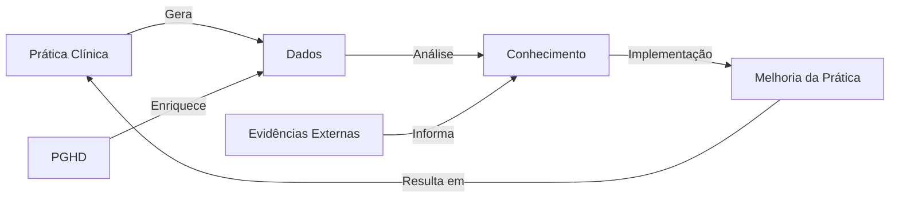

# SOP-013: Learning Health System - Estrutura Integradora para Medicina do Estilo de Vida

## Resumo Executivo

Este Standard Operating Procedure define a estrutura completa de um Learning Health System (LHS) que integra todos os componentes descritos nos SOPs anteriores¹, criando um ecossistema adaptativo de melhoria contínua da saúde². O LHS representa a convergência de dados clínicos³, evidências científicas⁴, tecnologia de informação⁵ e prática clínica⁶ em um ciclo virtuoso de aprendizado e melhoria.

## 1. Fundamentos do Learning Health System

### 1.1 Definição e Conceitos Centrais

**Definição IOM (Institute of Medicine)**: "Um sistema em que ciência, informática, incentivos e cultura estão alinhados para melhoria e inovação contínuas, com melhores práticas seamlessly incorporadas ao processo de cuidado e novos conhecimentos capturados como subproduto integral da experiência de cuidado."⁷

**Componentes Essenciais do LHS**⁸:
1. **Infraestrutura de Dados**: Captura e integração contínua de dados
2. **Análise e Insights**: Transformação de dados em conhecimento acionável
3. **Implementação**: Tradução de conhecimento em prática
4. **Avaliação**: Medição de impacto e resultados
5. **Feedback Loop**: Retroalimentação para melhoria contínua

### 1.2 Ciclo de Aprendizado Contínuo



**Características do Ciclo**⁹:
- **Velocidade**: Redução do tempo entre descoberta e implementação
- **Escala**: Aplicação em toda a população atendida
- **Personalização**: Adaptação para indivíduos e subgrupos
- **Transparência**: Processos e resultados visíveis e auditáveis

## 2. Arquitetura Técnica Integrada

### 2.1 Camadas da Arquitetura LHS

```python
class LearningHealthSystemArchitecture:
    """Arquitetura completa do Learning Health System"""¹⁰
    
    def __init__(self):
        # Camada de Dados (SOPs 10, 12)
        self.data_layer = {
            'ehr_system': FHIRServer(),¹¹  # SOP-012
            'pghd_collector': PGHDPlatform(),¹²  # SOP-010
            'clinical_repository': ClinicalDataWarehouse(),
            'research_database': ResearchDataMart()
        }
        
        # Camada de Conhecimento (SOPs 8, 9)
        self.knowledge_layer = {
            'evidence_synthesizer': LivingSystematicReview(),¹³  # SOP-009
            'ai_models': SmallLanguageModels(),¹⁴  # SOP-008
            'clinical_guidelines': GuidelineRepository(),
            'decision_support': CDSServices()
        }
        
        # Camada de Interoperabilidade (SOPs 1-7)
        self.interop_layer = {
            'fhir_ig': ImplementationGuides(),¹⁵  # SOP-001
            'terminology': TerminologyServices(),¹⁶  # SOP-002
            'security': SecurityFramework(),¹⁷  # SOP-003
            'standards_mapping': StandardsMapper()¹⁸  # SOPs 4-7
        }
        
        # Camada de Aplicação
        self.application_layer = {
            'clinical_apps': ClinicalApplications(),
            'patient_portals': PatientEngagementPlatform(),
            'analytics_dashboards': AnalyticsDashboards(),
            'research_tools': ResearchPlatform()
        }
```

### 2.2 Fluxo de Dados Integrado

```python
class IntegratedDataFlow:
    """Fluxo de dados através do LHS"""¹⁹
    
    async def process_health_data(self, data_source: str) -> Dict:
        """Processa dados de saúde através do sistema"""
        
        # 1. Ingestão de dados
        raw_data = await self.ingest_data(data_source)
        
        # 2. Padronização FHIR²⁰
        fhir_resources = self.standardize_to_fhir(raw_data)
        
        # 3. Enriquecimento com terminologias²¹
        enriched_data = self.enrich_with_terminologies(fhir_resources)
        
        # 4. Análise com SLMs²²
        insights = await self.analyze_with_ai(enriched_data)
        
        # 5. Comparação com evidências²³
        evidence_context = await self.compare_with_evidence(insights)
        
        # 6. Geração de recomendações
        recommendations = self.generate_recommendations(
            insights, evidence_context
        )
        
        # 7. Feedback para o sistema
        self.update_knowledge_base(recommendations)
        
        return {
            'data': enriched_data,
            'insights': insights,
            'recommendations': recommendations,
            'timestamp': datetime.now().isoformat()
        }
```

## 3. Governança e Gestão do LHS

### 3.1 Estrutura de Governança

```python
class LHSGovernance:
    """Sistema de governança do LHS"""²⁴
    
    def __init__(self):
        self.governance_structure = {
            'steering_committee': {
                'members': ['clinical_leaders', 'it_leaders', 'patient_representatives'],
                'responsibilities': ['strategic_direction', 'resource_allocation', 'oversight']
            },
            'data_governance': {
                'committee': DataGovernanceCommittee(),²⁵
                'policies': ['data_use', 'privacy', 'security', 'quality'],
                'standards': ['FHIR', 'HL7', 'ISO', 'HIPAA']
            },
            'ethics_board': {
                'committee': EthicsReviewBoard(),²⁶
                'scope': ['research_protocols', 'ai_algorithms', 'data_use'],
                'review_frequency': 'monthly'
            },
            'quality_assurance': {
                'team': QualityAssuranceTeam(),²⁷
                'metrics': ['data_quality', 'clinical_outcomes', 'patient_satisfaction'],
                'reporting': 'quarterly'
            }
        }
```

### 3.2 Políticas e Procedimentos

```yaml
lhs_policies:
  data_governance:
    access_control:²⁸
      - role_based_access
      - attribute_based_access
      - consent_management
    data_quality:²⁹
      - completeness_standards
      - accuracy_validation
      - timeliness_requirements
    retention:³⁰
      - clinical_data: 7_years
      - research_data: indefinite
      - pghd_data: 2_years
    
  privacy_security:³¹
    encryption:
      - at_rest: AES-256
      - in_transit: TLS_1.3
    authentication:³²
      - multi_factor: required
      - biometric: optional
    audit_logging:³³
      - all_access: logged
      - retention: 3_years
```

## 4. Implementação de Machine Learning e IA

### 4.1 Pipeline de ML para LHS

```python
class MLPipeline:
    """Pipeline de Machine Learning para o LHS"""³⁴
    
    def __init__(self):
        self.pipeline_stages = {
            'data_preparation': DataPreparationStage(),³⁵
            'feature_engineering': FeatureEngineeringStage(),³⁶
            'model_training': ModelTrainingStage(),³⁷
            'validation': ValidationStage(),³⁸
            'deployment': DeploymentStage(),³⁹
            'monitoring': MonitoringStage()⁴⁰
        }
    
    async def train_predictive_model(self, dataset: pd.DataFrame, target: str) -> Model:
        """Treina modelo preditivo para outcomes clínicos"""
        
        # 1. Preparação de dados
        prepared_data = await self.prepare_clinical_data(dataset)
        
        # 2. Engenharia de features
        features = self.extract_clinical_features(prepared_data)
        
        # 3. Divisão treino/teste/validação
        X_train, X_test, X_val, y_train, y_test, y_val = self.split_data(
            features, target, splits=[0.7, 0.15, 0.15]
        )
        
        # 4. Treinamento com AutoML⁴¹
        model = AutoMLPipeline(
            task='classification',
            time_limit=3600,
            metric='auc',
            frameworks=['lightgbm', 'xgboost', 'catboost']
        )
        
        model.fit(X_train, y_train, X_val=X_val, y_val=y_val)
        
        # 5. Validação rigorosa
        performance = self.validate_model(model, X_test, y_test)
        
        # 6. Interpretabilidade com SHAP⁴²
        explainer = shap.Explainer(model)
        shap_values = explainer(X_test)
        
        # 7. Fairness assessment⁴³
        fairness_metrics = self.assess_fairness(
            model, X_test, y_test,
            sensitive_attributes=['gender', 'race', 'age_group']
        )
        
        return {
            'model': model,
            'performance': performance,
            'explanations': shap_values,
            'fairness': fairness_metrics
        }
```

### 4.2 Implementação de NLP para Dados Clínicos

```python
class ClinicalNLP:
    """Processamento de linguagem natural para textos clínicos"""⁴⁴
    
    def __init__(self):
        # Modelos especializados em saúde
        self.models = {
            'biobert': AutoModel.from_pretrained('dmis-lab/biobert-v1.1'),⁴⁵
            'clinical_bert': AutoModel.from_pretrained('emilyalsentzer/Bio_ClinicalBERT'),⁴⁶
            'scispacy': spacy.load('en_core_sci_lg'),⁴⁷
            'medcat': MedCAT()⁴⁸
        }
    
    async def extract_clinical_concepts(self, text: str) -> Dict:
        """Extrai conceitos clínicos de texto não estruturado"""
        
        # 1. Pré-processamento
        cleaned_text = self.preprocess_clinical_text(text)
        
        # 2. Named Entity Recognition
        entities = await self.extract_entities(cleaned_text)
        
        # 3. Mapeamento para terminologias
        mapped_concepts = self.map_to_terminologies(entities, {
            'conditions': 'SNOMED-CT',
            'medications': 'RxNorm',
            'procedures': 'CPT',
            'lab_results': 'LOINC'
        })
        
        # 4. Extração de relações
        relations = self.extract_clinical_relations(cleaned_text, entities)
        
        # 5. Análise de sentimento/severidade
        severity = self.assess_severity(cleaned_text, entities)
        
        return {
            'entities': mapped_concepts,
            'relations': relations,
            'severity': severity,
            'confidence': self.calculate_confidence(entities)
        }
```

## 5. Análise de Real-World Evidence

### 5.1 Framework de RWE

```python
class RealWorldEvidenceFramework:
    """Framework para análise de Real-World Evidence"""⁴⁹
    
    def __init__(self):
        self.data_sources = {
            'ehr': EHRDataSource(),
            'claims': ClaimsDataSource(),
            'registries': RegistryDataSource(),
            'pghd': PGHDDataSource(),
            'social_determinants': SDOHDataSource()⁵⁰
        }
    
    async def conduct_rwe_study(self, research_question: str) -> StudyResults:
        """Conduz estudo de RWE completo"""
        
        # 1. Protocolo do estudo
        protocol = self.develop_protocol(research_question)
        
        # 2. Identificação de coorte
        cohort = await self.identify_cohort(protocol.inclusion_criteria)
        
        # 3. Extração de dados multi-fonte
        patient_data = await self.extract_multimodal_data(cohort)
        
        # 4. Harmonização de dados⁵¹
        harmonized_data = self.harmonize_data_sources(patient_data)
        
        # 5. Análise estatística
        results = await self.perform_statistical_analysis(
            harmonized_data,
            methods=['propensity_score_matching',⁵²
                    'instrumental_variables',⁵³
                    'difference_in_differences'⁵⁴]
        )
        
        # 6. Análise de sensibilidade
        sensitivity = self.sensitivity_analysis(results)
        
        # 7. Geração de evidências
        evidence = self.generate_evidence_package(results, sensitivity)
        
        return evidence
```

### 5.2 Comparative Effectiveness Research

```python
class ComparativeEffectivenessResearch:
    """Sistema de pesquisa de efetividade comparativa"""⁵⁵
    
    async def compare_interventions(
        self,
        intervention_a: str,
        intervention_b: str,
        outcome: str,
        population: Dict
    ) -> ComparisonResults:
        """Compara efetividade de duas intervenções"""
        
        # 1. Target Trial Emulation⁵⁶
        trial_design = self.emulate_target_trial(
            intervention_a, intervention_b, outcome
        )
        
        # 2. Confounding adjustment
        adjusted_analysis = self.adjust_for_confounding(
            methods=['g_computation',⁵⁷
                    'marginal_structural_models',⁵⁸
                    'doubly_robust_estimation'⁵⁹]
        )
        
        # 3. Heterogeneity of treatment effects⁶⁰
        subgroup_effects = self.analyze_heterogeneity(population)
        
        # 4. Cost-effectiveness analysis⁶¹
        cost_effectiveness = self.calculate_icer(
            intervention_a, intervention_b, outcome
        )
        
        return {
            'primary_outcome': adjusted_analysis,
            'subgroup_effects': subgroup_effects,
            'cost_effectiveness': cost_effectiveness,
            'quality_of_evidence': self.grade_evidence()⁶²
        }
```

## 6. Integração com Medicina do Estilo de Vida

### 6.1 Módulo Específico para Lifestyle Medicine

```python
class LifestyleMedicineModule:
    """Módulo especializado em medicina do estilo de vida"""⁶³
    
    def __init__(self):
        self.pillars = {
            'nutrition': NutritionAnalyzer(),⁶⁴
            'physical_activity': ActivityTracker(),⁶⁵
            'sleep': SleepAnalyzer(),⁶⁶
            'stress_management': StressMonitor(),⁶⁷
            'social_connection': SocialHealthAnalyzer(),⁶⁸
            'substance_avoidance': SubstanceMonitor()⁶⁹
        }
    
    async def analyze_lifestyle_factors(self, patient_id: str) -> LifestyleProfile:
        """Analisa fatores de estilo de vida do paciente"""
        
        # 1. Coleta de dados multimodais
        lifestyle_data = {}
        for pillar, analyzer in self.pillars.items():
            lifestyle_data[pillar] = await analyzer.collect_data(patient_id)
        
        # 2. Cálculo de scores compostos⁷⁰
        lifestyle_scores = self.calculate_lifestyle_scores(lifestyle_data)
        
        # 3. Identificação de padrões
        patterns = self.identify_lifestyle_patterns(lifestyle_data)
        
        # 4. Predição de riscos
        risk_profile = await self.predict_lifestyle_risks(
            lifestyle_scores,
            outcomes=['cardiovascular', 'metabolic', 'mental_health']
        )
        
        # 5. Recomendações personalizadas⁷¹
        recommendations = self.generate_personalized_recommendations(
            lifestyle_scores, patterns, risk_profile
        )
        
        # 6. Plano de intervenção
        intervention_plan = self.create_intervention_plan(
            recommendations,
            patient_preferences=await self.get_patient_preferences(patient_id)
        )
        
        return {
            'scores': lifestyle_scores,
            'patterns': patterns,
            'risks': risk_profile,
            'recommendations': recommendations,
            'intervention_plan': intervention_plan
        }
```

### 6.2 Monitoramento Contínuo de Wearables

```python
class WearableDataIntegration:
    """Integração contínua de dados de wearables"""⁷²
    
    def __init__(self):
        self.device_connectors = {
            'apple_health': AppleHealthConnector(),⁷³
            'google_fit': GoogleFitConnector(),⁷⁴
            'fitbit': FitbitConnector(),⁷⁵
            'garmin': GarminConnector(),⁷⁶
            'oura': OuraConnector(),⁷⁷
            'whoop': WhoopConnector()⁷⁸
        }
    
    async def stream_wearable_data(self, patient_id: str) -> AsyncIterator:
        """Stream contínuo de dados de wearables"""
        
        # 1. Autenticação OAuth para cada dispositivo
        authenticated_devices = await self.authenticate_devices(patient_id)
        
        # 2. Setup de webhooks para dados em tempo real
        webhooks = await self.setup_webhooks(authenticated_devices)
        
        # 3. Stream de processamento
        async for data_batch in self.data_stream(webhooks):
            # Validação de dados
            validated = self.validate_wearable_data(data_batch)
            
            # Detecção de anomalias⁷⁹
            anomalies = await self.detect_anomalies(validated)
            
            # Agregação temporal
            aggregated = self.aggregate_temporal_data(
                validated,
                windows=['5min', '1hour', '1day']
            )
            
            # Conversão para FHIR Observations
            fhir_observations = self.convert_to_fhir(aggregated)
            
            # Trigger de alertas se necessário
            if anomalies:
                await self.trigger_clinical_alerts(anomalies)
            
            yield {
                'patient_id': patient_id,
                'timestamp': datetime.now(),
                'data': fhir_observations,
                'anomalies': anomalies
            }
```

## 7. Clinical Decision Support Avançado

### 7.1 Sistema de Suporte à Decisão

```python
class AdvancedCDS:
    """Sistema avançado de suporte à decisão clínica"""⁸⁰
    
    def __init__(self):
        self.rule_engine = ClinicalRuleEngine()⁸¹
        self.ml_models = MLModelRegistry()⁸²
        self.guideline_repository = GuidelineRepository()⁸³
        self.alert_manager = AlertManager()⁸⁴
    
    async def generate_recommendations(
        self,
        patient_context: PatientContext
    ) -> List[ClinicalRecommendation]:
        """Gera recomendações clínicas contextualizadas"""
        
        recommendations = []
        
        # 1. Aplicar regras baseadas em guidelines
        rule_based_recs = await self.apply_clinical_rules(patient_context)
        recommendations.extend(rule_based_recs)
        
        # 2. Predições de ML
        ml_predictions = await self.ml_models.predict_all(patient_context)
        
        # 3. Análise de interações medicamentosas⁸⁵
        if patient_context.medications:
            drug_interactions = await self.check_drug_interactions(
                patient_context.medications
            )
            if drug_interactions:
                recommendations.append(
                    self.create_drug_alert(drug_interactions)
                )
        
        # 4. Recomendações preventivas
        preventive_care = await self.generate_preventive_recommendations(
            patient_context,
            guidelines=['USPSTF',⁸⁶ 'AHA/ACC'⁸⁷]
        )
        recommendations.extend(preventive_care)
        
        # 5. Priorização de recomendações
        prioritized = self.prioritize_recommendations(
            recommendations,
            factors=['urgency', 'impact', 'evidence_strength']
        )
        
        return prioritized
```

### 7.2 Explicabilidade e Transparência

```python
class ExplainableCDS:
    """Sistema de CDS explicável e transparente"""⁸⁸
    
    def explain_recommendation(
        self,
        recommendation: ClinicalRecommendation
    ) -> ExplanationPackage:
        """Gera explicação completa para recomendação"""
        
        explanation = ExplanationPackage()
        
        # 1. Evidências de suporte
        explanation.evidence = self.gather_supporting_evidence(
            recommendation,
            sources=['clinical_trials', 'guidelines', 'real_world_data']
        )
        
        # 2. Raciocínio clínico
        explanation.clinical_reasoning = self.trace_clinical_reasoning(
            recommendation.logic_path
        )
        
        # 3. Fatores do paciente considerados
        explanation.patient_factors = self.list_patient_factors(
            recommendation.input_data
        )
        
        # 4. Alternativas consideradas
        explanation.alternatives = self.document_alternatives(
            recommendation.alternative_options
        )
        
        # 5. Nível de confiança
        explanation.confidence = self.calculate_confidence_level(
            recommendation,
            factors=['evidence_quality', 'model_certainty', 'guideline_agreement']
        )
        
        # 6. Visualização interativa
        explanation.visualization = self.create_interactive_visualization(
            explanation
        )
        
        return explanation
```

## 8. Avaliação de Outcomes e Qualidade

### 8.1 Framework de Medição de Outcomes

```python
class OutcomesMeasurement:
    """Sistema de medição de outcomes clínicos e de qualidade"""⁸⁹
    
    def __init__(self):
        self.outcome_measures = {
            'clinical': ClinicalOutcomes(),⁹⁰
            'patient_reported': PatientReportedOutcomes(),⁹¹
            'functional': FunctionalOutcomes(),⁹²
            'quality_of_life': QualityOfLifeMeasures()⁹³
        }
    
    async def evaluate_intervention_effectiveness(
        self,
        intervention_id: str,
        cohort: PatientCohort,
        timeframe: TimeRange
    ) -> OutcomeReport:
        """Avalia efetividade de intervenção"""
        
        # 1. Baseline measurement
        baseline = await self.measure_baseline(cohort)
        
        # 2. Follow-up measurements
        followups = await self.collect_followup_data(
            cohort, timeframe,
            intervals=['1month', '3months', '6months', '1year']
        )
        
        # 3. Calculate change scores
        changes = self.calculate_change_scores(baseline, followups)
        
        # 4. Statistical analysis
        statistics = self.perform_outcome_analysis(changes, methods=[
            'mixed_effects_models',⁹⁴
            'time_series_analysis',⁹⁵
            'survival_analysis'⁹⁶
        ])
        
        # 5. Clinical significance
        clinical_significance = self.assess_clinical_significance(
            changes,
            thresholds=self.get_mcid_thresholds()⁹⁷  # Minimal Clinically Important Difference
        )
        
        # 6. Generate report
        return OutcomeReport(
            statistics=statistics,
            clinical_significance=clinical_significance,
            visualizations=self.create_outcome_visualizations(changes),
            recommendations=self.generate_improvement_recommendations(statistics)
        )
```

### 8.2 Continuous Quality Improvement

```python
class ContinuousQualityImprovement:
    """Sistema de melhoria contínua da qualidade"""⁹⁸
    
    async def run_pdsa_cycle(
        self,
        improvement_hypothesis: str
    ) -> PDSACycleResults:
        """Executa ciclo PDSA (Plan-Do-Study-Act)"""⁹⁹
        
        # PLAN
        plan = await self.plan_phase(
            hypothesis=improvement_hypothesis,
            metrics=self.define_metrics(),
            predictions=self.make_predictions()
        )
        
        # DO
        implementation = await self.do_phase(
            plan=plan,
            pilot_size='small',  # Start small
            duration='2weeks'
        )
        
        # STUDY
        analysis = await self.study_phase(
            data=implementation.collected_data,
            compare_to_predictions=plan.predictions
        )
        
        # ACT
        actions = await self.act_phase(
            results=analysis,
            decisions=['adopt', 'adapt', 'abandon']
        )
        
        return PDSACycleResults(
            plan=plan,
            implementation=implementation,
            analysis=analysis,
            actions=actions,
            next_steps=self.plan_next_cycle(actions)
        )
```

## 9. Implementação Prática e Deployment

### 9.1 Estratégia de Implementação

```python
class LHSImplementationStrategy:
    """Estratégia de implementação do LHS"""¹⁰⁰
    
    def __init__(self):
        self.phases = {
            'phase1_foundation': {
                'duration': '6months',
                'objectives': [
                    'Establish data infrastructure',
                    'Implement FHIR standards',
                    'Deploy basic analytics'
                ]
            },
            'phase2_integration': {
                'duration': '6months',
                'objectives': [
                    'Integrate clinical systems',
                    'Deploy CDS tools',
                    'Implement PGHD collection'
                ]
            },
            'phase3_intelligence': {
                'duration': '6months',
                'objectives': [
                    'Deploy ML models',
                    'Implement real-time analytics',
                    'Launch predictive capabilities'
                ]
            },
            'phase4_optimization': {
                'duration': 'ongoing',
                'objectives': [
                    'Continuous improvement',
                    'Scaling successful interventions',
                    'Research and innovation'
                ]
            }
        }
    
    async def execute_implementation(self) -> ImplementationReport:
        """Executa plano de implementação completo"""
        
        results = {}
        
        for phase_name, phase_config in self.phases.items():
            # 1. Preparação da fase
            preparation = await self.prepare_phase(phase_name, phase_config)
            
            # 2. Execução
            execution = await self.execute_phase(
                phase_config['objectives'],
                duration=phase_config['duration']
            )
            
            # 3. Avaliação
            evaluation = await self.evaluate_phase(execution)
            
            # 4. Ajustes
            adjustments = await self.make_adjustments(evaluation)
            
            results[phase_name] = {
                'preparation': preparation,
                'execution': execution,
                'evaluation': evaluation,
                'adjustments': adjustments
            }
            
            # Gate review antes de próxima fase
            if not await self.gate_review(results[phase_name]):
                break
        
        return ImplementationReport(results)
```

### 9.2 Monitoramento e Dashboards

```python
class LHSDashboard:
    """Dashboard de monitoramento do LHS"""¹⁰¹
    
    def __init__(self):
        self.metrics = {
            'system_health': SystemHealthMetrics(),
            'clinical_quality': ClinicalQualityMetrics(),
            'operational': OperationalMetrics(),
            'research': ResearchMetrics(),
            'patient_engagement': PatientEngagementMetrics()
        }
    
    async def generate_executive_dashboard(self) -> Dashboard:
        """Gera dashboard executivo"""
        
        dashboard = Dashboard(title="LHS Executive Overview")
        
        # 1. KPIs principais
        dashboard.add_kpi_section(
            kpis=[
                await self.calculate_kpi('patient_outcomes_improvement'),
                await self.calculate_kpi('cost_reduction'),
                await self.calculate_kpi('clinical_efficiency'),
                await self.calculate_kpi('patient_satisfaction')
            ]
        )
        
        # 2. Trends temporais
        dashboard.add_trend_charts(
            trends=[
                await self.generate_trend('monthly_active_patients'),
                await self.generate_trend('ai_recommendations_accepted'),
                await self.generate_trend('preventable_events_avoided')
            ]
        )
        
        # 3. Comparative analytics
        dashboard.add_comparison(
            comparisons=[
                await self.compare_to_benchmarks('national'),
                await self.compare_to_previous_period('year'),
                await self.compare_interventions('top_